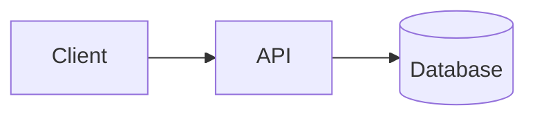

# riddam.github.io

Personal blog built with [Astro](https://astro.build), deployed to GitHub Pages.

Live at **https://riddam.github.io**

## Writing a post

Add a Markdown file to the section it belongs to:

| Section | Directory | URL |
| --- | --- | --- |
| Engineering | `src/content/engineering/` | `/engineering/<filename>/` |
| Book Notes | `src/content/book-notes/` | `/book-notes/<filename>/` |
| Leadership | `src/content/leadership/` | `/leadership/<filename>/` |
| Study Guides | `src/content/guides/` | `/guides/<filename>/` |

Every post starts with frontmatter:

```markdown
---
title: "My Post Title"
description: "One-sentence summary shown in listings and RSS."
pubDate: 2026-07-17
tags: ["gcp", "bigquery"]
draft: false        # optional — true hides the post
---

Post body in Markdown, starting at ## headings.
```

### Images

Put images in `src/assets/` and reference them relatively — Astro optimizes
them at build time:

```markdown

*Optional caption as an italic line right under the image.*
```

Files dropped in `public/images/` are served unprocessed at `/images/...`.

### Diagrams

Write [Mermaid](https://mermaid.js.org) diagrams directly in Markdown — they
render as SVGs in the browser (flowcharts, sequence, ER, state diagrams…):

````markdown

````

### Table of contents

Posts with three or more `##` headings automatically get a sticky
"On this page" sidebar on screens wider than 1100px.

Push to `main` and GitHub Actions builds and deploys automatically
(`.github/workflows/deploy.yml`).

## Local development

```sh
npm install
npm run dev        # http://localhost:4321
npm run build      # production build into dist/
```

## Notes

- `_originals/` holds the original standalone HTML study guides these posts
  were converted from; it is not part of the built site.
- Site-wide settings (title, sections, GitHub link) live in `src/consts.ts`.
- To add a custom domain later: add a `CNAME` file to `public/`, update
  `site` in `astro.config.mjs`, and configure the domain in the repo's
  Pages settings.
