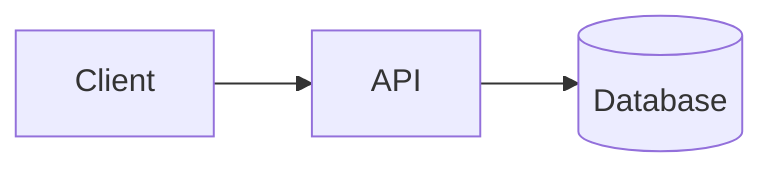

# riddam.github.io

Personal blog built with [Astro](https://astro.build), deployed to GitHub Pages.

Live at **https://riddam.github.io**

## Writing a post

Add a Markdown file to the section it belongs to:

| Section | Directory | URL |
| --- | --- | --- |
| Engineering | `src/content/engineering/` | `/engineering/<filename>/` |
| Book Notes | `src/content/book-notes/` | `/book-notes/<filename>/` |
| Leadership | `src/content/leadership/` | `/leadership/<filename>/` |
| Study Guides | `src/content/guides/` | `/guides/<filename>/` |

Every post starts with frontmatter:

```markdown
---
title: "My Post Title"
description: "One-sentence summary shown in listings and RSS."
pubDate: 2026-07-17
tags: ["gcp", "bigquery"]
draft: false        # optional — true hides the post
---

Post body in Markdown, starting at ## headings.
```

### Images

Put images in `src/assets/` and reference them relatively — Astro optimizes
them at build time:

```markdown

*Optional caption as an italic line right under the image.*
```

Files dropped in `public/images/` are served unprocessed at `/images/...`.

### Diagrams

Write [Mermaid](https://mermaid.js.org) diagrams directly in Markdown — they
render as SVGs in the browser (flowcharts, sequence, ER, state diagrams…):

````markdown

```mermaid
flowchart LR
  A[Client] --> B[API] --> C[(Database)]
```
````

### Table of contents

Posts with three or more `##` headings automatically get a sticky
"On this page" sidebar on screens wider than 1100px. `###` headings appear
in it too, indented one level — the threshold still counts `##` only, so a
post with one `##` and several `###` gets no sidebar.

Push to `main` and GitHub Actions builds and deploys automatically
(`.github/workflows/deploy.yml`).

## Revising a published post

Set `updatedDate` in the frontmatter when you materially change a post that is
already live (new content, corrected facts, refreshed API details) — not for
typos. It drives four things at once: the "Updated <date>" line in the post
header, `dateModified` in the BlogPosting JSON-LD, `article:modified_time`, and
`lastmod` in the sitemap. Leave it off and search engines assume the post has
not moved since `pubDate`.

## Local development

```sh
npm install
npm run dev        # http://localhost:4321
npm run build      # production build into dist/
npm run preview    # serve dist/ — the only way to test search locally
npm test           # unit tests
```

`npm run dev` does not generate the Pagefind index, so `/search/` is inert
there. Deploys must use `npm run build` (`astro build && pagefind --site
dist`) — a bare `astro build` silently omits the index.

## Tests

`npm test` runs the unit tests via Node's built-in test runner (no dependency).
Currently covers `src/utils/reading-time.ts`. Everything else is verified by
building and asserting against `dist/` — see
`docs/superpowers/plans/2026-08-03-blog-audit-remediation.md`.

## Notes

- `_originals/` holds the original standalone HTML study guides these posts
  were converted from; it is not part of the built site.
- Site-wide settings (title, sections, GitHub link) live in `src/consts.ts`.
- To add a custom domain later: add a `CNAME` file to `public/`, update
  `site` in `astro.config.mjs`, and configure the domain in the repo's
  Pages settings.
