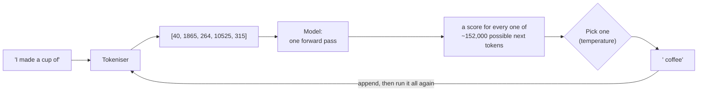
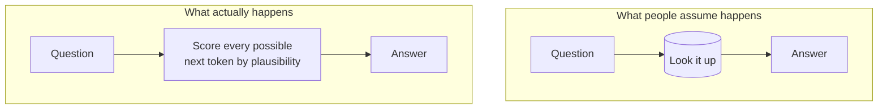

# AI Foundations — Step 1 Implementation Plan

> **For agentic workers:** REQUIRED SUB-SKILL: Use superpowers:subagent-driven-development (recommended) or superpowers:executing-plans to implement this plan task-by-task. Steps use checkbox (`- [ ]`) syntax for tracking.

**Goal:** Stand up the `ai-foundations` collection end to end, then publish two of its nine files — the glossary and post 1 — so voice, depth and code density can be judged before posts 2–8 are written.

**Architecture:** The site is fully data-driven from `SECTIONS` in `src/consts.ts`: nav, homepage blocks, `/archive`, `/[section]/` routing, per-section RSS, OG images and tag pages all iterate that one array. So "add a section" means four small edits (`consts.ts`, `content.config.ts`, `motifs.ts`, `global.css`) plus a content directory — no new pages, components or routes. Because those four files must agree and nothing currently enforces that, Task 1 adds a unit test that fails first and pins the invariant. Content then lands as ordinary Markdown.

**Tech Stack:** Astro 5 content collections, TypeScript, `node --test` with native type stripping (Node 26), Pagefind, Mermaid. Reader-facing code in the posts is Python 3.12+ run via `uv`.

**Scope note:** This plan covers **Step 1 of the spec only** (`docs/superpowers/specs/2026-08-05-ai-foundations-series-design.md`, "Delivery"). The spec gates posts 2–8 behind a review of post 1, so Step 2 gets its own plan written after that review. Step 1 stands alone: a complete, navigable, buildable section with two finished pages.

---

## Global Constraints

Every task's requirements implicitly include this section.

- **No emoji anywhere** in new content. The site policy is none; decorative emoji were deliberately stripped in an earlier pass, so adding them is a regression.
- **No new npm dependencies.** The repo has a standing zero-new-dependencies rule (this is why `npx astro check` cannot be run — it wants `@astrojs/check` + `typescript`).
- **No new cover SVGs and no raster images.** Every visual in a post is a ` ```mermaid ` fence.
- **Build with `npm run build`, never bare `astro build`.** The bare command skips Pagefind and breaks `/search` in production.
- **Numbered H2s in the form `## 01 — Topic`** (two digits, space, em dash `—`, space), matching `ai-architecture-master-guide`. Verified anchor form: `## 05 — RAG Architectures` renders `id="05--rag-architectures"`.
- **Post body starts at `##`.** No H1 — the title renders from frontmatter.
- **Frontmatter:** `title`, one-sentence `description`, `pubDate: 2026-08-11`, 3–4 kebab-case `tags`, `cover`. No `draft` key on files meant to publish (it defaults to `false`).
- **Accent colour:** light `#3f4fbf`, dark `#8f9cf0`.
- **Section label** is `AI Foundations`, id `ai-foundations`, served at `/ai-foundations/`.
- **Python 3.12+, environments via `uv`.** Every snippet self-contained, under ~40 lines, and printing something the reader can compare against, with **real output in a fenced block underneath**.
- **Nothing invented.** Every number, token id, probability and heading anchor in a post comes from a real run or a real grep. Values already verified for this plan are marked *(verified 2026-08-11)* — paste those exactly rather than re-deriving or paraphrasing.
- **State the versions each post was written against.** This is the spec's mitigation for code rot. The verified stack for Step 1 *(2026-08-11)*: Python 3.13.3, `uv` 0.9.8, `torch` 2.13.0, `transformers` 5.15.0. Add `updatedDate` when a published post is later revised, matching the existing guides.
- **Load the `claude-api` skill before writing any Claude- or LLM-specific definition or claim** — including the glossary's reasoning-model, prompt-caching, batch-API and MCP entries. Model ids, pricing and parameters come from that skill, never from memory. Its SKIP rule does not apply here: no other provider is in scope.
- **No push to `origin`.** Publishing stays a separate, explicit decision. Commit locally only.

### Decisions taken 2026-08-11 that amend the spec

The spec was approved before the environment was checked. Four amendments, all confirmed with Riddam except where noted:

1. **Post 1 uses `transformers` + `Qwen/Qwen2.5-0.5B`, not Ollama.** Ollama is not installed on this machine, and its API does not cleanly expose per-token probabilities — which *is* post 1's centrepiece. `transformers` gives exact logits from one script with no server, run via `uv run --with torch --with transformers`. Posts 3 and 7 revisit the runtime choice in Step 2. The spec's "copy-paste fallback" intent is preserved and strengthened: all real output is already in this plan, so a reader who installs nothing still gets the lesson.
2. **Step 1 makes no API calls and states no API cost.** No `ANTHROPIC_API_KEY` is available. The spec's "measured API cost in cents" line in Prerequisites becomes a measured *local* cost (download size and runtime). **Step 2 is blocked on a key** — posts 2, 4, 5, 6 and 8 cannot be written with real outputs without one.
3. **Motif reuse is accepted.** All 22 motifs in `src/motifs.ts` are already used exactly once each, so the nine motifs the spec assigns (`ai`, `book`, `assist`, `network`, `lever`, `agent`, `scales`, `training`, `pipeline`) are all second uses. The spec forbids new cover SVGs, so the new `tint-ai-foundations` colour is the only thing distinguishing them. Task 4 includes a visual check that this reads acceptably.
4. **The spec's "18 unpushed commits" is stale** — there is exactly one (`30d3f1f`, the spec commit). The no-push constraint is unaffected.
5. **The glossary carries 44 terms, not 40.** The spec says "roughly 40", and 44 is what its seven groups actually need once each post's vocabulary is enumerated (Task 2, Step 2). The spec's provisional title `"The AI Vocabulary: 40 Terms That Unlock Everything Else"` becomes `44 Terms`, so the title does not contradict the page. My own call, not Riddam's — flag it at review.

---

## File Structure

| File | Responsibility | Task |
|---|---|---|
| `src/consts.test.ts` | **Create.** Pins the five-section invariant across the four config files. The only automated guard that "add a section" was done completely. | 1 |
| `src/consts.ts` | **Modify.** `Section['id']` union (line 12), `SECTIONS` entry (after line 81), `SERIES` entry (after line 56). | 1 |
| `src/content.config.ts` | **Modify.** One `collections` key (line 26). | 1 |
| `src/motifs.ts` | **Modify.** `SectionId` union (line 35). | 1 |
| `src/styles/global.css` | **Modify.** Three `.cover.tint-ai-foundations` rules in the three blocks at lines 77–91. | 1 |
| `src/content/ai-foundations/_template.md` | **Create.** `draft: true`, so the loader has a directory and the collection resolves before any real post exists. Matches the `engineering`/`book-notes`/`leadership` convention. | 1 |
| `src/content/ai-foundations/ai-vocabulary-glossary.md` | **Create.** The 44-term reference page. Not a series rung. Linked from every post's Prerequisites. | 2 |
| `src/content/ai-foundations/what-a-model-actually-is.md` | **Create.** Post 1, the depth-calibration gate for the whole series. | 3 |
| `src/content/guides/ai-architecture-master-guide.md` | **Modify.** One italic pointer line after line 9. | 4 |

---

### Task 1: Section plumbing, pinned by a sync test

Four files must agree for a section to exist, and nothing enforces it today. Write the guard first, watch it fail, then make it pass.

**Files:**
- Test: `src/consts.test.ts` (create)
- Modify: `src/consts.ts` (line 12, after line 56, after line 81)
- Modify: `src/content.config.ts:26`
- Modify: `src/motifs.ts:35`
- Modify: `src/styles/global.css` (lines 77–91)
- Create: `src/content/ai-foundations/_template.md`

**Interfaces:**
- Consumes: nothing.
- Produces: section id `'ai-foundations'` valid in `Section['id']` and `SectionId`; collection key `'ai-foundations'` resolvable by `getCollection`; a `SERIES` entry titled `'AI from scratch, for working engineers'` whose `slugs` array contains `'what-a-model-actually-is'` at index 0 and eight entries total. Tasks 2 and 3 write files whose basenames must match those slugs exactly.

- [ ] **Step 1: Write the failing test**

Create `src/consts.test.ts`. Note it reads `content.config.ts`, `motifs.ts` and `global.css` as *text* — `content.config.ts` imports `astro:content`, which cannot resolve under `node --test`, and `SectionId` is a type with no runtime value.

```ts
import { test } from 'node:test';
import assert from 'node:assert/strict';
import { readFileSync } from 'node:fs';
import { SECTIONS, SERIES } from './consts.ts';

const read = (p: string) => readFileSync(new URL(p, import.meta.url), 'utf8');

test('every section is registered as a content collection', () => {
  const config = read('./content.config.ts');
  for (const s of SECTIONS) {
    assert.match(
      config,
      new RegExp(`['"]?${s.id}['"]?:\\s*makeCollection\\(['"]${s.id}['"]\\)`),
      `${s.id} missing from content.config.ts collections`
    );
  }
});

test('every section is in the motifs SectionId union', () => {
  const motifs = read('./motifs.ts');
  const union = motifs.match(/export type SectionId =([^;]+);/)?.[1] ?? '';
  for (const s of SECTIONS) {
    assert.ok(union.includes(`'${s.id}'`), `${s.id} missing from SectionId union`);
  }
});

test('every section has a cover tint in all three theme blocks', () => {
  const css = read('./styles/global.css');
  for (const s of SECTIONS) {
    const rules = css.match(new RegExp(`\\.cover\\.tint-${s.id}\\s*\\{`, 'g')) ?? [];
    assert.equal(rules.length, 3, `expected 3 tint rules for ${s.id}, found ${rules.length}`);
  }
});

test('every series points at a real section', () => {
  const ids = new Set(SECTIONS.map((s) => s.id));
  for (const series of SERIES) {
    assert.ok(ids.has(series.sectionId), `series "${series.title}" has unknown section`);
  }
});

test('series slugs are unique within a series', () => {
  for (const series of SERIES) {
    assert.equal(
      new Set(series.slugs).size,
      series.slugs.length,
      `series "${series.title}" repeats a slug`
    );
  }
});

test('the AI Foundations section and its series are registered', () => {
  const section = SECTIONS.find((s) => s.id === 'ai-foundations');
  assert.ok(section, 'ai-foundations section missing');
  assert.equal(section.label, 'AI Foundations');

  const series = SERIES.find((s) => s.sectionId === 'ai-foundations');
  assert.ok(series, 'ai-foundations series missing');
  assert.equal(series.slugs.length, 8, 'the ladder is eight posts');
  assert.equal(series.slugs[0], 'what-a-model-actually-is');
  assert.ok(
    !series.slugs.includes('ai-vocabulary-glossary'),
    'the glossary is a reference page, not a rung'
  );
});
```

- [ ] **Step 2: Run the test to verify it fails**

Run: `npm test`

Expected: the five generic tests **pass** (they describe the existing four sections correctly — this is the point, they are a real invariant, not scaffolding), and `the AI Foundations section and its series are registered` **fails** with `ai-foundations section missing`. Overall: `tests 16`, `pass 15`, `fail 1`.

All three regexes above were run against the real `content.config.ts`, `motifs.ts` and `global.css` *(verified 2026-08-11)*: collection key, `SectionId` membership and a tint count of exactly 3 all match for `engineering`, `book-notes`, `leadership` and `guides`. The `[^;]+` capture also survives Step 7 turning the union multi-line, since a negated character class matches newlines. If any of these fail on a clean checkout, the regex is wrong, not the source.

- [ ] **Step 3: Add the section id to the `Section['id']` union**

`src/consts.ts:12` — replace:

```ts
  id: 'engineering' | 'book-notes' | 'leadership' | 'guides';
```

with:

```ts
  id: 'engineering' | 'book-notes' | 'leadership' | 'guides' | 'ai-foundations';
```

- [ ] **Step 4: Add the `SERIES` entry**

`src/consts.ts` — insert as a new array element after the `'Building and running AI systems'` entry (which closes at line 56), keeping the existing comment style:

```ts
  {
    // The ladder: what a model is, how to talk to it, how to give it your data,
    // your tools, and its own head — then how to know it works, tune it, and run
    // it. Strictly increasing; each post is still readable standalone. The
    // vocabulary glossary sits outside the arc — it's a reference, not a rung.
    title: 'AI from scratch, for working engineers',
    sectionId: 'ai-foundations',
    slugs: [
      'what-a-model-actually-is',
      'talking-to-a-model-properly',
      'giving-a-model-your-data',
      'giving-a-model-hands',
      'letting-it-decide-agents',
      'knowing-whether-it-works',
      'making-the-model-yours',
      'running-it-in-production',
    ],
  },
```

Note: seven of these eight files do not exist until Step 2 of the spec. **Corrected 2026-08-31:** an earlier version of this note claimed the nav builder "skips misses, so a partially written series renders only the posts that exist". That was wrong at the time -- it mapped over every slug and fell back to the raw slug for a missing post's title, so an eight-slug entry with one post would have shipped seven links to 404s. It is true now: the filter was added in commit `044d74e` while publishing the portable-AI-platform series incrementally, and `src/consts.test.ts` pins it. So the `SERIES` entry can land now -- but for a different reason than this plan originally gave.

- [ ] **Step 5: Add the `SECTIONS` entry**

`src/consts.ts` — append as the final array element, after the `guides` entry (closes line 81):

```ts
  {
    id: 'ai-foundations',
    label: 'AI Foundations',
    description:
      'AI from first principles for working engineers — eight posts that start at what a token is and end at running a system in production.',
  },
```

- [ ] **Step 6: Register the collection**

`src/content.config.ts:26` — add after the `guides` line:

```ts
  'ai-foundations': makeCollection('ai-foundations'),
```

- [ ] **Step 7: Add the section to the motifs `SectionId` union**

`src/motifs.ts:35` — replace:

```ts
export type SectionId = 'engineering' | 'book-notes' | 'leadership' | 'guides';
```

with:

```ts
export type SectionId =
  | 'engineering'
  | 'book-notes'
  | 'leadership'
  | 'guides'
  | 'ai-foundations';
```

- [ ] **Step 8: Add the three cover tint rules**

`src/styles/global.css` — one line in each of the three blocks at lines 77–91. First update the comment on line 76 (`All four stay within the lavender family`) to read `All five stay within the lavender family`, then add:

After line 80 (`.cover.tint-leadership`):

```css
.cover.tint-ai-foundations { --cover-accent: #3f4fbf; } /* deep cool indigo */
```

Inside the `@media (prefers-color-scheme: dark)` block, after the `tint-leadership` line:

```css
  :root:not([data-theme='light']) .cover.tint-ai-foundations { --cover-accent: #8f9cf0; }
```

In the `:root[data-theme='dark']` block, after the `tint-leadership` line:

```css
:root[data-theme='dark'] .cover.tint-ai-foundations { --cover-accent: #8f9cf0; }
```

- [ ] **Step 9: Create the content directory with a template**

Create `src/content/ai-foundations/_template.md`. `draft: true` keeps it out of every page — all routes filter `({ data }) => !data.draft` — while giving the glob loader a directory to resolve, so the build succeeds before Task 2 lands any real post.

```markdown
---
title: "AI Foundations post template — copy me"
description: "Duplicate this file, rename it to the post slug, and delete the draft line when ready."
pubDate: 2026-08-11
tags: []
draft: true
---

*One italic line of intro, in first person.*

## TL;DR

Five bullets.

## Where This Sits

One line: what the previous post gave you, what this one adds.

## Prerequisites

Exact installs, the measured cost of running everything here, and a link to
[the vocabulary glossary](/ai-foundations/ai-vocabulary-glossary/).

## 01 — The Failure You'll Recognise

The scenario hook. Always the internal IT helpdesk assistant, broken a new way.

## 02 — <topic>

Concept, then runnable code, then what just happened, then what breaks.
Expected output goes in a fenced block directly under every snippet.

## 03 — Medior+: <topic>

The under-the-hood rung. Always the last numbered section: why the naive
version breaks at scale, what the trade-off costs, what you'd argue in a
design review.

## Try It Yourself

Two or three exercises, each with a stated expected outcome.

## Common Mistakes

Four to six — the ones juniors actually make.

## Go Deeper

Links into the playbooks, then canonical external sources.

## Final Thoughts
```

- [ ] **Step 10: Run the test to verify it passes**

Run: `npm test`

Expected: `pass 16`, `fail 0`.

- [ ] **Step 11: Build and verify the section renders**

Run: `npm run build`

Expected: exits 0, and Pagefind reports its index at the end. Then confirm the routing, feed and OG image all materialised from the one `SECTIONS` entry:

```bash
ls dist/ai-foundations/index.html dist/ai-foundations/rss.xml
ls dist/og/ai-foundations* 2>/dev/null || echo "(no OG images yet — expected, no published posts)"
grep -c 'href="/ai-foundations/"' dist/index.html
ls dist/ai-foundations/
```

Expected: `index.html` and `rss.xml` exist; no OG images yet, because OG generation iterates published posts and there are none; `grep -c` returns at least 1 (nav link on the homepage); and `ls` shows no `_template` directory, confirming the draft was filtered.

- [ ] **Step 12: Commit**

```bash
git add src/consts.ts src/consts.test.ts src/content.config.ts src/motifs.ts src/styles/global.css src/content/ai-foundations/_template.md
git commit -m "Add the AI Foundations section, pinned by a config-sync test

Everything on the site derives from SECTIONS, so a fifth section is four
small edits plus a content directory. Nothing enforced that those four
files agree, so add the test that does — it also pins the invariant for
the existing four."
```

---

### Task 2: The vocabulary glossary

44 terms, each one sentence plus one concrete example, grouped by the post that needs them. Juniors cannot read *any* AI writing until they own the vocabulary, and a standalone page is sendable on its own and findable from post 6 — neither of which a post-1 appendix would be.

**Files:**
- Create: `src/content/ai-foundations/ai-vocabulary-glossary.md`

**Interfaces:**
- Consumes: the `'ai-foundations'` collection and `tint-ai-foundations` from Task 1.
- Produces: the URL `/ai-foundations/ai-vocabulary-glossary/`, which post 1's Prerequisites links to; and the anchor ids `#01--what-a-model-is` … `#07--running-it-in-production` for future per-term deep links.

- [ ] **Step 1: Write the frontmatter and intro**

```markdown
---
title: "The AI Vocabulary: 44 Terms That Unlock Everything Else"
description: "Every term you need to read AI writing without bluffing — one sentence and one concrete example each, grouped by the post that needs them."
pubDate: 2026-08-11
tags: ["ai-foundations", "llm", "glossary"]
cover: book
---

*The reference page for the AI Foundations series. You don't need to read it end
to end — skim the group you're working through, then come back when a word
stops you.*
```

Then a short intro (~80 words) making one argument: the vocabulary is the actual barrier, not the concepts. Most AI writing assumes forty words a beginner has never been taught, so the writing reads as harder than the ideas are. Close the intro by saying each entry is one sentence plus one example, and terms are grouped by the post that introduces them.

- [ ] **Step 2: Write the seven grouped sections**

Use exactly these H2s and exactly these terms, in this order. **44 terms total.** Each term is a `**Bold term.**` opening a paragraph: one sentence of definition, then `*Example:*` and one concrete example. No emoji. Do not add terms — the count is in the title, and Step 4 verifies it.

```
## 01 — What a Model Is (post 1)
Token · Tokeniser · Context window · Parameters (weights) · Inference ·
Logits · Temperature · Hallucination · Base model vs instruct model · Attention

## 02 — Talking to a Model (post 2)
System prompt · In-context learning (few-shot) · Chain of thought ·
Reasoning model (extended thinking) · Streaming · Max tokens ·
Input vs output tokens · Model card

## 03 — Giving It Your Data (post 3)
Embedding · Cosine similarity · Chunking · Vector database ·
RAG (retrieval-augmented generation) · Reranking · Hybrid search

## 04 — Tools and Agents (posts 4 and 5)
Tool calling · Tool schema · MCP (Model Context Protocol) · Agent ·
Agent loop · Step budget · Human in the loop

## 05 — Knowing It Works (post 6)
Eval · Golden dataset · LLM-as-judge · Recall@k · MRR (mean reciprocal rank)

## 06 — Making It Yours (post 7)
Fine-tuning · LoRA · Quantisation

## 07 — Running It in Production (post 8)
Prompt caching · Batch API · Prompt injection · Guardrail
```

Three entries must carry values verified for this plan rather than invented ones — the glossary is the page people quote, so its numbers have to hold:

- **Token.** Use the *(verified 2026-08-11)* run: `"The helpdesk printer is unresponsive."` is 37 characters and 8 tokens, splitting `helpdesk` into `' help'` + `'desk'`.
- **Tokeniser.** Qwen2.5's vocabulary is 151,643 tokens (`tok.vocab_size`, *verified 2026-08-11*). Write it as "about 152,000" in prose and cite the exact figure once.
- **Temperature.** Use the *(verified 2026-08-11)* figures: after `"I made a cup of"`, `' coffee'` is 76.56% at temperature 0.5 and 38.09% at 1.0.

- [ ] **Step 3: Write the closing section**

```
## Where to Start
```

Three or four sentences pointing a reader at [post 1](/ai-foundations/what-a-model-actually-is/) if they are starting cold, and noting that the terms in groups 03 onward will make more sense once the post that needs them exists. No "Final Thoughts" here — this is a reference page, not an essay.

- [ ] **Step 4: Verify content constraints**

```bash
F=src/content/ai-foundations/ai-vocabulary-glossary.md
grep -c '^\*\*' $F                        # expect 44 — one bolded term per entry
grep -c '^\*Example:\*\|\*Example:\*' $F  # expect 44 — one example per entry
grep -c '^## ' $F                         # expect 8 — seven groups plus "Where to Start"
grep -nP '[\x{1F300}-\x{1FAFF}\x{2600}-\x{27BF}]' $F || echo "no emoji — good"
grep -n 'ANTHROPIC_API_KEY\|sk-ant' $F || echo "no keys — good"
```

Expected: `44`, `44`, `8`, then both "good" lines. If the first two disagree, an entry is missing its definition or its example — fix rather than adjusting the expected count, and if the term count genuinely changes, update the title and description to match.

- [ ] **Step 5: Build and verify the page**

Run: `npm run build`

Then:

```bash
ls dist/ai-foundations/ai-vocabulary-glossary/index.html
ls dist/og/ai-foundations/ai-vocabulary-glossary.png
grep -o 'On this page' dist/ai-foundations/ai-vocabulary-glossary/index.html | head -1
grep -o 'tint-ai-foundations' dist/ai-foundations/index.html | head -1
grep -c 'ai-vocabulary-glossary' dist/ai-foundations/rss.xml
```

Expected: both files exist (the OG image proves a published post now flows through `og/[...route].ts`); `On this page` appears, confirming the TOC fired at 8 H2s; `tint-ai-foundations` appears on the section index, confirming the cover tint is wired; and the RSS grep returns at least 1.

- [ ] **Step 6: Commit**

```bash
git add src/content/ai-foundations/ai-vocabulary-glossary.md
git commit -m "AI Foundations: the 44-term vocabulary glossary

Grouped by the post that needs each term, so it works as a reference
page rather than a wall. Token counts, vocabulary size and the
temperature figures come from real runs against Qwen2.5-0.5B."
```

---

### Task 3: Post 1 — What a Model Actually Is

The depth-calibration gate for all eight posts. Anchor analogy, carried from the opening scene to Common Mistakes: **a very well-read person guessing the next word — never retrieving, always guessing.**

**Files:**
- Create: `src/content/ai-foundations/what-a-model-actually-is.md`

**Interfaces:**
- Consumes: `SERIES.slugs[0] === 'what-a-model-actually-is'` from Task 1 (the filename must match exactly, or series nav silently omits the post); `/ai-foundations/ai-vocabulary-glossary/` from Task 2.
- Produces: the URL `/ai-foundations/what-a-model-actually-is/`, linked from the glossary's "Where to Start" and from Task 4's pointer line in `ai-architecture-master-guide.md`.

**All code and output in this task is *(verified 2026-08-11)* on this machine — Python 3.13.3, `uv` 0.9.8, `transformers` and `torch` resolved fresh by `uv run`. Paste the outputs exactly as given. Re-running is fine and encouraged, but note the probabilities are deterministic here (a single forward pass, no sampling), so any difference means something changed and needs investigating, not overwriting.**

- [ ] **Step 1: Write the frontmatter and intro**

```markdown
---
title: "What a Model Actually Is"
description: "A language model does exactly one thing: guess the next token. Everything that feels like intelligence — and everything that feels like lying — falls out of that one mechanic."
pubDate: 2026-08-11
tags: ["ai-foundations", "llm", "tokens", "temperature"]
cover: ai
---

*The first post in a series that takes you from "what is a token" to running an
AI system in production. It starts here because every confusing thing a model
does makes sense once you've watched it guess.*
```

- [ ] **Step 2: Write TL;DR, Where This Sits, and Prerequisites**

```
## TL;DR
```

Exactly five bullets: (1) a model turns text into tokens, then predicts a probability for every possible next token — that is the whole mechanism; (2) it never looks anything up, which is why it invents things with total confidence; (3) temperature does not change what it knows, only how boldly it picks from what it already scored; (4) "confident" and "correct" are unrelated — confidence is the shape of a distribution; (5) context length is not free, and the cost grows faster than the length.

```
## Where This Sits
```

One line. Post 1 has no predecessor, so state what the series as a whole delivers, per the spec's anatomy: this is the ground floor, and every later post — prompting, your own data, tools, agents, evals, fine-tuning, production — assumes only what this post establishes.

```
## Prerequisites
```

Must contain, concretely:
- Python 3.12 or newer, and `uv` — cross-link [my uv post](/engineering/uv-one-tool-to-rule-your-python/) for setup.
- The exact command that runs every snippet here, no virtualenv needed: `uv run --with torch --with transformers python script.py`
- The measured local cost, not an estimate: the first run downloads PyTorch and a 0.5-billion-parameter model, and took **1 minute 48 seconds end to end** on an Apple-silicon laptop *(verified 2026-08-11)*; later runs skip the download. **No API key and no spending — everything in this post runs on your machine.** Cost in money arrives in post 2, measured.
- The versions this post was written against, so a reader can tell when it has rotted: Python 3.13.3, `uv` 0.9.8, `torch` 2.13.0, `transformers` 5.15.0 *(verified 2026-08-11)*. One line, phrased as a note rather than a warning.
- A link to [the vocabulary glossary](/ai-foundations/ai-vocabulary-glossary/), noting that group 01 covers every term in this post.
- One line saying that if the reader would rather not download anything, the real printed output of every snippet is in the post — the lesson survives reading alone.

- [ ] **Step 3: Write `## 01 — The Failure You'll Recognise`**

The scenario spine, first appearance. The fictional product for all eight posts: **an internal IT helpdesk assistant at a mid-size company.** Generic on purpose — no employer fingerprint, and every reader has met that helpdesk.

The failure: someone asks the assistant which VPN client to install, and it answers with a specific version number, a specific download path and a confident tone. All three are invented. The company never used that client. Nobody typed that path.

Write ~200 words. Land two points: the answer was not *retrieved wrongly*, it was *never retrieved at all*; and the confidence was not a bug or a bluff, it is the only register the mechanism has. Then state the promise: by the end of this post you will know precisely why that happened, because you will have watched the mechanism do it.

- [ ] **Step 4: Write `## 02 — Text Becomes Numbers`, with the verified tokenisation snippet**

Concept first (~150 words): a model has no notion of letters or words. Text is cut into tokens — common chunks from a fixed vocabulary of about 152,000 for the model used here — and each becomes an integer. That is the only form the model ever sees.

Then the snippet:

````markdown
```python
from transformers import AutoTokenizer

tok = AutoTokenizer.from_pretrained("Qwen/Qwen2.5-0.5B")

text = "The helpdesk printer is unresponsive."
ids = tok(text).input_ids

print(f"{len(text)} characters -> {len(ids)} tokens\n")
for i in ids:
    print(f"{i:>7}  {tok.decode(i)!r}")
```

```text
37 characters -> 8 tokens

    785  'The'
   1492  ' help'
  50069  'desk'
  22380  ' printer'
    374  ' is'
    650  ' un'
  51297  'responsive'
     13  '.'
```
````

Then "what just happened" (~150 words), pulling out what the output actually shows:
- Six words became eight tokens. Tokens are not words.
- `helpdesk` split into `' help'` + `'desk'`, and `unresponsive` into `' un'` + `'responsive'` — the tokeniser knows nothing about meaning, only about which chunks are frequent.
- The leading space is *part of* the token: `' help'` and `'help'` are different tokens with different ids.

Then "what breaks" (~100 words): this is why token counts never match word counts, why unusual words and non-English text cost disproportionately more, and why a model can miscount the letters in a word — it cannot see letters. Note that billing and context limits are both counted in these units, which is why post 2 counts them properly.

- [ ] **Step 5: Write `## 03 — The Model Only Ever Guesses the Next Token`, with the verified probabilities snippet**

Concept first (~150 words): given a sequence of token ids, the model outputs one score for every token in its vocabulary — about 152,000 numbers — saying how well each would continue the text. Softmax turns those scores into probabilities summing to 1. One token gets picked, appended, and the whole thing runs again. That loop is the entire product.

Then the snippet — this is the post's centrepiece, and it also carries section 04, so introduce it here and reuse the output:

````markdown
```python
import torch
from transformers import AutoTokenizer, AutoModelForCausalLM

MODEL = "Qwen/Qwen2.5-0.5B"
tok = AutoTokenizer.from_pretrained(MODEL)
model = AutoModelForCausalLM.from_pretrained(MODEL)


def top_next_tokens(prompt, temperature, k=8):
    ids = tok(prompt, return_tensors="pt").input_ids
    logits = model(ids).logits[0, -1]          # scores for the NEXT token only
    probs = torch.softmax(logits / temperature, dim=-1)
    top = probs.topk(k)
    print(f"\n{prompt!r}  at temperature {temperature}")
    for p, t in zip(top.values, top.indices):
        print(f"  {p:6.2%}  {tok.decode(t)!r}")


for temp in (0.5, 1.0, 2.0):
    top_next_tokens("I made a cup of", temp)

top_next_tokens("def add(a, b):\n    return a +", 1.0)
```

```text
'I made a cup of'  at temperature 0.5
  76.56%  ' coffee'
  21.88%  ' tea'
   0.75%  ' hot'
   0.31%  ' milk'
   0.12%  ' green'
   0.09%  ' black'
   0.09%  ' water'
   0.08%  ' ste'

'I made a cup of'  at temperature 1.0
  38.09%  ' coffee'
  20.31%  ' tea'
   3.76%  ' hot'
   2.43%  ' milk'
   1.47%  ' green'
   1.30%  ' black'
   1.30%  ' water'
   1.22%  ' ste'

'I made a cup of'  at temperature 2.0
   1.39%  ' coffee'
   1.02%  ' tea'
   0.44%  ' hot'
   0.35%  ' milk'
   0.27%  ' green'
   0.26%  ' black'
   0.26%  ' water'
   0.25%  ' ste'

'def add(a, b):\n    return a +'  at temperature 1.0
 100.00%  ' b'
   0.08%  'b'
   0.05%  ' '
   0.02%  ' int'
   0.01%  ' str'
   0.00%  ' float'
   0.00%  ' ('
   0.00%  ' a'
```
````

"What just happened" for this section covers the temperature-1.0 block and the code block only (temperature itself is section 04). Make three points (~250 words):
- At temperature 1.0 the model's honest read of `"I made a cup of"` is coffee 38%, tea 20%, and a long tail. There is no single answer inside it; there is a *distribution*. The well-read person is guessing, and knows several guesses are reasonable.
- The `def add` prompt shows the same mechanism with a distribution collapsed to a point: `' b'` at 100.00%. Nothing about the code path differs. Only the shape of the guess does. **This is the post's key reframe: "the model is confident" and "the model knows" are different claims, and only the first is measurable.**
- The eight lines shown are the top 8 of about 152,000. Everything the model *could* have said is in there with a number next to it.

Add the mechanism diagram here (Mermaid fence, one of the two allowed in this post). The token ids in it are the *(verified 2026-08-11)* ids for `"I made a cup of"` — do not invent replacements:

````markdown

````

Follow the diagram with one sentence naming the thing the diagram does not contain: **there is no lookup step.** No database, no index, no memory of a source. That absence is section 05.

- [ ] **Step 6: Write `## 04 — Temperature: The Confidence Dial`**

Reuse the output already printed in section 03 — do not add a second snippet. Reference the three `"I made a cup of"` blocks and make the argument (~300 words):

- At 0.5, coffee climbs to 76.56% and the tail all but vanishes. At 2.0, coffee falls to 1.39% and everything flattens.
- The critical point, which almost every beginner gets wrong: **temperature changed nothing about what the model knows.** One forward pass produced one set of scores. Temperature only divides those scores before the softmax, reshaping how boldly the pick is made. Lower is not more accurate; it is more repetitive.
- Point at the 2.0 block and note the top eight now sum to about 5%. The other 95% moved into a tail of 152,000 tokens, most of them nonsense. That is what "creative" settings actually buy.
- Practical guidance: low for anything you want to be reproducible or parseable, higher only when variety is the goal. Tie back to the helpdesk: turning temperature down would have made the invented VPN version *more consistent*, not more true.

- [ ] **Step 7: Write `## 05 — Why It Makes Things Up`**

This is the series' hallucination through-line, first appearance (post 3 mitigates it, post 6 measures it). No new snippet — argue from the output already on the page (~300 words):

- Ask what the mechanism *could* have done differently for the VPN question. It scored 152,000 candidate tokens by how well each continues the text. "Plausible continuation" is the only criterion available. Truth is not one of the inputs.
- A version number is exactly the kind of thing that has a strong, confident-looking distribution — version strings follow patterns the model has seen thousands of times. The shape of a real answer and the shape of an invented one are identical, because they are produced identically.
- Therefore: hallucination is not a malfunction. It is the mechanism working exactly as built, applied to a question where plausibility and truth diverge. Calling it lying attributes an intent the mechanism cannot hold.
- Close by naming the fix and deferring it: the answer is to *put the truth in the context* so plausible continuation and correct continuation coincide — which is post 3, and why every post after this one is really about controlling what the model sees.

Second Mermaid diagram here, contrasting what readers assume with what happens:

````markdown

````

- [ ] **Step 8: Write `## 06 — Medior+: Why Context Length Costs Quadratically`**

The last numbered section, labelled `Medior+` per the spec's ladder. Numbered in sequence so it reads as part of the post, not an appendix. No new snippet — this is mechanism and consequence (~400 words):

- Explain attention by mechanism, not equation: to score the next token, every token in the context is compared against every other token to work out what is relevant. That is the pairwise comparison at the heart of a transformer. **No derivations** — point a reader who wants the maths at the "Attention Is All You Need" paper in Go Deeper.
- The consequence: double the context and you roughly quadruple that comparison work. Cost and latency do not scale with context length, they scale faster. State this as the shape of the growth, not as a benchmarked figure — no measured numbers are available in this post, so do not produce any.
- Note honestly that production systems soften this with attention variants, caching and paging, and that the quadratic term is the thing all of that engineering exists to fight. Name where it lands in the series: prompt caching in post 8.
- What you would argue in a design review: "stuff everything into the context" has a cost curve, so retrieving 5 relevant chunks beats pasting 200 pages — a claim that is about money and latency, not just tidiness. That is the design pressure post 3's RAG actually relieves.

- [ ] **Step 9: Write Try It Yourself, Common Mistakes, Go Deeper, Final Thoughts**

```
## Try It Yourself
```

Three exercises, each with a stated expected outcome, all runnable by editing the section-03 script:

1. Replace the prompt with `"The capital of the Netherlands is Amsterdam. The capital of France is"`. **Expected:** `' Paris'` at roughly 90% *(verified 2026-08-11: 90.23%)*. Ask the reader why one example in the prompt sharpened the distribution so much — and note that the answer, in-context learning, is post 2.
2. Change `k=8` to `k=50` on the `"I made a cup of"` prompt at temperature 2.0 and add up the probabilities. **Expected:** still well under half the mass. Point: the tail is enormous.
3. Write a prompt where you expect the model to be certain and one where you expect it to be torn, predict which tokens win before running, then run it. **Expected:** the collapsed-versus-spread distinction from section 03, now on prompts the reader chose.

```
## Common Mistakes
```

Five, phrased as the misconception then the correction:
1. Thinking a model looks things up. It does not; there is no retrieval step to be wrong.
2. Reading confidence as correctness. Confidence is distribution shape and says nothing about truth.
3. Turning temperature down to stop hallucinations. It makes the same invention more consistent.
4. Counting words instead of tokens for limits and cost. `helpdesk` is two tokens.
5. Assuming a model can reason about letters and characters. It sees token ids, so letter-counting and spelling puzzles fail for structural reasons.

```
## Go Deeper
```

Site links first, then external. Use these exact targets, all verified:
- [AI Architecture: A Practitioner's Field Guide](/guides/ai-architecture-master-guide/) — the map of everything this series builds up to.
- [uv: one tool to rule your Python](/engineering/uv-one-tool-to-rule-your-python/) — environment setup.
- Externals: the "Attention Is All You Need" paper for the maths this post deliberately skips, and Anthropic's docs for the API side that post 2 opens. **Do not paste an external URL from memory** — verify each one resolves before committing, or name the source without a link.

```
## Final Thoughts
```

~150 words. Return to the anchor analogy one last time and close it: a very well-read person, guessing the next word, never retrieving. Say plainly that nothing in the eight posts is more important than this one idea, because every technique that follows — prompting, retrieval, tools, agents, evals, fine-tuning, production hardening — is a different answer to the same question: what do we put in front of the guesser? Then point forward to post 2 without over-promising, since it does not exist yet.

- [ ] **Step 10: Verify content constraints**

```bash
F=src/content/ai-foundations/what-a-model-actually-is.md
grep -c '^## ' $F                              # expect 13
grep -n '^## ' $F                              # confirm order and the 01..06 numbering
grep -c '^```mermaid' $F                       # expect 2 — the spec's maximum
grep -c '^```python' $F                        # expect 2
grep -c '^```text' $F                          # expect 2 — one output block per snippet
grep -nP '[\x{1F300}-\x{1FAFF}\x{2600}-\x{27BF}]' $F || echo "no emoji — good"
grep -n 'sk-ant\|ANTHROPIC_API_KEY' $F || echo "no keys — good"
grep -c 'ai-vocabulary-glossary' $F            # expect at least 1
```

Expected: `13`, the numbered headings running `01`–`06` with `Medior+` on `06`, then `2`, `2`, `2`, both "good" lines, and at least `1`.

Then confirm the three internal links point at real files:

```bash
ls src/content/ai-foundations/ai-vocabulary-glossary.md \
   src/content/guides/ai-architecture-master-guide.md \
   src/content/engineering/uv-one-tool-to-rule-your-python.md
```

Expected: all three listed.

- [ ] **Step 11: Re-run every snippet and confirm the pasted output**

Extract both Python snippets to a scratch directory and run them exactly as the post tells the reader to:

```bash
uv run --with torch --with transformers python snippet_02.py
uv run --with torch --with transformers python snippet_03.py
```

Expected: byte-identical to the `text` blocks in the post (a single forward pass with no sampling is deterministic). Note that running the tokeniser snippet *without* `--with torch` emits a `PyTorch was not found` warning — this is why the post gives one command with both packages for every snippet. If any number differs, investigate before changing the post: a changed figure means a changed model or library, which also invalidates the glossary's Token, Tokeniser and Temperature entries from Task 2.

- [ ] **Step 12: Build and verify the post renders**

Run: `npm run build`

Then:

```bash
ls dist/ai-foundations/what-a-model-actually-is/index.html
ls dist/og/ai-foundations/what-a-model-actually-is.png
P=dist/ai-foundations/what-a-model-actually-is/index.html
grep -o 'On this page' $P | head -1
grep -c 'class="mermaid"\|mermaid' $P
grep -o 'AI from scratch, for working engineers' $P | head -1
grep -o 'ai-vocabulary-glossary' $P | head -1
```

Expected: both files exist; `On this page` present (TOC at 13 H2s); the mermaid grep is non-zero; the series title appears, proving the `SERIES` entry from Task 1 matched this slug; and the glossary link survived into the HTML.

- [ ] **Step 13: Commit**

```bash
git add src/content/ai-foundations/what-a-model-actually-is.md
git commit -m "AI Foundations post 1: what a model actually is

Tokens, next-token probabilities, temperature, and why hallucination is
the mechanism working as built. Every snippet was run against
Qwen2.5-0.5B and its real output is pasted underneath — including the
'def add' prompt at 100.00%, which is what makes the confidence-is-not-
knowledge point land."
```

---

### Task 4: The pointer line, and full-site verification

One edit to existing content, then the spec's whole verification list run against the built site.

**Files:**
- Modify: `src/content/guides/ai-architecture-master-guide.md` (after line 9)

**Interfaces:**
- Consumes: `/ai-foundations/what-a-model-actually-is/` from Task 3.
- Produces: nothing downstream. This is the last task of Step 1.

- [ ] **Step 1: Add the pointer line to the architecture guide**

`src/content/guides/ai-architecture-master-guide.md` — the existing italic intro is on line 9. Add one italic line directly after it, separated by a blank line. This is the guide most likely to land on a junior who is not ready for it, which is why it is the only existing file this step touches.

```markdown
*New to this? Start with [What a Model Actually Is](/ai-foundations/what-a-model-actually-is/) — this guide assumes the ground that series covers.*
```

Do not restructure or rewrite anything else in the file.

- [ ] **Step 2: Run the unit tests**

Run: `npm test`

Expected: `pass 16`, `fail 0`.

- [ ] **Step 3: Build**

Run: `npm run build`

Expected: exit 0, with Pagefind's index summary at the end. Confirm Pagefind ran — this is the check the spec calls out, because a bare `astro build` silently breaks `/search`:

```bash
ls dist/pagefind/pagefind.js
```

- [ ] **Step 4: Verify the section end to end**

```bash
# Routing, feed, OG, search index
ls dist/ai-foundations/index.html dist/ai-foundations/rss.xml
ls dist/og/ai-foundations/
grep -c '<item>' dist/ai-foundations/rss.xml           # expect 2

# The five-item nav, everywhere it is generated
grep -c 'href="/ai-foundations/"' dist/index.html dist/404.html dist/about/index.html

# Cross-section surfaces
grep -c 'ai-foundations' dist/archive/index.html
grep -o 'ai-foundations' dist/tags/index.html | head -1

# The new pointer line survived into the guide
grep -o 'What a Model Actually Is' dist/guides/ai-architecture-master-guide/index.html | head -1

# Series prev/next between the two published rungs — post 1 is slugs[0] and
# posts 2-8 do not exist yet, so expect the series block with no "next" link.
grep -o 'AI from scratch, for working engineers' dist/ai-foundations/what-a-model-actually-is/index.html | head -1
```

Expected: files present; 2 RSS items (glossary + post 1); at least 1 nav hit in each of the three pages; archive and tag-index hits; the pointer line present; the series title present on post 1.

- [ ] **Step 5: Grep the whole new section for emoji and for leaked secrets**

```bash
grep -rnP '[\x{1F300}-\x{1FAFF}\x{2600}-\x{27BF}\x{2190}-\x{21FF}\x{2B00}-\x{2BFF}]' src/content/ai-foundations/ \
  || echo "no emoji in the new section — good"
grep -rn 'sk-ant\|ANTHROPIC_API_KEY=' src/content/ai-foundations/ || echo "no secrets — good"
```

Expected: both "good" lines. Em dashes and arrows inside Mermaid fences are ASCII (`-->`), so they will not trip this.

- [ ] **Step 6: Check the five-item header nav on a narrow viewport**

The header goes from four items to five, which is the one layout risk in this change. `nav` and `.links` are both `flex-wrap: wrap`, so the expected behaviour is a clean wrap rather than overflow.

Serve the built site and drive Chrome over the DevTools Protocol — Node 26 has a global `WebSocket`, so `Emulation.setDeviceMetricsOverride` plus `Page.captureScreenshot` need no new dependencies, and the same harness produces both-theme screenshots. Headless Chrome defaults to a **dark** `prefers-color-scheme`, so set it explicitly per shot with `Emulation.setEmulatedMedia`.

```bash
npm run preview   # then drive the running server over CDP
```

Check at 375px and 320px wide, in both themes:
- No horizontal scrollbar on `body`.
- All five section links plus About, search and the theme toggle reachable.
- The active-link highlight on `/ai-foundations/` uses the accent colour, not the muted one.

If the nav overflows at 320px, that is a real finding — report it rather than fixing it silently, since a header change affects every page on the site and is outside this plan's scope.

- [ ] **Step 7: Check the new cover tint in both themes**

The nine motifs the spec assigns are all second uses, so the tint is the only thing distinguishing an AI Foundations cover from the existing post that shares its motif. Screenshot `/ai-foundations/` and `/guides/` in both themes and confirm:
- `#3f4fbf` (light) and `#8f9cf0` (dark) read as part of the lavender family rather than as an outlier.
- The `ai` motif on post 1 is visibly distinct from the same motif on `ai-architecture-master-guide` in the same theme.
- Cover art is not clipped in the list thumbnails. The 16/10 thumbnail crop shows only **x 296–904** of the 1200-wide viewBox — no new SVGs are added here, so this is a regression check on reused motifs, not new art.

Report the outcome either way. If the two `ai` covers are hard to tell apart, that is a finding for Riddam to weigh against the spec's no-new-SVGs rule, not something to fix by adding a motif.

- [ ] **Step 8: Commit**

```bash
git add src/content/guides/ai-architecture-master-guide.md
git commit -m "Point newcomers from the AI architecture guide at post 1

One italic line. The guide is breadth-first and lands on juniors who
aren't ready for it; the AI Foundations series is the ground it assumes."
```

- [ ] **Step 9: Confirm nothing was pushed**

```bash
git log --oneline origin/main..main
git status --short
```

Expected: the pre-existing spec commit plus this step's commits, all local; a clean working tree. **Do not push.** Publishing is Riddam's separate decision.

---

## Step 2 readiness

Record for whoever plans Step 2:

- **Blocked on `ANTHROPIC_API_KEY`.** Posts 2, 4, 5, 6 and 8 are Anthropic-SDK posts, and the spec forbids estimated costs. Without a key their centrepieces cannot be run, so their outputs cannot be real.
- **Load the `claude-api` skill before writing any of them.** Model ids, pricing and parameters come from that skill at write time, never from memory.
- **Revisit the local runtime for posts 3 and 7.** Post 7 needs a real LoRA run; `transformers` + `peft` is the natural continuation of post 1's choice, and Ollama may not be needed at all.
- **The seven remaining slugs are already committed** in the `SERIES` entry from Task 1, so filenames are fixed: `talking-to-a-model-properly`, `giving-a-model-your-data`, `giving-a-model-hands`, `letting-it-decide-agents`, `knowing-whether-it-works`, `making-the-model-yours`, `running-it-in-production`.
- **Motif assignments** are in the spec's post table and all are second uses. See Global Constraints decision 3.
- **The spec's "additional required coverage" all lands in Step 2** and must not be lost: streaming and perceived latency (post 2), benchmark literacy and model cards (post 2), prompt caching and batch APIs named as the two largest cost levers (post 8), what you may legally send to an API — GDPR, data residency, PII, EU AI Act (post 8), and "where to go next" including finding AI work inside your current company (post 8, Final Thoughts). Post 8 closes by pointing at `mlops-production-guide` rather than duplicating it.
- **Post 3's Go Deeper anchor is verified:** `/guides/ai-architecture-master-guide/#05--rag-architectures` *(verified 2026-08-11 against `dist/`)*.
