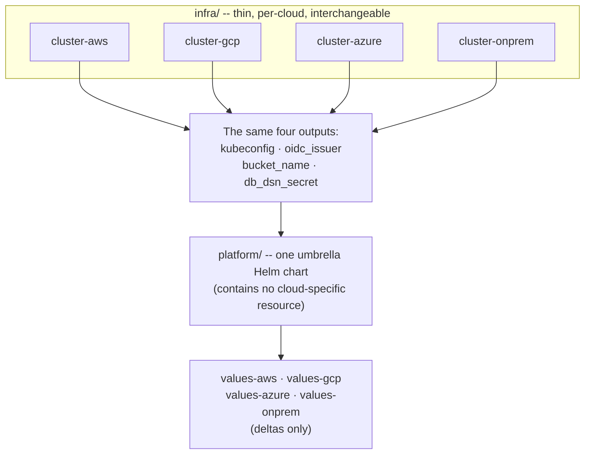
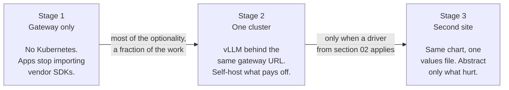
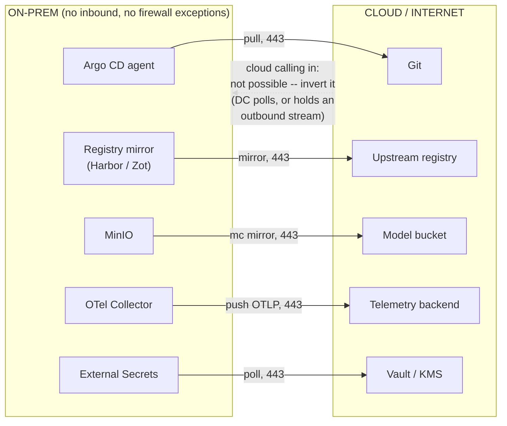
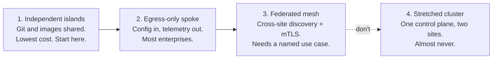
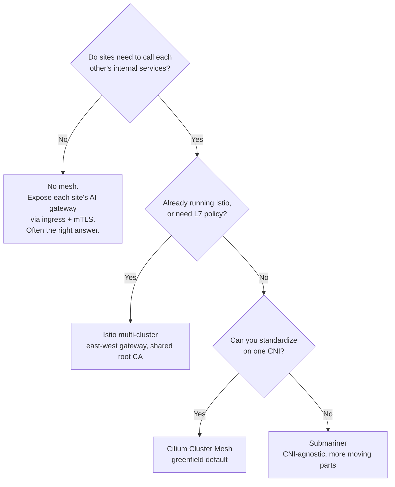
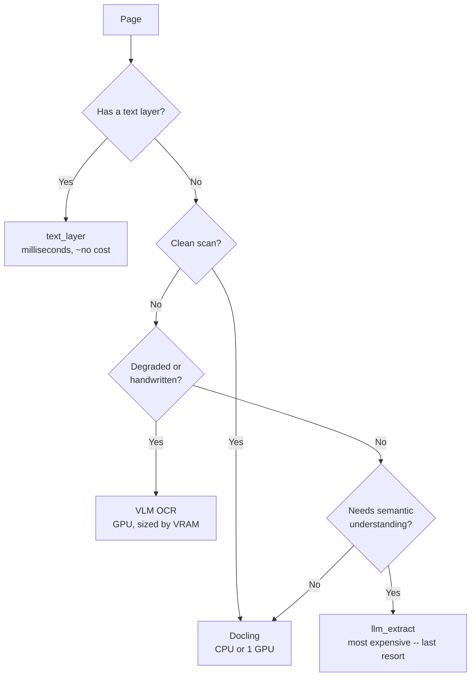
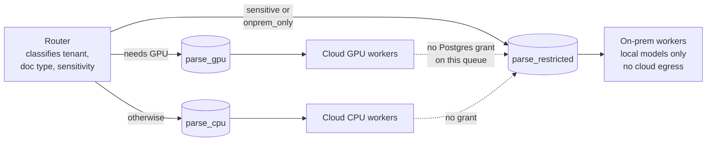
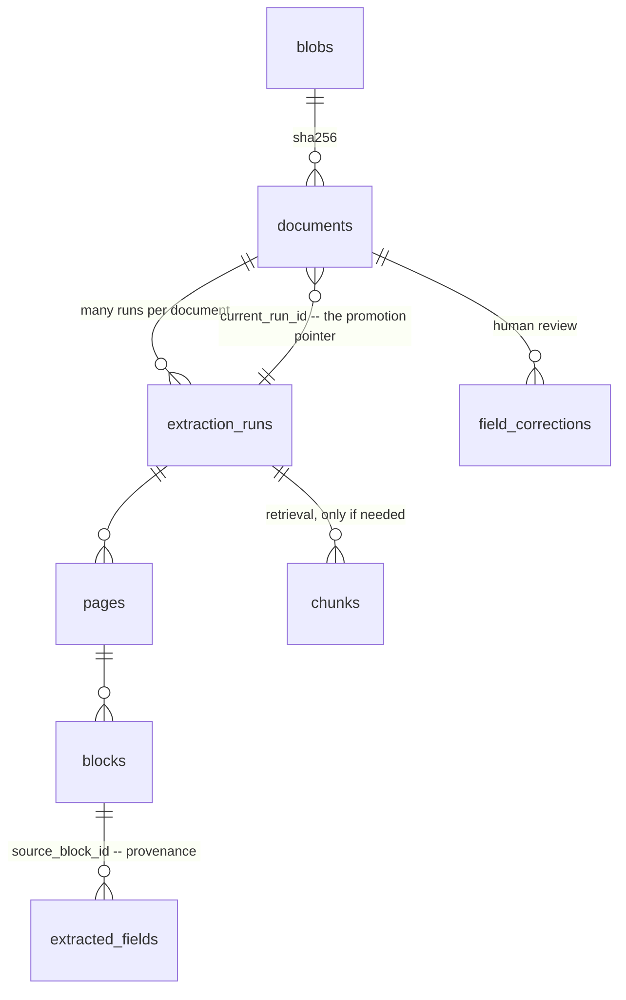
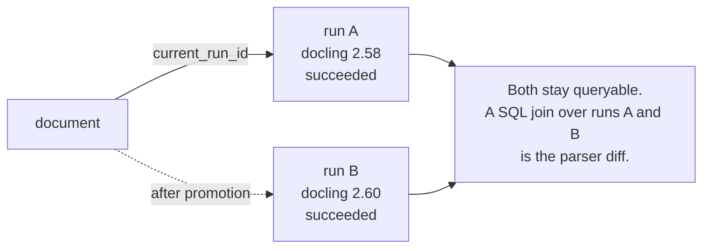

# Running AI on infrastructure you control — a four-post series

**Date:** 2026-08-11
**Status:** design for review, not yet approved
**Sources:** `_originals/portable-ai-platform-guide.md` (6,050 words), `_originals/doc-extraction-platform-gcp-azure-onprem.md` (3,750 words)

## Problem

The site has three AI guides and they are all implicitly cloud-native. `ai-architecture-master-guide`
maps the layers, `model-training-finetuning-eval` covers the model lifecycle, and
`mlops-production-guide` covers running it — but every one of them assumes a managed cloud
underneath. Nothing on the site answers the questions that arrive when that assumption breaks:

- What do you depend on if you need the same AI stack to run on two clouds and in your own
  datacenter?
- How does a locked-down datacenter that accepts no inbound connections participate at all?
- What does a real workload do to the generic architecture when it is throughput work rather than
  low-latency chat?

Two source documents cover this ground and are the highest-value unpublished material in the repo.
Neither is publishable as-is: one duplicates roughly 30% of what the site already says, the other
is written in second person to a specific team.

## Goal

Four Playbooks posts that take an engineer from "should I even build this" to a working portable AI
platform, with the hybrid and on-premises material — absent from the site entirely — as the
centrepiece. Each post readable standalone; the four together form an arc about *where* AI runs,
complementing rather than extending the existing arc about *what* it does.

## Non-goals

- **No duplication of the three existing AI guides.** This is the governing constraint, not a
  preference. See "The de-duplication contract" — every collision has a named resolution and a
  verified anchor to link to instead.
- **No new cover SVGs, no raster images.** Every visual is a Mermaid fence, following
  `ai-architecture-master-guide`'s `Fig NN.N` caption convention.
- **No week-by-week calendar in more than one post.** Both sources carry a timeline; timelines age
  badly and read as consulting boilerplate. One survives, as exit criteria.
- **No fabricated case study.** The earlier idea of a fourth "worked example" post is dropped —
  the repo's standing rule is that nothing is invented, and post 4 is the honest substitute.
- **No new npm dependencies.** Standing repo rule.
- **No push to `origin`.** Publishing stays a separate, explicit decision.

## Audience and entry point

A senior or staff engineer evaluating or building an AI platform, comfortable with Kubernetes and
Terraform, who has a compliance requirement, a sovereign-cloud requirement, or on-premises GPUs
arriving. Explicitly *not* the AI Foundations audience — that series is the low-level ladder for
juniors and mediors, and the two do not overlap in reader or in register.

Post 1 opens by trying to talk most readers out of it. That is deliberate: the honest answer for a
team with one cloud and no compliance driver is "don't", and a series that says so earns the trust
to be believed when it says "here's how".

## Placement

The `guides` collection (labelled **Playbooks**), as a **new `SERIES` entry** — not appended to
"Building and running AI systems".

Rationale: that arc is model-lifecycle-shaped (design, train, operate). This one is
infrastructure-shaped (substrate, topology, workload, data). Appending would produce a seven-post
series that changes subject halfway. A separate series is also the de-duplication mechanism: post 1
names the existing arc as prerequisite reading, which licenses it to skip everything that arc
already establishes.

```ts
// src/consts.ts — append to SERIES, after 'Building and running AI systems'
{
  // Where AI runs, as opposed to what it does. The existing AI arc assumes a
  // managed cloud underneath; this one removes that assumption. Post 2 is the
  // centre of gravity -- hybrid and on-prem appear nowhere else on the site.
  title: 'Running AI on infrastructure you control',
  sectionId: 'guides',
  slugs: [
    'portable-ai-platform-contract',
    'connecting-cloud-and-on-premises',
    'document-extraction-at-scale',
    'extraction-data-modelling-with-provenance',
  ],
},
```

No other plumbing. The `guides` section, its collection, its cover tint and its routing all exist —
this is the cheap case, unlike the AI Foundations section.

### Covers

All 22 motifs in `src/motifs.ts` are currently used exactly once. These four are second uses; no new
SVGs, per the standing rule.

| Post | `cover` | Why |
|---|---|---|
| 1 | `cloud` | The substrate argument |
| 2 | `network` | Connectivity is the whole post |
| 3 | `pipeline` | Queue-driven throughput work |
| 4 | `config` | Schema as the durable artifact |

### Tags

Reuse existing tags where they exist, so tag-based "Keep reading" connects the new posts to the old
ones without any manual cross-linking.

| Post | Tags |
|---|---|
| 1 | `ai-platform`, `kubernetes`, `portability`, `cloud-infrastructure` |
| 2 | `hybrid-cloud`, `kubernetes`, `networking`, `on-premises` |
| 3 | `document-extraction`, `ai-platform`, `kubernetes`, `postgres` |
| 4 | `postgres`, `data-modelling`, `document-extraction`, `provenance` |

`cloud-infrastructure` is on `mlops-production-guide`; `networking` is on
`network-connectivity-for-managed-database-platforms`. Those two tags do the connective work.

---

## The de-duplication contract

Eleven collisions between the sources and published content. Every anchor below was verified against
`dist/` on 2026-08-11. **A writer working on these posts may not restate any left-column topic —
link the middle column and write only the right column.**

| Source topic | Already published at | What the new post may say |
|---|---|---|
| AI gateway as key abstraction (A §5) | `/guides/ai-architecture-master-guide/#model-gateway-pattern` and `#multi-cloud-ai-patterns` (has its own diagram) | Only the portability angle: one in-cluster URL so app code never imports a vendor SDK; the Envoy AI Gateway CRD vs LiteLLM choice. Not what a gateway is or does. |
| Cost and GPU efficiency, 8 levers (A §10) | `/guides/mlops-production-guide/#11--cost-optimization` — 9-lever table. **Six of the eight are already there** | Two only: Kueue fair-share queueing, and KV-cache as the real capacity ceiling via `--max-model-len` / `--gpu-memory-utilization`. |
| vLLM / TGI / Triton comparison | `/guides/mlops-production-guide/#serving-runtimes-for-llms` — already names vLLM the 2026 default | Cite it. New material is the layer above: KServe as control plane, `InferenceService`, RawDeployment vs the Knative dependency. |
| Buy-vs-build / self-host economics (A §10.8) | `/guides/ai-architecture-master-guide/#13--infrastructure--serving` — has the monthly-spend crossover callout | Cut. Link only. |
| Canary and traffic splitting | `/guides/mlops-production-guide/#07--release-strategies-for-models` | One clause noting KServe does this natively, then link. |
| Train on one cloud, serve on another (A §7.5) | `/guides/ai-architecture-master-guide/#multi-cloud-ai-patterns` — first bullet | Frame as the hybrid variant: fine-tune on rented GPUs, ship weights down to the DC once. An extension, not a restatement. |
| Security and governance (A §9) | `/guides/mlops-production-guide/#12--security--governance` — versioning, RBAC, lineage, audit, model cards, supply chain, prompt injection, EU AI Act | Four K8s-native controls only: SPIFFE workload identity, External Secrets Operator, Kyverno plus cosign admission, per-site residency as enforced policy. |
| Quantization | Twice: mlops §11 and `model-training-finetuning-eval` §08 | One line, link. |
| Distributed training, KubeRay (A tiers) | `model-training-finetuning-eval` — LoRA, distributed training, frameworks | One line. Source A's own advice is that fine-tuning is cheaper to rent than to operate; lean on that. |
| Evaluation generally | arch §10, `model-training-finetuning-eval` §07 | Only the new angle: diffing two parser versions over one corpus with a SQL join *is* the harness (post 4). |
| OpenTofu module discipline (A rule 5) | `/engineering/multi-cloud-terraform-vs-pulumi/` — when multi-cloud is worth it, Terraform vs Pulumi | Do not re-argue tool choice or whether to go multi-cloud. One new claim: every per-cloud module exposes *identical outputs*. |

**Consequence on sizing.** Source A absorbs nearly the whole de-duplication cost; source B is
almost entirely new ground.

| # | Post | Source | De-dup loss | Target words |
|---|---|---|---|---|
| 1 | The portability contract | A §0–5, §9–11 | ~30% | 2,000 |
| 2 | Connecting cloud and on-premises | A §7–8 | ~0% | 2,400 |
| 3 | Document extraction at scale | B §1–4, §6–8 | ~5% | 2,400 |
| 4 | Extraction data modelling with provenance | B §5 | 0% | 1,800 |

Post 1 therefore changes character: less stack survey, more "should you, and what is the cheapest
first step". The stack survey is what `mlops-production-guide` already is.

---

## The six additions

Neither source contains these. They are the difference between publishing the documents and
publishing something better than the documents.

**1. The portability tax (post 1, section 02 — near the front).** Source A never costs out its own
recommendation. What the contract costs: managed Bedrock/Vertex features you forgo, autoscaling
sophistication you rebuild, N-2 Kubernetes support because on-premises upgrades slowly, and an
operator burden spanning Kubernetes, GPU drivers, CSI and possibly a mesh. Then the three drivers
that justify it — regulatory data residency, a sovereign-cloud requirement, real on-premises GPU
capital — against the three that don't: unspecific lock-in anxiety, negotiating leverage, "we might
need to move someday". Source A's own question 7 is the line to build on: *if the answer to "who
operates this at 3 a.m." is two people who also have other jobs, cut the stack to Tier 0 and stop.*
It is currently the last item of the last section; it belongs early. Cross-link
`/engineering/multi-cloud-terraform-vs-pulumi/`, which makes the same argument for infrastructure
tooling.

**2. Gateway first, Kubernetes later, maybe never (post 1, section 03).** Both sources are
greenfield; no reader is. Source A calls the gateway the single most important piece for portability,
then sequences it as step 5 of 8, after a local cluster, an umbrella chart, GPU enablement and
KServe. Invert it: a gateway in front of Bedrock, with no Kubernetes anywhere, captures most of the
optionality for a fraction of the work, and rule 2 (no vendor SDK in application code) is the one
rule that pays off immediately and independently of the other seven. This is what makes the series
usable by people who will never build the full stack. Carries Fig 1.2.

**3. What breaks first (all four posts, as a closing numbered section).** Source A's failure content
is one sentence about StorageClasses. Source B §8 is the model to follow — symptom, cause, fix.
Post 2 needs it most and has none: overlapping CIDRs discovered after the clusters exist, MTU
mismatches that break only large payloads, trust-domain and certificate misconfiguration that fails
asymmetrically, a mesh pinned incompatibly against a Kubernetes upgrade.

**4. Multi-tenancy (post 1, section 07).** Currently one table row — "namespace per tenant plus
ResourceQuota plus Kueue ClusterQueue plus gateway virtual keys" — for what is the common case of an
internal platform: noisy neighbours on shared GPUs, quota versus borrowing, per-tenant cost
attribution, model isolation.

**5. The DR claim needs qualifying (post 1, section 06).** Source A asserts any site can be rebuilt
from Git plus object storage. Postgres holds job state, application state and vectors, and none of
that is in Git or the bucket. Either qualify the claim or make the backup path
([pgBackRest](https://pgbackrest.org/) to S3, currently a passing mention in a tier table)
load-bearing and explicit. A reviewer will catch this; better to fix it deliberately.

**6. The no-GPU path (post 3, section 03).** Many readers assume no GPUs disqualifies them. Source B
has the best line in either document on it — Docling's CPU path is what makes the on-premises
compliance story viable without GPUs — buried in a risk list. Pair it with a concrete smallest-useful
version: k3s on one machine, CPU parsing, Postgres, no mesh, no KServe.

### The framing thread: portability you cannot verify is not portability

Source A's last anti-pattern: *"Without automated evals in CI, you cannot safely upgrade a model,
and your 'portable' platform is frozen on whatever you deployed first."* Source B's risk 5:
*"without an eval set you can never safely upgrade a parser — your 'portable' platform freezes on
whatever you deployed first."*

Two documents written for different purposes independently reach the same sentence, scare quotes
included, and in both it is a footnote. That is the series' actual argument and it should be
promoted: post 1 states it as the condition that makes the contract mean anything, post 4
mechanizes it. It cannot become a general evals post — arch §10 and the training guide §07 own that
ground — but this angle is untouched.

---

## Post 1 — The portability contract

**Slug:** `portable-ai-platform-contract`

```yaml
---
title: "The Portability Contract: Running the Same AI Stack Anywhere"
description: "What you actually depend on if an AI platform has to run on two clouds and in your own datacenter — the eight rules, what portability costs, and why the gateway comes first and Kubernetes second."
pubDate: 2026-08-11
tags: ["ai-platform", "kubernetes", "portability", "cloud-infrastructure"]
cover: cloud
---
```

Italic intro, first person, one or two sentences, matching the other guides.

| H2 | Content | Source |
|---|---|---|
| `## 01 — The Contract, In One Line` | OCI containers, Kubernetes, OpenAI-compatible HTTP, S3-compatible storage, OpenTelemetry, Postgres/pgvector, GitOps. Then the fork: serving vs training vs applications, and the advice to start at serving and add applications. | A §0–1 |
| `## 02 — What Portability Costs` | **Addition 1.** The tax, then the three drivers that justify it and the three that don't. Ends on the 3 a.m. question. | new |
| `## 03 — Start With the Gateway, Not the Cluster` | **Addition 2.** The incremental path. Rule 2 pays off alone. Fig 1.2. | new |
| `## 04 — The Eight Rules` | The rules as the spine. Rule 5's contribution is narrowed to identical module outputs per the de-dup contract; rule 8 (no inbound, ever) is stated here and deferred to post 2. | A §2 |
| `## 05 — The Shape of a Site` | Sites as peers, not hub and spokes. Fig 1.1. Repository layout, and the discipline that `platform/` never contains a cloud-specific resource. | A §3, §5 |
| `## 06 — What "Rebuild From Git" Actually Means` | **Addition 5.** Honest DR: what is genuinely in Git, what is not, and what the backup path has to be. | new |
| `## 07 — Many Teams, One Platform` | **Addition 4.** Multi-tenancy: quotas, borrowing, cost attribution, isolation. | new |
| `## 08 — Two Levers the Other Guides Don't Cover` | Kueue fair-share queueing; KV-cache as the capacity ceiling. Everything else links to mlops §11. | A §10, narrowed |
| `## 09 — What Breaks First` | **Addition 3.** Missing StorageClass, unschedulable GPU node, unreachable registry, weights exceeding ephemeral storage. | A §6 + new |
| `## 10 — Anti-Patterns` | Source A §11, minus the two that duplicate published content. | A §11 |
| `## 11 — Questions That Change the Design` | Source A §13's seven questions, which route the reader to posts 2, 3 and 4. | A §13 |
| `## Tools and Further Reading` | Reference table. | new |

Source A §13's questions currently close the document. Moving them here, at the end of post 1 but
*before* the rest of the series, makes them a router rather than an afterthought.

### Fig 1.1 — The identical-outputs contract

The mechanism that makes one chart install anywhere: per-cloud modules differ internally and are
interchangeable externally.



### Fig 1.2 — The adoption ladder

Addition 2, as a diagram. Each stage is independently useful, which is the point.



---

## Post 2 — Connecting cloud and on-premises

**Slug:** `connecting-cloud-and-on-premises`

The flagship. Survives de-duplication intact, and source A itself says to budget more time here
than for everything else combined.

```yaml
---
title: "Connecting Cloud and On-Premises: The Part That Actually Takes the Time"
description: "Hybrid AI platforms fail at the network boundary, not the model layer — outbound-only architecture, CIDR planning, choosing between Cilium Cluster Mesh, Istio and no mesh at all, and portable identity across the edge."
pubDate: 2026-08-11
tags: ["hybrid-cloud", "kubernetes", "networking", "on-premises"]
cover: network
---
```

| H2 | Content | Source |
|---|---|---|
| `## 01 — Assume No Inbound Connectivity, Ever` | The premise. Firewall change requests are where hybrid projects die, and the constraint is a feature: it forces an architecture that is also more secure. Fig 2.1. | A rule 8, §7.6 |
| `## 02 — Pick a Topology First` | Four patterns as an escalation ladder, with stretched clusters marked as don't. Start at 1 or 2; graduate to 3 only against a named use case. Fig 2.2. | A §7.1 |
| `## 03 — CIDR Planning, Or a Rebuild Later` | The non-negotiable prerequisite. Overlapping RFC1918 between a datacenter and a VPC is the most common hybrid blocker and retrofitting means rebuilding clusters. | A §7.2 |
| `## 04 — Getting IP Reachability` | WireGuard mesh, tunnels, IPsec, dedicated interconnect — in order of increasing commitment. | A §7.2 |
| `## 05 — Cross-Cluster Service Discovery` | Cilium Cluster Mesh as the greenfield default, Istio multi-cluster if already invested, Submariner when the CNI cannot be standardized, and **no mesh at all** — which is often correct and dramatically easier to operate. Fig 2.3. | A §7.3 |
| `## 06 — Identity Across the Boundary` | Cloud IAM stops at the cloud's edge. SPIFFE/SPIRE trust-domain federation; policies referencing workload identity rather than IP ranges. Human identity federated to one OIDC provider. | A §7.4 |
| `## 07 — Move the Compute, Not the Data` | Inference at the data; embed and index locally; train in cloud and serve on-premises; cache at the boundary; watch egress. Note vectors are partially invertible and should be treated as sensitive. | A §7.5 |
| `## 08 — The Locked-Down Datacenter Checklist` | The five outbound channels, and the one thing that is impossible plus how to invert it. | A §7.6 |
| `## 09 — Air-Gap as a First-Class Path` | Mirroring images by parsing the chart rather than hand-maintaining a list; bundle, checksum, sign; test the air-gap install in CI from day one. | A §8 |
| `## 10 — What Breaks First` | **Addition 3.** CIDR overlap found late; MTU mismatch that breaks only large payloads; trust-domain and certificate errors that fail asymmetrically; mesh version pinned against a Kubernetes upgrade; a registry mirror that silently stops syncing. | new |
| `## Tools and Further Reading` | Reference table. | new |

### Fig 2.1 — Outbound-only, and the one thing that is impossible

The core mechanism of the post: five channels out, nothing in.



### Fig 2.2 — Topology as an escalation ladder



### Fig 2.3 — Choosing a service-connectivity mechanism

Pick one. Not two.



---

## Post 3 — Document extraction at scale

**Slug:** `document-extraction-at-scale`

The workload post. Its job is to show a real workload *bending* the generic architecture — source
B's opening table is the best structural idea in either document.

```yaml
---
title: "When the Workload Isn't Chat: Document Extraction on a Portable Platform"
description: "What changes when AI work is throughput rather than conversation — the parser is the swappable seam instead of the model, queues replace serving, and residency gets enforced by queue topology rather than application code."
pubDate: 2026-08-11
tags: ["document-extraction", "ai-platform", "kubernetes", "postgres"]
cover: pipeline
---
```

| H2 | Content | Source |
|---|---|---|
| `## 01 — Four Things That Change` | The divergence table, rewritten in third person. What you do *not* need — KServe, Kubeflow, Ray, a service mesh, a vector database — is the biggest win available. | B §0 |
| `## 02 — The Parser Is the Swappable Seam` | The `DocumentParser` protocol as the most important 40 lines in the system. The OCR field churns monthly; the abstraction buys A/B testing, fallback and replacement without touching downstream code. | B §2 |
| `## 03 — Choosing a Parser, Including With No GPUs` | The parser table with licensing as a first-class column. **Addition 6.** CPU-only viability as the thing that makes the compliance story work. Licensing traps get named precisely and pointed at the actual licences, never paraphrased. | B §2 + new |
| `## 04 — The Routing Ladder` | Run the cheapest path that works. Fig 3.1. The economics argument, with the numbers handled per the verification list below. | B §2 |
| `## 05 — Storage Across Three Backends` | Abstract in Python with `fsspec`, not at the protocol layer, because Blob is not S3-native. One environment variable is the whole difference. Credentials from the platform, never from code. | B §3 |
| `## 06 — Postgres as the Queue` | `pgmq` or `SELECT ... FOR UPDATE SKIP LOCKED`. The decisive argument: KEDA has a native PostgreSQL scaler, so queue-driven GPU autoscaling is identical on every cloud and on bare metal. Scale-to-zero is the biggest cost lever here. | B §4 |
| `## 07 — Residency by Queue Topology` | Enforce at the queue, not in application logic: application checks get bypassed, queue topology cannot be. Postgres role grants, absent config in the on-premises values file, default-deny egress, and a `site` column as the audit answer. Fig 3.2. | B §6 |
| `## 08 — The GKE / AKS / On-Prem Delta` | Ninety percent of the chart is shared. The seven differences, and the argument for ingress-nginx plus the GPU Operator everywhere rather than each cloud's native option. | B §7 |
| `## 09 — What Breaks First` | Source B §8 nearly as-is; it is already in the right format. Content-hash caching, per-document timeouts with fallback rather than dropping, page-range splitting, idempotent workers, pre-baked models, memory over latency. | B §8 |
| `## 10 — Sequencing` | The surviving build order, as exit criteria without the calendar. | B §9 |
| `## Tools and Further Reading` | Reference table. | new |

### Fig 3.1 — The routing ladder



The first branch is close to free: a text-layer check is one call and no model. That is why the
ladder starts there.

### Fig 3.2 — Residency as queue topology



The dotted lines are the enforcement: cloud workers have no grant on the restricted queue, so the
boundary holds at the database rather than in a code path someone can bypass.

---

## Post 4 — Extraction data modelling with provenance

**Slug:** `extraction-data-modelling-with-provenance`

The most reusable material in either source, currently buried mid-document. Useful to anyone doing
document AI regardless of cloud or parser, which makes it the widest-reach post of the four.

```yaml
---
title: "Data Modelling for Document Extraction: Provenance, Versioning, Promotion"
description: "The Postgres schema that lets you re-extract a corpus with a new parser, compare both versions in SQL, promote atomically and roll back with one UPDATE — with every extracted value tracing back to a page and a bounding box."
pubDate: 2026-08-11
tags: ["postgres", "data-modelling", "document-extraction", "provenance"]
cover: config
---
```

| H2 | Content | Source |
|---|---|---|
| `## 01 — Four Design Commitments` | Content-addressed documents; immutable versioned runs; provenance on every value; JSONB for raw and columns for queried. | B §5 |
| `## 02 — The Six Layers` | The schema, layer by layer. Fig 4.1. | B §5 |
| `## 03 — Promotion: The Pattern That Saves You` | Re-extract, compare, promote in a transaction. Old runs stay queryable, rollback is one `UPDATE`, and diffing two parsers over one corpus is a plain SQL join. Fig 4.2. | B §5 |
| `## 04 — That Join Is Your Eval Harness` | The framing thread, mechanized. Without it, the platform freezes on whatever was deployed first — which is what makes the whole portability argument conditional. | new |
| `## 05 — Corrections Are Three Assets` | Audit trail, eval set and training data from one table. Reads go through a view so application code never knows about runs, promotion or corrections. | B §5 |
| `## 06 — Scale, Honestly` | Partitioning as row counts grow; pgvector's real limits and the failure mode that actually bites (tenant filters destroying recall, not raw scale); re-embedding churn as the likely pain point. | B §5 |
| `## 07 — When Analytics Turns Up` | Keep the operational schema as source of truth and build marts on top with dbt. Don't let BI requirements distort the extraction schema. | B §5 |
| `## 08 — What Breaks First` | **Addition 3.** Unbounded `blocks` growth; a promotion that half-succeeded; corrections orphaned by a re-extract; HNSW rebuild time discovered during an upgrade. | new |
| `## Tools and Further Reading` | Reference table. | new |

### Fig 4.1 — Six layers, and the promotion pointer



The second relationship is the one that matters: `documents.current_run_id` points *back* at one run
out of many, so promotion and rollback are pointer moves rather than data rewrites.

### Fig 4.2 — Promotion and rollback



---

## Numbers: verify, attribute, soften, or cut

Both sources are dense with figures that are citations to other people's benchmarks presented as
fact. The repo's standing rule is that nothing is invented, and an earlier proofread pass on this
site removed three invented specifics — so the bar is real. **No figure below ships until it is
resolved.**

| Claim | Source | Resolution |
|---|---|---|
| GPU utilization 25–35% without fair-share queueing, 60–85% with | A §6, §10 | **Load-bearing and unsourced.** Needs a named citation or it becomes directional: "commonly leaves large amounts of capacity idle; fair-share queueing is the highest-leverage fix." |
| LiteLLM supply-chain compromise, late March 2026 | A §4 | **Verify or cut.** A dated security allegation about a named project does not ship on assertion. The surrounding advice — pin digests, vendor images, verify signatures regardless of gateway — stands on its own and should be kept either way. |
| Self-hosted VLM OCR $140–$700 per million pages; cloud vision $1,500+; 167× cheaper | B §2 | Cut the precision. Keep the shape: self-hosting is dramatically cheaper per page at volume, and the ladder is where cost lives. If any single figure is kept, attribute it inline to its published source. |
| olmOCR-2 near $178 per million pages on an H100 | B §2 | Attribute to the project's own published figure with a link, or cut. |
| DeepSeek-OCR 200k+ pages/day on one 40 GB A100 | B §2 | Vendor claim. Attribute explicitly or cut. |
| RT-DETR above 85% mAP on DocLayNet; TableFormer TEDS above 91% on FinTabNet | B §2 | Attribute to the Docling technical report with a link, or cut. The advice that follows — benchmark on your own documents — is the actual lesson and needs no number. |
| Born-digital PDFs 50–70% of enterprise corpora | B §2 | Unsourced. Soften to "frequently the majority". |
| Marker ~3–5 GB per worker; MinerU-class ≥8 GB VRAM; VLMs 3–8+ GB | B §2, §4 | Soften to "measure peak VRAM under real batch sizes and set replica limits from that". The method is the point, not the figure. |
| pgvector comfortable to ~10M, workable to 50–100M, 6+ hour HNSW rebuilds | B §5 | Attribute or soften. Keep the failure-mode claim (tenant filters destroying recall) — that is the useful part and it is a documented behaviour, not a benchmark. |
| `blocks` grows 50–200 rows per page | B §5 | Soften to "tens to low hundreds". |
| 80% of failed installs are a missing StorageClass, unschedulable GPU node, or unreachable registry | A §8 | Cut the percentage, keep the list — it is a good preflight checklist regardless. |
| Working stack in 1–2 days; production topology in 6–10 weeks | A §0 | Cut. Unverifiable, and the kind of estimate that ages worst. |
| A 70B in bf16 needs ~144 GB | A §6 | **Keep, showing the arithmetic** — 70 billion parameters at 2 bytes each is ~140 GB. Derived, not borrowed. |
| IPsec ~1.25 Gbps per tunnel; dedicated interconnect 1–100 Gbps | A §7.2 | Both are vendor-documented. Link the provider documentation or state as "roughly". |
| FP8/INT8/AWQ cuts memory 2–4× | A §10 | Already published in mlops §11 with the same range. Cite the site's own post rather than restating. |
| Chart versions: KServe `0.15.*`, Docling `2.58.0` / `2.60.0` | A §6, B §5 | Fine as illustrative values inside code blocks. Do not assert them as current. Both posts carry the sources' closing note that this ecosystem moves fast and manifests should be treated as structurally correct patterns verified against the pinned version. |

## Anonymization

Source A is already generic. Source B is not — it is written to a specific team about a specific
project and needs a rewrite pass before any of it ships. Per the standing constraint, this is
achieved by writing generically, **not** by adding a disclaimer or a note about sanitization.

The distinction that matters: generic second person is fine and on-voice — the published guides
already say things like "you're making trade-off decisions". What must go is second person that
presupposes a specific reader's environment.

| Source B as written | Rewrite |
|---|---|
| Subtitle: "Python · Kubernetes · GCP + Azure + on-prem · PDF/document extraction · Postgres" | Cut. The frontmatter description does this job generically. |
| Table header "Your version" | "Extraction-shaped version" |
| "Your constraints move four things" | "Four things change" |
| "You're already modelling in Postgres" | "When Postgres is already central" |
| "You do not need / You do need" | Third person: "This architecture does not need..." |
| "§10 Things I'd flag as risks in your specific setup" | "Where this design goes wrong" |
| "your documents", "your corpus", "your likely volume" | "the corpus", "representative documents", "at volume" |
| "If on-prem has no GPUs" (as a known fact about the reader) | Reframed as the branch it is — Addition 6 |

**One judgment call for Riddam.** The combination of document extraction, GCP plus Azure plus
on-premises, and Postgres is specific enough to read as a real project. Framing post 3 as a worked
design rather than a case study handles this — the guides are already written as teaching material
("the guide I wish I'd had"), not as "what I built" — and I would keep GCP and Azure named, since
they are the obvious non-AWS pair and it reads as instruction. Flagging it rather than deciding it.

## Tools and further reading

Every URL below returned HTTP 200 on **2026-08-11**. Two are unlinkable and noted as such. Cite
tools inline at first mention, and close each post with the subset it actually used — not this whole
table.

### Substrate and delivery (post 1)

| Tool | Link |
|---|---|
| Kubernetes Gateway API | https://gateway-api.sigs.k8s.io/ |
| Helm | https://helm.sh/docs/ |
| OpenTofu | https://opentofu.org/docs/ |
| Argo CD | https://argo-cd.readthedocs.io/en/stable/ |
| Argo Workflows | https://argoproj.github.io/workflows/ |
| Cluster API | https://cluster-api.sigs.k8s.io/ |
| k3d | https://k3d.io/ |
| RKE2 | https://docs.rke2.io/ |
| Talos Linux | https://www.talos.dev/ |
| Pod Security Standards | https://kubernetes.io/docs/concepts/security/pod-security-standards/ |

### Serving, scheduling, GPUs (post 1)

| Tool | Link |
|---|---|
| KServe | https://kserve.github.io/website/ |
| KServe source | https://github.com/kserve/kserve |
| vLLM | https://docs.vllm.ai/en/latest/ |
| NVIDIA Triton | https://docs.nvidia.com/deeplearning/triton-inference-server/user-guide/docs/index.html |
| llama.cpp | https://github.com/ggml-org/llama.cpp |
| Kueue | https://kueue.sigs.k8s.io/docs/ |
| Volcano | https://volcano.sh/en/docs/ |
| NVIDIA GPU Operator | https://docs.nvidia.com/datacenter/cloud-native/gpu-operator/latest/index.html |
| KEDA PostgreSQL scaler | https://keda.sh/docs/latest/scalers/postgresql/ |
| Knative | https://knative.dev/docs/ |
| Ray on Kubernetes (KubeRay) | https://docs.ray.io/en/latest/cluster/kubernetes/index.html |
| Kubeflow Trainer | https://www.kubeflow.org/docs/components/trainer/ |
| Flyte | https://docs.flyte.org/en/latest/ |
| MLflow | https://mlflow.org/docs/latest/index.html |

### Gateway, security, observability (posts 1 and 2)

| Tool | Link |
|---|---|
| Envoy AI Gateway | https://aigateway.envoyproxy.io/docs/ |
| LiteLLM | https://docs.litellm.ai/ |
| Anthropic API | https://docs.anthropic.com/en/api/overview |
| SPIFFE | https://spiffe.io/docs/latest/spiffe-about/overview/ |
| SPIRE | https://spiffe.io/docs/latest/spire-about/ |
| External Secrets Operator | https://external-secrets.io/latest/ |
| Kyverno | https://kyverno.io/docs/ |
| Sigstore cosign | https://docs.sigstore.dev/cosign/signing/overview/ |
| OpenTelemetry | https://opentelemetry.io/docs/ |
| Prometheus | https://prometheus.io/docs/introduction/overview/ |
| Grafana | https://grafana.com/docs/grafana/latest/ |
| Langfuse | https://langfuse.com/docs |
| Arize Phoenix | https://docs.arize.com/phoenix |
| Presidio | https://microsoft.github.io/presidio/ |

### Connectivity (post 2)

| Tool | Link |
|---|---|
| Cilium Cluster Mesh | https://docs.cilium.io/en/stable/network/clustermesh/clustermesh/ |
| Istio multi-cluster | https://istio.io/latest/docs/setup/install/multicluster/ |
| Submariner | https://submariner.io/getting-started/ |
| ingress-nginx | https://kubernetes.github.io/ingress-nginx/ |
| Tailscale | https://tailscale.com/kb/ |
| Headscale | https://github.com/juanfont/headscale |
| NetBird | https://docs.netbird.io/ |
| Harbor | https://goharbor.io/docs/ |
| Zot registry | https://github.com/project-zot/zot |
| Skopeo | https://github.com/containers/skopeo |
| MinIO `mc mirror` | https://min.io/docs/minio/linux/reference/minio-mc/mc-mirror.html |
| Hugging Face Hub | https://huggingface.co/docs/hub/index |

### Data layer (posts 3 and 4)

| Tool | Link |
|---|---|
| CloudNativePG | https://cloudnative-pg.io/documentation/current/ |
| pgBackRest | https://pgbackrest.org/ |
| pgvector | https://github.com/pgvector/pgvector |
| pgvectorscale | https://github.com/timescale/pgvectorscale |
| pgmq | https://github.com/tembo-io/pgmq |
| MinIO | https://min.io/docs/minio/kubernetes/upstream/index.html |
| fsspec | https://filesystem-spec.readthedocs.io/en/latest/ |
| dbt Postgres adapter | https://docs.getdbt.com/docs/core/connect-data-platform/postgres-setup |
| Qdrant | https://qdrant.tech/documentation/ |
| Milvus | *No link — `milvus.io` returns 403 to non-browser clients. Name it, or link* https://github.com/milvus-io/milvus |

### Document parsing (posts 3 and 4)

| Tool | Link |
|---|---|
| Docling | https://docling-project.github.io/docling/ |
| Docling source | https://github.com/docling-project/docling |
| PyMuPDF | https://pymupdf.readthedocs.io/en/latest/ |
| pypdfium2 | https://github.com/pypdfium2-team/pypdfium2 |
| Marker | https://github.com/datalab-to/marker |
| MinerU | https://github.com/opendatalab/MinerU |
| olmOCR | https://github.com/allenai/olmocr |

**Licensing must be linked, never paraphrased.** PyMuPDF is AGPL and commonly missed in review;
Marker combines GPL-3.0 code with restricted model weights. Point at each project's own licence
file and let the reader read it — do not restate a revenue threshold or a permission from memory.

## Cross-linking

Inbound, so the new series is reachable from what already exists:

- `ai-architecture-master-guide` §15 (`#multi-cloud-ai-patterns`) gains one line pointing at post 1.
  That section is the closest published material to this series' thesis.
- `mlops-production-guide` §05 (`#05--cloud-infrastructure-selection`) gains one line pointing at
  post 2 for the on-premises and hybrid case it does not cover.
- `multi-cloud-terraform-vs-pulumi` gains one line pointing at post 1 from the multi-cloud
  strategy discussion.

Three one-line edits, no restructuring. Outbound links are already specified per post in the
de-duplication contract.

## Verification

Beyond the standard build:

```bash
npm test                       # the consts sync test must still pass
npm run build                  # never bare astro build -- Pagefind
ls dist/pagefind/pagefind.js
```

Then, per post:

```bash
P=dist/guides/<slug>/index.html
ls $P dist/og/guides/<slug>.png
grep -o 'Running AI on infrastructure you control' $P | head -1   # series nav matched the slug
grep -c 'mermaid' $P                                              # diagrams present
grep -c '<item>' dist/guides/rss.xml
grep -nP '[\x{1F300}-\x{1FAFF}\x{2600}-\x{27BF}]' src/content/guides/<slug>.md || echo "no emoji"
```

Two checks specific to this series:

1. **Every external link resolves.** Re-run the URL verification at write time, not just today —
   this table has a shelf life. Any 404 gets fixed or the link gets dropped.
2. **Every de-duplication anchor resolves.** The eleven anchors in the contract table were verified
   against `dist/` on 2026-08-11; re-check before committing, since a heading edit in an existing
   guide would silently break them.

## Risks

- **Post 1 may not survive its own de-duplication.** It loses ~30% and its remaining spine is the
  eight rules plus four new sections. If it reads thin at 2,000 words, the fallback is merging it
  into post 2 and shipping three posts — the hybrid material is strong enough to open a series.
- **The numbers table is most of the work.** Fourteen entries, several requiring a source hunt. If
  sourcing fails, the directional rewrites are all specified, so this delays rather than blocks.
- **Post 3 and 4 share a domain the site has never touched.** Document extraction is a narrower
  topic than anything currently published. Post 4 mitigates this by being useful independent of the
  parser and the cloud, but the pair is a bet that the specificity reads as depth rather than as a
  detour.
- **Motif reuse.** Four second uses, distinguished only by nothing — same section, same tint as the
  existing guides. Unlike the AI Foundations case there is no new colour to separate them, so two
  `cloud`-motif Playbooks covers will look identical in listings. Worth a visual check, and worth
  Riddam deciding whether it matters.

## Open questions

1. **Series title.** "Running AI on infrastructure you control" — or something shorter.
2. **Three posts or four?** See the first risk. My recommendation is four, with post 1 written last
   so its final scope is set by what posts 2–4 actually needed.
3. **Is post 3's domain specificity acceptable?** See "Anonymization", final paragraph.
4. **Queue position.** AI Foundations is eight posts spec'd, one planned, none written. This is four
   more. Which goes first is a scheduling call, not a design one.
