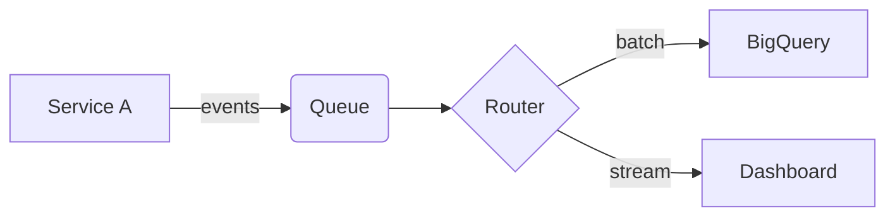

## Start here

This is a draft template — it never appears on the site while `draft: true`.
Write your post in Markdown, starting headings at `##`.

## Images

Put image files in `src/assets/` and reference them with a relative path —
Astro optimizes them at build time:

```markdown

*Captions: put an italic line directly under the image.*
```

(Alternatively, files in `public/images/` are served as-is at `/images/...`.)

## Diagrams

Fenced code blocks with the `mermaid` language render as diagrams:



See mermaid.js.org for flowcharts, sequence diagrams, ER diagrams, and more.
