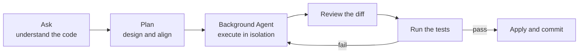
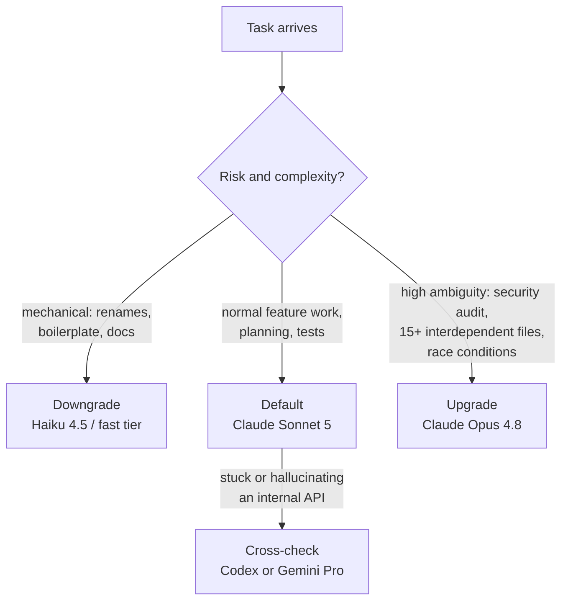

Over the last couple of years I've gone from occasionally accepting an autocomplete to running multi-file agents against real codebases every day. Along the way these tools have saved me genuine hours — and, on the days I got sloppy, handed me confident, subtly wrong code that cost me more hours than they saved. This post is the working discipline I've settled on to get the upside without the regret. It's the guide I'd give a version of myself two years ago.

*My examples lean on the stack I use daily — Python (uv, pytest, click) and TypeScript (AWS CDK) — but every principle transfers. It's written for cloud engineers and early-career developers, and everything here is generic; no employer-specific details.*

The goal is simple: make AI coding assistance **reliable, secure, and low-regret**. These assistants are spectacular accelerators and confident liars, often in the same minute. In my experience the difference between the days they make me faster and the days they quietly make me slower isn't the model — it's the discipline around it.

## TL;DR

**Defaults**

- Default model: **Claude Sonnet 5**
- Default workflow: **Ask → Plan → Agent → Review → Test**
- Rule: small diffs, explicit constraints, always add or verify tests

**Model ladder** (as of 2026 — revisit quarterly, this changes fast)

- Quick tiny edits → **Claude Haiku 4.5** or your provider's fast tier (e.g. Gemini Flash)
- Most coding tasks → **Claude Sonnet 5**
- Multi-file patch + lots of tests → **GPT Codex** (current tier)
- Deep debugging / security review / hardest refactors → **Claude Opus 4.8**
- Second opinion on architecture or algorithms → **Gemini Pro** (current tier)

## 1. What an AI Assistant Is (and Isn't)

Think of Copilot not as a replacement for a developer, but as a highly skilled, tireless intern with a photographic memory and no common sense.

### ✅ What it's good at

- **Accelerating mechanical coding** — boilerplate, wiring up DTOs and interfaces, repetitive edits across large blocks of code.
- **Agentic multi-file scaffolding** — drafting entire feature skeletons: a new API endpoint, its service layer, and its database model in one pass.
- **Generating test matrices** — edge-case matrices, pytest parameterization, and mock setups for legacy code that no human wants to write by hand.
- **Code forensics** — explaining legacy modules, tracing call graphs, finding hidden side effects ("Which functions in this module write to S3?").
- **Constraint-based refactoring** — safe refactors ("rewrite this without changing the public API") when you provide a "golden example" from the repo to mimic.
- **On-the-fly documentation** — README updates, docstrings, and architectural summaries derived directly from code.

### ❌ What it's not

- **An independent architect.** It cannot make high-level design decisions or understand business requirements without explicit context and human steering.
- **A source of truth.** It doesn't "know" your system state — it predicts from what it sees in your open tabs. Outdated tabs produce outdated advice.
- **A replacement for quality gates.** It doesn't replace code review, integration tests, or threat modeling. AI-generated code needs *more* rigorous review, not less.
- **A security expert.** It's a pattern mimic. It will happily suggest insecure patterns — hardcoded credentials, permissive IAM wildcards — because those patterns are everywhere in public training data.
- **An autopilot for high-risk code.** IAM policies, encryption logic, and auth handlers require deep human verification plus specialized tooling (Snyk, Checkov, bandit).

> **The golden rule:** trust the AI for the syntax, trust yourself for the logic and security. If you wouldn't merge a junior developer's code without reading it, don't merge the AI's.

## 2. Modes & Sessions: Choosing How It Thinks and Where It Works

Modern Copilot is no longer a chat box — it's a tiered workflow system. Picking the right **mode** (how it thinks) and **session** (where it works) is the difference between a clean PR and a messy refactor.

### Modes — the "brain" selection

**🧠 Ask (analyze & explore).** For forensics ("trace the call graph of this function"), strategy ("brainstorm test approaches for this module"), and gut checks ("is this IAM policy too permissive?"). Avoid it when you want code written and applied — that's Agent mode.

**📐 Plan (architect & align).** Produces a Markdown plan and checklist of files to touch and tests to add *before* any code changes. Best for multi-file work where you want to review the "Step 1, Step 2…" logic first, and for surfacing side effects early.

**🤖 Agent (autonomous execution).** Implements features spanning multiple layers, applies patterns consistently across folders, and self-heals: it runs tests and linters, reads the errors, and fixes its own code until green.

Guardrails I include in *every* agent prompt:

- "No new dependencies."
- "Limit scope to [specific folder]."
- "Stop and ask for confirmation after each step."
- "Run `uv run pytest` after changes."

### Sessions — the "workspace" selection

- **🟢 New chat** — start fresh for each ticket, or whenever the context feels polluted with old logs. Stale context measurably degrades reasoning.
- **💻 Local (interactive)** — short tasks where you watch every edit in real time. Best for small fixes and tests in the file you're already in.
- **🌑 Background (asynchronous)** — delegated tasks of five-plus minutes ("write 20 integration tests"). The agent works in an isolated Git worktree while you keep coding; you review the diff and apply when done.
- **☁️ Cloud (remote / PR agent)** — large refactors and repo-wide tasks. Runs on remote infrastructure, opens a draft pull request, and assigns you as reviewer.

The workflow I use for 90% of non-trivial tasks:



## 3. Context Window: The AI's Working Memory

AI reliability isn't about model size anymore — it's about **context engineering**. Most tools now show real-time token usage (e.g. `15K / 128K`); learn to read it.

**Why it matters:**

- **Too little context** → the AI guesses your repo patterns: hallucinated internal APIs, generic boilerplate that doesn't fit your stack.
- **Too much noisy context** → "context rot." Models get measurably less accurate when the window fills with irrelevant code, dead logs, and failed attempts.
- **The 80% rule** → when usage climbs past roughly 80% of the limit, compact the conversation or start a new chat.

### Practical context hygiene

**1. Curate your workspace.** The AI weights your active tab and open editors heavily. Keep open: the file you're editing, its test file (the "contract" for success), one golden example of the pattern you want, and config files only when relevant.

**2. Use explicit references.** Don't let it guess which files matter:

> "Implement the logic in #UserService.py following the pattern in #AuthService.py."

**3. Run the "inferred convention" check.** Before letting it write 100 lines, verify its mental model:

> "Before you begin coding, summarize the architectural conventions, naming patterns, and testing libraries you've inferred from my open files. If any convention is unclear, ask me instead of guessing."

**4. Manage session history.** Use `/compact` to summarize the conversation and prune dead context. Switching goals (CLI work → infrastructure work)? New chat. Mixing goals leads to logic leaks.

Think of the context window as working memory: if *you'd* be overwhelmed by 30 open tabs, so is the model.

## 4. Which Model to Use When

The current generation of models is optimized for agentic workflows and long-horizon coding, not just chat. Use a ladder to balance cost, speed, and accuracy — and expect this table to age; revisit whatever your tool offers every quarter.

| Situation | My pick (2026) | Why |
| --- | --- | --- |
| Default daily driver | **Claude Sonnet 5** | Near-frontier quality on coding and agentic work at mid-tier cost. Handles most planning and implementation. |
| Quick tasks / tiny edits | **Claude Haiku 4.5** / fast tier | Surgical for scoped edits, boilerplate tests, renames, and docs — at a fraction of the cost. |
| Multi-file patch + heavy tests | **GPT Codex** (current tier) | Strong instruction-following for structured code output; usefully rigid about provided signatures. |
| Deep debugging / security review / huge refactors | **Claude Opus 4.8** | The heavy artillery: long-horizon autonomy, strongest first-try rate on complex tasks, 1M-token context for sprawling codebases. |
| Second opinion / logic check | **Gemini Pro** (current tier) | A genuinely different model family — useful cross-check on architectural trade-offs and math-heavy algorithms. |

### The escalation strategy

Don't sit on one model all day — switch based on the risk profile of the task:



**Tip:** if your default model keeps hallucinating a specific internal library, try a different family — specialized code models are often more rigid (in a good way) about sticking to the signatures you provide.

## 5. The Contract Model: Why Assistants Become Reliable

Copilot gets "buggy" when it has to guess your architecture. The fix is a **contract-first** approach: bind the AI to the same truth sources humans follow.

### 5.1 System rules (the always-on layer)

Bake non-negotiables into `.github/copilot-instructions.md` (or `AGENTS.md`) so they attach to every request:

- **Dependency discipline** — no new libraries unless explicitly requested.
- **Security hygiene** — never log secrets or print tokens.
- **Atomic changes** — small, incremental diffs; no drive-by refactors.
- **Test-driven execution** — every logic change ships with a test or verification checklist.
- **Infrastructure** — least privilege always; IAM wildcards (`*`) require a comment explaining why, or they get rejected in review.

### 5.2 Repo signals (defining the truth)

Keep these open or reference them with `@` to ground the AI in your actual stack:

| Category | Python (uv) | TypeScript (CDK) |
| --- | --- | --- |
| Build & deps | `pyproject.toml`, `uv.lock` | `package.json`, `tsconfig.json` |
| Quality gates | `ruff.toml`, `.pre-commit-config.yaml` | `eslint.config.js`, `.prettierrc` |
| Test logic | `tests/`, `conftest.py` | `tests/`, `jest.config.js` |
| Conventions | `README.md`, `CONTRIBUTING.md` | `README.md`, `docs/architecture.md` |

### 5.3 The task prompt (ticket-level contract)

When handing a ticket to an agent, include four pillars:

1. **Anchor** — specific file paths and a golden example to mimic.
2. **Behavior** — clear inputs and outputs ("the CLI takes `--json` and returns a flat object").
3. **Constraints** — explicit don'ts ("don't call boto3 directly; use the existing storage wrapper").
4. **Acceptance** — how to verify ("`uv run pytest tests/unit` passes").

**The truth-check prompt**, for when you suspect a hallucinated API:

> "Stop. Check the definitions in #pyproject.toml and the actual module source. Are you using a real method or guessing? If guessing, ask me for the correct import."

## 6. The 4-Part Prompt: A.T.C.D.

**Anchor, Task, Constraints, Done-means.** Without an anchor the AI defaults to "generic internet style"; without exit criteria an agent doesn't know when to stop.

Copy-paste template:

```markdown
# Context: You are acting as a senior engineer in this repository.

### ⚓ ANCHOR
- Primary file: @src/cli/deploy.py
- Reference pattern: follow the argument parsing style in @src/cli/auth.py

### 🎯 TASK
- Goal: [describe the feature or fix]
- Signature: add_record(id: str, data: dict) -> bool
- Business rules: [rule 1], [rule 2]

### 🛡️ CONSTRAINTS
- Dependencies: no new libraries — existing uv / npm packages only
- Security: no PII or secrets in logs; least-privilege IAM
- Style: follow the ruff / eslint config in the repo root
- Diff: minimal changes only; do not refactor unrelated logic

### ✅ DONE MEANS
- [ ] Logic implemented in [path]
- [ ] Unit tests added/updated in [path]
- [ ] Verification: uv run pytest
- [ ] Edge cases handled: empty input, timeout, 403
```

For complex tasks, add a chain-of-thought trigger at the bottom:

> "Before writing any code, explain your reasoning and list the files you intend to modify. Wait for my GO to proceed."

## 7. Prompt Profiles: Choosing Reasoning Intensity

Match the instruction set to the task, like choosing a gear.

### 🚀 Generate (fast)

For atomic edits and one-liners. Ideal model: Haiku 4.5 / fast tier.

> "Minimal diff. Change ONLY the logic inside this function. Do not refactor, do not add comments, do not rename variables. If the fix is more than 5 lines, stop and ask."

### 🛡️ Safe (default)

For daily feature work. Ideal model: Sonnet 5. The rhythm: **plan → you approve → implement one step → verify with tests**. Plan twice, code once.

### 🔍 Forensics (legacy & infrastructure)

For high-stakes areas — legacy modules, complex CDK stacks, IAM logic. Ideal model: Opus 4.8 with thinking. The discovery prompt:

> "Before suggesting any changes, analyze this module: 1) **System map** — key responsibilities. 2) **Side effects** — does this touch S3, a database, or external APIs? 3) **Safe seams** — where is the safest place to inject new logic? 4) **Blast radius** — if this fails, what breaks downstream? Return a bulleted report before proposing code."

**The profile switcher rule:** if a "fast" task starts getting complicated, abort and restart in Safe mode. Hallucinations cluster exactly where a complex problem meets a fast instruction set.

## 8. Prompt Cookbook: Battle-Tested Recipes

### 🔍 Module forensics

> "Analyze this module for a new engineer. Return bullets covering: core mission, the 3 most critical functions and their callers, any AWS / database / filesystem / network touches, which env vars or config files dictate behavior, and the lowest-risk seams for injecting new logic."

### 📐 The plan-act handoff

> "Propose a 4-step implementation plan for [feature] following the patterns in #file. Constraints: no new dependencies, minimal diff, pytest verification. Provide the plan first — do not write code. Once I approve, implement step 1 only."

### 🧪 Pytest matrix & parameterization

> "Given this function, propose a pytest test matrix covering happy paths, boundaries (max/min, empty strings, None), and error propagation (403s, timeouts). Write the tests with @pytest.mark.parametrize and fixtures from #conftest.py. Strictly no network calls — mock all AWS and external APIs."

### 🖱️ Click CLI testing

> "Write pytest tests using click.testing.CliRunner for [command]. Cover exit codes (0 vs non-zero), stdout/stderr, and the --dry-run and --json flags. For --json, assert the output dictionary schema."

### ☁️ CDK fine-grained assertions

> "Write unit tests using the aws-cdk-lib assertions library for this construct. Verify resource properties in the synthesized template: encryption settings, retention policies, mandatory tags. Do not use snapshots — use Template.has_resource_properties for targeted assertions."

### ♻️ The safe refactor

> "Refactor this function to reduce cyclomatic complexity. Constraints: zero behavior change, add type hints and docstrings, keep the public signature identical. Propose the refactor plus pytest tests that would protect existing behavior during the swap."

### 📝 Facts-only documentation

> "Update the docs for [feature]. Document ONLY behavior and flags explicitly present in the provided code. If unsure about a side effect, omit it. Include 3 usage examples and common failure modes with their error messages."

### 🛡️ The self-critique pass

> "Critique your own solution: 1) Security — hardcoded secrets, IAM wildcards? 2) Performance — O(n²) loops, excessive API calls? 3) Constraints — did you stick to #pyproject.toml dependencies? 4) Edge cases — network down, malformed input? Return a fix list before I merge."

## 9. VS Code Surfaces: What to Use When

**⚡ Inline suggestions** — the flow state. Micro-edits, repetitive wiring, next-edit predictions. Steer with a comment:

```python
# Create an SQS queue with a 14-day DLQ and KMS encryption
```

Avoid inline for multi-file logic or anything security-sensitive.

**💬 Chat (Ask mode)** — the researcher. `@workspace /explain` for repo architecture (in current VS Code, `#codebase` is the newer inline equivalent), stack-trace root-causing from `#terminal`, planning before touching code.

**🤖 Agent & Plan modes** — the executors. Plan researches and drafts a step-by-step TODO list; Agent applies edits, runs commands, and fixes its own errors.

**Session types in practice:**

| Session | Best for | How it works |
| --- | --- | --- |
| Local | Interactive tasks, real-time Keep/Undo review | Edits your working tree directly |
| Background | Long tasks (bulk test-writing, folder-wide refactors) | Isolated Git worktree; review and apply when done |
| Cloud | Repo-wide migrations, "document everything" | Remote infrastructure; opens a draft PR |

**Watch the context indicator.** Red means the AI is about to start forgetting your early instructions — compact or start fresh.

## 10. The Agent Workflow, Step by Step

### 🟢 Step 1: Local agent (interactive scaffolding)

1. Ensure a clean Git state so you can diff everything.
2. Open Chat → Mode: Agent, with your default model.
3. Prompt with the A.T.C.D. structure.
4. Review with the Keep/Undo UI, cherry-picking suggestions.

Example: *"Create a CLI skeleton using click with a command group and one subcommand. No new dependencies; use uv. Done means: pytest tests using CliRunner and the exact uv run command."*

### 🟡 Step 2: Plan + background agent (delegated execution)

1. **Commit first** — create a clean baseline.
2. Switch to Plan mode and prompt for a roadmap.
3. Approve the plan, then "Continue in Background."
4. Keep coding while the agent works in its isolated worktree.
5. Review the completed diff and apply.

Note: background agents don't see unsaved changes — save everything before delegating.

### 🔵 Step 3: Cloud agent (PR-scale work)

For repo-wide changes and migrations: the agent runs remotely, creates a branch, opens a draft PR, and your CI runs against it. Review it exactly like a human's PR — because that's the contract that keeps quality up.

## 11. Instruction Files: Reducing Bugs Through Grounding

The most common cause of hallucination is a lack of grounding. Instruction files are the AI's law books.

**What counts as an instruction file:** anything that defines the rules of the repo — `pyproject.toml` and lockfiles (which libraries are allowed), linter configs (style and strictness), CI workflows (how code is actually tested and deployed), and `CONTRIBUTING.md` (conventions and philosophy).

**Three habits:**

1. **The open-tab rule.** Keep `pyproject.toml` open in a background tab when dependency decisions matter — open files carry more weight in the AI's reasoning.
2. **Explicit grounding.** "Write this test using the fixtures defined in @conftest.py." Don't assume it read your configs.
3. **Forbidden invention.** Models love suggesting popular libraries (`requests`, `pandas`) whether or not they're in your stack: *"Strictly use only the dependencies listed in #pyproject.toml. Do not suggest new libraries."*

**The repo-level instruction file.** Create `.github/copilot-instructions.md` (Copilot) or `AGENTS.md` (the emerging cross-tool standard) at the repo root with your hard rules: "We use uv for all Python tasks." "CDK tests use fine-grained assertions, never snapshots." "CLI output must support --json."

> If a rule isn't in a file, it doesn't exist for the AI. Document your conventions to automate your conventions.

## 12. Safe Usage Rules (Security & Privacy)

AI-assisted coding is now a real attack vector — both for leaking your data and for pulling malicious code in.

### 🛡️ Data privacy

Treat every prompt as a record that may be stored and logged.

- **No secrets.** Never paste API keys, tokens, or credentials. Use placeholders like `<MY_API_KEY>`.
- **Redact PII.** No customer names, emails, or production data — use synthetic data (`test_user_123`) for debugging.
- **Prompt hygiene.** Don't describe proprietary algorithms in detail; use abstract descriptions. If you're doing this at work, know your employer's AI usage policy before pasting anything.

### 🔑 Infrastructure & IAM

AI agents lack common sense about permissions. They suggest wildcards (`*`) because wildcards always work — and always create holes.

- **Least privilege:** S3 access means a policy for *one bucket*, not `s3:*`.
- **The "why" rule:** any AI-suggested wildcard needs a manual comment justifying it.
- **Audit trail:** tag AI-generated infrastructure code — `# Generated with AI — reviewed by <name>`.

### 🕵️ Human-in-the-loop verification

Never blind-merge AI code. A meaningful share of AI suggestions still contains subtle vulnerabilities — SQL injection, insecure deserialization, over-broad permissions.

- Security-critical code (auth, IAM, encryption, data handling) gets human senior review, full stop.
- Run scanners in pre-commit: `ruff`, `bandit`, `checkov`.
- **Check for phantom dependencies.** Verify every new import actually exists in your lockfile. Attackers register packages under names AI models commonly hallucinate ("slopsquatting") — an import that "looks right" can be a supply-chain attack.

## 13. Definition of Done for AI-Assisted Changes

Because AI is probabilistic, "done" needs a verification loop. My PR checklist:

- [ ] **Small diff, scoped to the ticket** — no drive-by refactors.
- [ ] **Contract alignment** — verified against `pyproject.toml` (deps) and `conftest.py` (test patterns).
- [ ] **No phantom dependencies** — every new import exists in the lockfile.
- [ ] **Tests added/updated** — happy path plus at least two edge cases.
- [ ] **Local verification passed** — `uv run pytest` / `npm test` ran and passed.
- [ ] **Lint & type checks pass.**
- [ ] **Facts-only docs** — updated from the final code, not from intentions.
- [ ] **Security gut-check** — no secrets, no unjustified wildcards, no PII in logs.
- [ ] **The explain-back test** — can *you* explain why the AI chose this logic? No black-box code allowed.

Automate the tail end by ending agent prompts with:

> "When finished, provide a verification report: 1) files changed, 2) the exact command you ran to test, 3) confirmation that no new libraries were added."

## 14. Going Deeper

**Learn to verify, not just to prompt.** The skills that matter most for auditing AI output:

1. **Advanced pytest** — fixtures, `parametrize`, `monkeypatch`. The AI writes test logic well; humans must design the test *strategy*.
2. **Fine-grained CDK assertions** — snapshots are brittle and AI defaults to them; targeted assertions make infrastructure tests survive refactors.
3. **Secure-by-design IAM** — you need to spot an over-privileged suggestion at a glance.
4. **Legacy refactoring patterns** — seams, the strangler-fig pattern, working effectively with untested code. Large AI refactors need stepwise human strategy.

**References worth your time:** the [VS Code Copilot documentation](https://code.visualstudio.com/docs/copilot/overview) and [agents guide](https://code.visualstudio.com/docs/copilot/copilot-coding-agent), plus [Anthropic's prompt-engineering docs](https://platform.claude.com/docs/en/build-with-claude/prompt-engineering/overview) — most of it transfers directly to any coding assistant.

## 15. Expert-Level Pitfalls

- **Avoid vibe coding.** Never accept code because it looks clean and the AI sounds confident. Run the tests. Confidence is a UI feature, not a correctness signal.
- **Combat context rot.** Models get less sharp as the window fills. `/compact` often; new chat per ticket.
- **Use cross-repo awareness deliberately.** `@workspace` can trace how service A's schema change breaks service B — ask for the blast radius before you change shared contracts.

## Appendix: Quick Prompt Snippets

**Diff control**

> **Minimal diff:** "Change ONLY the code inside the target function. No unrelated refactors, no reformatting, no import changes unless strictly required."

> **No new dependencies:** "Use only libraries already in @pyproject.toml / @package.json. If a task requires a new one, stop and ask."

> **Ask before guessing:** "If unsure about a repo convention or internal API, ask a clarifying question. I prefer a question over a hallucination."

**Python & CLI**

> **Type-strict:** "Implement with full type hints; explicit return types everywhere."

> **Click hygiene:** "Every @click.option gets a help string and a defined type, matching the existing help-text style."

**Infrastructure**

> **Least-privilege IAM:** "Generate the IAM policy with no wildcards for actions or resources. Use specific ARNs."

> **CDK assertions:** "Test with the assertions library, focusing has_resource_properties on encryption and public-access settings. No snapshots."

**Quality & debugging**

> **Manual verification checklist:** "Give me a checklist to verify manually: happy-path test, an error state to trigger, and logs to monitor."

> **Log forensics:** "Analyze this stack trace against #file. Give the most likely failing line and 3 ranked hypotheses."

> **Blast radius:** "If I change the return type of get_user_auth in @auth.py, trace all downstream dependencies across @workspace and list every file needing a signature update."

---

*This playbook is a snapshot of 2026. The models will change; the discipline — anchor, constrain, verify, never blind-merge — won't.*
