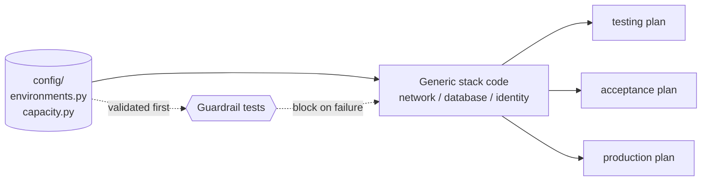

Almost every infrastructure incident I have had to clean up traced back to the same root cause, and it was never an exotic cloud bug. It was a human editing stack code under pressure: a CIDR copied from the wrong environment, an availability zone hardcoded "just for now," a feature flag that defaulted to *on* because nobody wrote down that it shouldn't. The cloud primitive worked perfectly. The change did exactly what the code said. The code was just wrong in a way no review caught, because the risky value was buried in the middle of a hundred lines of resource wiring.

One pattern fixed most of that class of problem for me: **treat configuration as data, and infrastructure code as a generic engine that consumes it.** The stacks stop knowing anything about "production" or "testing." They know how to *build a network* or *build a database*, and they read every environment-specific number from a validated config file.

This post is the anchor for a small series on the practices that grew out of running this pattern in anger — it pairs closely with [safe rollouts for stateful infrastructure](/engineering/safe-rollouts-for-stateful-cloud-infrastructure/) and [path-filtered CI/CD for infra monorepos](/engineering/path-filtered-ci-cd-for-infra-monorepos/). The whole point is that the *pattern* is the reusable part.

## The Core Rule

Keep stack logic generic. Put every mutable, environment-specific value in a versioned config file. The dividing line is simple: **if a value can differ between environments, it is data.**

What lives in config:

- CIDR blocks and subnet allocations
- Availability zone choices
- Environment toggles for optional resources
- Principals and cross-account sharing targets
- Sizing and capacity values

What stays in code:

- Validation rules
- Resource composition logic
- Security defaults (retention, encryption, permission boundaries)
- Naming and tagging conventions

The mental model is a pure function. Config is the input, the stack is the function, and the rendered plan is the output:



Same function, different inputs, deterministic outputs. That single property is where all the benefits come from.

## Why This Works

You gain three things that compound:

- **Predictability.** A change diff is almost entirely config, so intent is obvious at a glance. "We grew the acceptance database by two nodes" reads as a two-line diff, not a hunt through stack logic.
- **Reusability.** The same code path serves every environment, so testing exercises the exact code that runs in production.
- **Safety.** Because config is just data, you can validate it *before* the provider ever sees it.

It also collapses code review into one question: **did we change data, or did we change behavior?** Data changes get scrutinized for values; behavior changes get scrutinized for blast radius. Reviewers stop having to do both at once on every line.

## A Practical Structure

A layout that has held up well for me:

```text
infra/
  config/
    environments.py     # per-env CIDRs, AZs, principals, toggles
    capacity.py         # per-env sizing, gated by an `enabled` flag
  stacks/
    network_stack.py
    database_stack.py
    identity_stack.py
  tests/
    test_config_guardrails.py
```

Stacks load config by environment key and never reach for a constant of their own:

```python
env_cfg = ENVIRONMENTS[env_name]
network_cfg = env_cfg.network
capacity_cfg = CAPACITY[env_name]

# The stack composes resources from cfg — it never hardcodes an environment.
VpcNetwork(self, "network", cidr=network_cfg.cidr, azs=network_cfg.azs)
```

The rule I hold the line on: **grep the `stacks/` directory for an environment name and you should find zero hits.** The moment `if env == "production"` appears in stack code, the pattern has started to leak.

## Guardrails You Should Add Early

The payoff of config-as-data is that you can validate the data. Do it before synth/preview runs, as ordinary unit tests:

```python
def test_subnets_within_supernet():
    for name, env in ENVIRONMENTS.items():
        assert env.network.cidr in env.network.supernet, (
            f"{name}: client subnet escapes its supernet"
        )

def test_no_overlapping_cidrs():
    seen = []
    for env in ENVIRONMENTS.values():
        assert not any(env.network.cidr.overlaps(s) for s in seen)
        seen.append(env.network.cidr)
```

A starter set of checks worth having on day one:

- Every subnet sits within its environment's supernet.
- No two environments overlap CIDRs. (This one has saved me more than once — it's the same discipline that keeps [database connectivity](/engineering/network-connectivity-for-managed-database-platforms/) sane across peerings.)
- Every environment defines all required keys.
- Account and tenant identifiers appear only in config, never in code.
- Optional features require an explicit flag; nothing dangerous defaults on.

These run in milliseconds and catch bad inputs before any provider API call — which means bad config fails a pull request, not a deployment window.

## CI/CD Integration

The guardrails only help if they run automatically. In every pull request:

1. Lint and unit tests.
2. Config guardrail tests.
3. Render plans/previews for the changed environments.
4. Block merge on any failure.

Because the config is the diff, reviewers get a plan that maps one-to-one to the values that changed. That fast, legible feedback loop is exactly what makes [path-filtered pipelines](/engineering/path-filtered-ci-cd-for-infra-monorepos/) worth building.

## Where State and Secrets Live

Config-as-data answers *what* to deploy. Two adjacent questions decide how safely you can operate it.

**State.** Tools like Pulumi and Terraform keep a state file describing reality. You can self-host that backend on object storage you own, or use the vendor's managed service. Self-hosting keeps the data in your own account and gives you full control; the managed option hands you locking, history, and encryption without running one more piece of stateful infrastructure. Neither is wrong — self-host when control or data residency matters, reach for the managed service when you would rather not babysit a backend. Pick deliberately, because migrating state later is a chore.

**Secrets.** Whatever you choose, database credentials and other secrets do **not** belong in that state file, in config, or in the repo — the state file is the classic accidental leak. Keep secrets in a dedicated secrets manager, reference them by name, and rotate them on a schedule (more on rotation in [safe rollouts](/engineering/safe-rollouts-for-stateful-cloud-infrastructure/)).

## Common Anti-Patterns

Even when time is tight, these are the ones that come back to bite:

- A "quick fix" value hardcoded directly into stack logic.
- Environment-name checks (`if env == ...`) scattered across files.
- Feature switches with implicit defaults.
- Copy-pasted config with no schema validation.

Every one of them reintroduces the exact drift the pattern exists to kill.

## Further Reading

The official guidance below backs up this pattern if you want to go deeper:

- [AWS CDK — Best practices for developing and deploying cloud infrastructure](https://docs.aws.amazon.com/cdk/v2/guide/best-practices.html) — see "Model all production stages in code" and "Commit `cdk.context.json` to avoid non-deterministic behavior".
- [Pulumi — Configuration](https://www.pulumi.com/docs/concepts/config/) — per-stack configuration and secrets.
- [The Twelve-Factor App — III. Config](https://12factor.net/config) — the original argument for separating config from code.

If you're still choosing the tool that will consume this config, my [take on Terraform vs. Pulumi](/engineering/multi-cloud-terraform-vs-pulumi/) covers that decision.

## Final Takeaway

If you adopt one rule from this post, make it this: **environment-specific values are data, never stack logic.**

It speeds reviews, kills a whole category of drift, and makes multi-environment infrastructure easier to reason about the larger your platform grows. Everything else in this series is a consequence of taking that one rule seriously.
