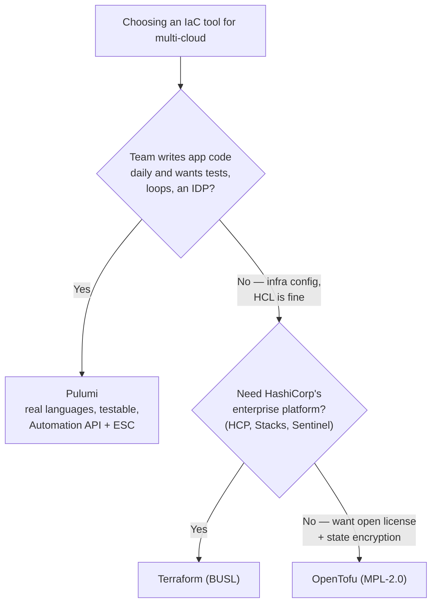

Most "multi-cloud strategies" I've seen weren't strategies at all. They were the accumulated residue of an acquisition, a team that liked BigQuery, another that lived in AWS, and a CFO who read an article about vendor lock-in. Multi-cloud arrived; nobody chose it.

That's the honest starting point. Multi-cloud can be a genuine advantage or a self-inflicted tax, and the difference is whether you did it *deliberately* — with a reason, a boundary, and the automation to keep it from sprawling. This post is about both halves: deciding whether (and how) to go multi-cloud, and then picking the infrastructure-as-code tool that makes it survivable. Since the IaC landscape shifted hard over the last two years, I'll be specific about where things actually stand in 2026.

## Part 1 — Is multi-cloud even the right call?

Start by being ruthless about *why*. There are good reasons and expensive-cargo-cult reasons.

**Reasons that hold up:**

- **Best-of-breed by workload.** BigQuery for analytics, a specific AWS service for something else, Azure because your enterprise agreements and AD already live there. You're picking the best tool per job, not spreading one app across clouds.
- **Data residency and regulation.** You genuinely need workloads in a region or jurisdiction where only one provider is a good fit.
- **Resilience against provider-level failure.** Real, but rarer and more expensive than people think — true active-active across clouds is a serious engineering commitment, not a checkbox.
- **Mergers and acquisitions.** You inherited another cloud and consolidation isn't worth it yet.
- **Negotiating leverage / avoiding lock-in.** Legitimate, but it's a business hedge, not an architecture — and it has a running cost.

**Reasons that usually don't survive scrutiny:** "in case we ever want to switch," and "so we're not locked in" — when nobody has costed what that portability actually requires.

> **The uncomfortable truth:** the more portable you force your architecture to be, the more you give up the managed services that made each cloud worth using. A lowest-common-denominator design that runs anywhere often runs *worse everywhere*. Portability is a real cost you pay in capability — spend it on purpose.

### The patterns, honestly

| Pattern | What it is | When it's worth it |
|---|---|---|
| **Portfolio / siloed** | Different apps live on different clouds; each is single-cloud internally | The common, sane default — best-of-breed without cross-cloud complexity |
| **Best-of-breed composition** | One system spans clouds to use a specific service (e.g. app on one, analytics on another) | When a specific managed service is genuinely differentiated |
| **Portable / abstracted** | Workloads built to run on any cloud (often on Kubernetes) | Strong regulatory or exit requirements — and you've accepted the capability tax |
| **Active-active DR** | Same workload live across clouds for provider-level resilience | Rarely; only when an outage cost genuinely exceeds the (large) engineering cost |

### What this looks like in practice

One estate I've worked on is a deliberate best-of-breed split across four providers:

| Workload | Cloud | Why there |
|---|---|---|
| Analytics | **GCP** | BigQuery and the data stack around it |
| User identity | **Azure** | Entra ID — where the enterprise directory already lived |
| Application infrastructure | **AWS** | The broadest service catalog for the app tier |
| Primary database | **Oracle Cloud (OCI)** | The best home for the database workload |

Four clouds, but not chaos: each was chosen because it was the best home for that specific job, and each workload stays coherent inside its own provider. That's the "best-of-breed" pattern working as intended — multi-cloud by deliberate selection, not by accident. The cost is that you now need *one* consistent way to provision and observe all four, which is the whole reason the IaC choice below matters so much.

My default advice: **aim for "portfolio" and reach for the heavier patterns only when a concrete requirement forces you there.** Whatever you pick, the thing that keeps multi-cloud from rotting into chaos is a single, consistent way to define and change infrastructure — which is where IaC earns its keep.

## Part 2 — Why IaC matters more in multi-cloud

In a single cloud you can *almost* get away with clicking around the console. Across clouds you can't: you now have two or three sets of primitives, IAM models, and networking quirks, and no human holds all of it. Infrastructure-as-code gives you one control plane, reviewable diffs, reproducible environments, and drift detection across every provider. In multi-cloud, IaC isn't a nice-to-have; it's the only thing standing between you and untracked, un-auditable sprawl.

The 2026 question isn't *whether* to use IaC — it's *which* tool. The realistic contenders are **Terraform**, its fork **OpenTofu**, and **Pulumi**. (Cloud-specific tools like AWS CDK or Bicep are excellent but single-cloud by design, so they're out for a genuinely multi-cloud estate.)

## Part 3 — Terraform and OpenTofu: the fork you need to understand

You can't choose Terraform in 2026 without understanding what happened to it.

In August 2023, HashiCorp relicensed Terraform from the open-source MPL to the **Business Source License (BUSL)** — still source-available, but no longer OSI-approved, and it restricts building competing products. The community forked the last MPL version into **OpenTofu**, now a Linux Foundation / CNCF project. Then in April 2024 **IBM announced it would acquire HashiCorp**, a deal that **closed on February 27, 2025** (~$6.4B). The license did not revert after the acquisition — Terraform remains BUSL.

Two years on, the fork has genuinely **diverged** — this is the part people miss:

| | Terraform (BUSL, IBM/HashiCorp) | OpenTofu (MPL-2.0, CNCF) |
|---|---|---|
| License | Business Source License — source-available, restricted | MPL-2.0, fully open source |
| Leads on | Enterprise platform: HCP Terraform, Stacks, Sentinel policy, the provider registry, Infragraph | Open-source CLI features: **native state encryption**, provider `for_each`, `-exclude`, early variable evaluation, OCI registries |
| Governance | Vendor-controlled | Community / foundation |
| Best when | You want the managed enterprise platform and don't mind the license | You want open governance, no license risk, and state encryption in the CLI |

Both still speak **HCL**, share the state format, and have the deepest provider ecosystem in the industry. Day to day they look nearly identical — but they are no longer the same tool, and "which Terraform" is now a real decision. For a licensing- or compliance-sensitive enterprise, OpenTofu is often the safer default; for teams already invested in HCP Terraform's platform features, Terraform proper still leads.

> **If you're starting fresh on HCL in 2026,** I'd default to OpenTofu unless you specifically need HashiCorp's commercial platform — you get an open license, state encryption out of the box, and an easy path, without betting on a vendor-controlled license.

## Part 4 — Pulumi: infrastructure in a language you already know

Pulumi takes the other road. Instead of a DSL, you define infrastructure in **general-purpose languages** — TypeScript, Python, Go, C#, Java, or YAML — against the same underlying cloud providers (including GCP, Azure, AWS, and OCI, so it genuinely spans a four-cloud estate). It's **Apache-2.0 open source**. State can live in **Pulumi Cloud** (managed, versioned, locked, with per-value secret encryption), or in a **self-managed backend** — in my case an **S3 bucket for state**, with **AWS Secrets Manager** holding the secrets. You're not forced onto a hosted service to use it.

What that buys you:

- **Real language constructs** — loops, conditionals, functions, classes, types — without HCL's expression gymnastics.
- **Lower onboarding cost.** Engineers who already write Python or TypeScript can read, understand, and contribute to infrastructure without first learning a separate DSL. In a four-cloud estate that's a genuine force-multiplier: the app and data engineers who need to touch infra can *understand the setup* because it's written in a language they already think in, so onboarding someone onto the infra is a matter of hours, not weeks spent learning HCL.
- **Testability** — you can unit-test infrastructure with the frameworks you already use (pytest, Jest, Go's testing), mock provider calls, and run integration tests.
- **Embedding IaC in software** — the **Automation API** lets you drive Pulumi programmatically, which is why it's a strong fit for building an internal developer platform.
- **Secrets and config** — **Pulumi ESC** (Environments, Secrets, Configuration), GA since 2025, centralizes secrets across AWS Secrets Manager, Vault, Azure Key Vault, GCP Secret Manager, and more, with logged access.
- **A hedge on the HCL question** — as of January 2026 Pulumi added **native HCL support via a Terraform bridge**, so it can interpret existing HCL. That lowers the switching cost if you're coming from Terraform.

The trade-off: general-purpose languages give you power *and* enough rope to build genuinely over-engineered infrastructure. HCL's constraints are sometimes a feature — they keep configuration boring and legible. Pulumi shines when your team is application-developer-heavy or you're building a platform; it can feel like overkill for a small, stable estate a couple of HCL modules would cover.

## Part 5 — How I'd choose

There's no universal winner. The decision comes down to your team, your license tolerance, and whether infrastructure is a *product* you build on or a *config* you maintain.

A head-to-head, condensed:

| Dimension | Terraform / OpenTofu | Pulumi |
|---|---|---|
| Language | HCL (declarative DSL) | TypeScript / Python / Go / C# / Java / YAML |
| License | BUSL (Terraform) · MPL-2.0 (OpenTofu) | Apache-2.0 |
| Provider ecosystem | Largest in the industry | Broad (bridges Terraform providers) |
| Testing | Limited (plan checks, terratest) | Native unit/integration testing |
| Secrets | Vault / cloud stores; OpenTofu adds state encryption | ESC + per-value state encryption by default |
| Best fit | Ops/platform teams standardizing on config | App-dev teams, platform engineering, IDPs |

> **What I actually run:** across the four-cloud estate above, the IaC is **Pulumi in Python and TypeScript**, with **state in an S3 backend** and **secrets in AWS Secrets Manager**. Real languages let the data and application engineers contribute to infrastructure in the languages they already use — onboarding a developer onto the infra takes hours rather than weeks of learning a DSL, and they can genuinely *understand* how the setup works because it's written in a language they know. One tool spans GCP, Azure, AWS, and OCI without four dialects to context-switch between. It's not the only right answer — but for a team that lives in code, it's the one that stuck.

## Part 6 — The part that matters more than the tool

Here's what I'd tell anyone going multi-cloud: **the tool is the smallest decision.** I've watched teams agonize over Terraform-vs-Pulumi and then lose a weekend to a corrupted state file, or ship an IAM wildcard to three clouds at once. What actually determines whether multi-cloud IaC succeeds:

- **State strategy.** Remote, locked, encrypted, and *segmented* — not one monolithic state file for your whole estate. Blast radius is a design decision.
- **Module/component boundaries per cloud.** Resist the urge to build a grand homegrown abstraction that "unifies" the clouds. Share *patterns and conventions*, not a leaky lowest-common-denominator wrapper — those wrappers become the thing nobody can maintain.
- **Policy-as-code.** Sentinel (Terraform) or OPA/Conftest (anywhere) to enforce least-privilege, tagging, and region rules *before* apply — across every provider.
- **Secrets, centralized.** ESC or Vault, never in state you can read, never in the repo.
- **CI/CD with plan-review gates.** Every change is a reviewed diff; nobody applies from a laptop.
- **Observability as code, and centralized.** Telemetry can't live in four separate cloud consoles. Standardize on one observability plane — I use **Datadog** — and manage its monitors, dashboards, and SLOs *as code* too. Datadog ships both a **Pulumi provider and a Terraform provider**, so the same review-and-apply flow that provisions the infrastructure also provisions what watches it, across every cloud.

Get those right and Terraform, OpenTofu, and Pulumi all work. Get them wrong and no tool saves you.

## Part 7 — From image to running infra: the delivery pipeline

Choosing the IaC tool is only half of "automation." The other half is how images get built and how changes actually ship — and in a four-cloud estate, that pipeline is what keeps things reproducible instead of hand-crafted.

**Immutable images, built once, deployed as versions.** Rather than mutating running servers, bake versioned images and replace instances wholesale. The estate above builds those images two ways:

- **Packer** for golden images across clouds — one set of templates produces the AWS AMI, the Azure image, the GCP image, and the OCI custom image from a shared definition, which is exactly the leverage you want when you support four providers. (Worth knowing: Packer, like Terraform, is now BUSL-licensed — the same license consideration applies.)
- **Cloud-native image builders** (EC2 Image Builder, Azure VM Image Builder, and equivalents) where a provider-managed pipeline fits a workload better than a portable one.
- **Salt** for configuration — the "what's actually inside the image" layer: packages, hardening, and config applied at build time, so a running instance is fully defined rather than hand-tweaked after boot.

That gives a clean separation of stages: **build the image (Packer / image builder + Salt) → version it → let Pulumi reference the image ID → provision and deploy.** Each stage is independently versioned and reviewable, which is what makes a change traceable across four clouds.

**CI/CD ties it together.** The Pulumi runs live in a mix of **on-prem TeamCity and GitHub Actions** — on-prem runners earn their place for pipelines that need to sit inside the network or reach systems that shouldn't touch the public internet; GitHub Actions handles the rest. Either way the flow is the same: **`pulumi preview` on the pull request** (the reviewed diff), **`pulumi up` on merge**, pulling secrets from AWS Secrets Manager and state from the S3 backend, with policy checks gating the apply. Image builds run on the same backbone, publishing new versioned images that later infra changes pick up.

The through-line: **image build, configuration, and provisioning are three distinct, versioned, reviewable stages** — not one big manual dance. That discipline is what lets a four-cloud, multi-language estate stay reproducible.

## Final thoughts

Go multi-cloud because a specific requirement makes it the better architecture — best-of-breed services, real regulatory needs, genuine resilience economics — not because "lock-in" sounds scary in the abstract. Then automate it with the tool that fits your team: **OpenTofu** if you want open, HCL-based IaC without license risk; **Terraform** if you're buying into HashiCorp's enterprise platform; **Pulumi** if your people think in code and you're building infrastructure as a product. And whichever you pick, spend your real effort on state, boundaries, policy, and secrets — the discipline outlives the tool.

*What's your multi-cloud setup — deliberate, or accidental? I'd love to compare notes — [find me on LinkedIn](https://www.linkedin.com/in/riddam/).*
