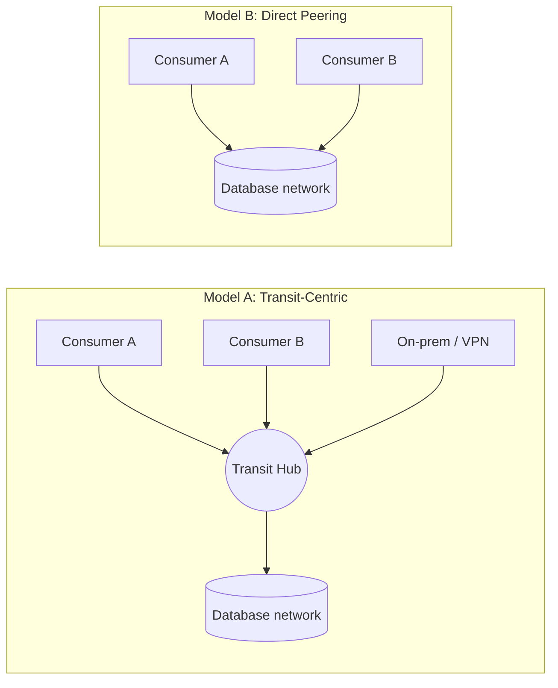

The hardest part of putting a managed database platform into a large organization is almost never the database. It is answering one deceptively simple question: *how does everything that needs the database actually reach it?* A dozen application teams, a couple of legacy accounts, an on-prem network still running the systems of record — each one needs a path in, and each path is a decision about ownership, latency, blast radius, and cost.

I have watched that question get answered badly in both directions. Route everything through one central hub and you get a tidy diagram and a single point of failure that no one team feels responsible for. Let every team build its own path and you get flexibility plus a slow drift into a routing mess nobody can reason about. The useful framing sits in between:

- **Transit path** — for centralized ingress/egress, on-prem, and shared inspection.
- **Direct peering** — for low-friction, east-west application access.

This post is the connectivity chapter of a series on running stateful platforms safely; it leans on the same [config-as-data discipline](/engineering/config-as-data-for-infrastructure-repos/) for CIDRs and shares its DR thinking with [safe rollouts](/engineering/safe-rollouts-for-stateful-cloud-infrastructure/).

## Two Connectivity Models



### Model A: Transit-Centric

All traffic passes through a transit hub.

**Pros:** centralized routing controls, a natural place for shared inspection, easy global policy enforcement.

**Cons:** more route dependencies, a larger blast radius when the hub changes, and often a longer path for what should be a short app-to-database hop.

### Model B: Direct Peering by Consumer Domain

Each consumer domain owns a direct peering to the database network.

**Pros:** clear ownership boundaries, simpler troubleshooting (one path, two ends), no central bottleneck.

**Cons:** more peerings to govern, and route hygiene now lives in each domain rather than one place.

## Decision Criteria

Choose **direct peering** when:

- consumer domains are mature enough to own their own routes
- low-latency application flows are the primary use case
- decentralized ownership is a feature, not a risk

Choose **transit-centric** when:

- centralized traffic inspection is mandatory
- consumer domains cannot safely manage network routes
- a hub-and-spoke operating model already exists and works

In practice most mature setups end up hybrid, and deliberately so: direct peering carries the high-volume east-west application traffic, while the transit path is reserved for on-prem and shared ingress — the flows that genuinely benefit from a central chokepoint. The mistake is drifting into a hybrid by accident, with no clear rule for which flow belongs where.

## A Migration That Paid for Itself

My own route to that hybrid was not a clean design — it was a correction. The first version I built routed *everything* through a central transit hub, because a hub is the easy thing to reason about: one place for routes, one place for policy, one diagram. It worked. It was also needlessly expensive.

A transit hub typically bills two ways: an hourly charge per attachment *and* a per-gigabyte data-processing charge on everything that flows through it. All that east-west application traffic to the database was paying a toll on a path that added nothing for it — those flows never needed central inspection, they just needed to reach the database. Moving the consumer traffic onto direct peerings, and leaving only on-prem and shared ingress on the hub, took a recurring line item down substantially with no loss of function.

The lesson I took: a transit hub is a great home for the traffic that benefits from centralization and a quietly expensive one for the traffic that doesn't. Route by need, not by habit — and revisit the bill once real traffic is flowing, because the cheapest topology on day one is rarely the cheapest at scale.

## The Ideal Path vs. the One You Can Afford

The ideal connectivity design is fully redundant: every consumer reaches the database over at least two independent paths, in two failure domains, so no single peering, route table, or region can cut access. Pair that with an active-active database footprint and you have a platform that shrugs off most infrastructure failures.

That resilience is not free. Every extra path is another peering to create, another set of routes to keep clean, and — for active-active — a duplicate of the most expensive resource you run. The trade-offs I weigh in practice:

- **Redundant paths everywhere** — highest resilience, but the most route-governance overhead and cost. Justified only when downtime on this flow is genuinely unacceptable.
- **Single primary path plus a tested failover** — where most projects should live. You accept a short, rehearsed recovery step in exchange for far less standing cost and complexity.
- **Single path, no failover** — fine for environments you can afford to lose for a while (testing, internal tooling), reckless for anything else.

My rule of thumb mirrors how I think about DR generally: design the ideal on paper, then deliberately spend down from it based on what an outage on *this specific flow* would actually cost. A redundant path you never fail over to is just complexity with a bill attached. (I develop the same idea, applied to the database itself, in the [safe rollouts post](/engineering/safe-rollouts-for-stateful-cloud-infrastructure/).)

## Routing Guardrails That Prevent Incidents

Whichever model you pick, the failure mode is the same — ambiguity about who owns which route. Most outages I have seen came from that, not from a missing cloud feature. The guardrails that hold it back:

- Declare route ownership per domain, explicitly.
- Document the allowed prefixes in *both* directions.
- Enforce non-overlapping CIDR allocations (validate them as data — see the [config-as-data guardrails](/engineering/config-as-data-for-infrastructure-repos/)).
- Test bidirectional reachability *before* cutover, not after.
- Keep DNS forwarding design explicit and versioned, not tribal knowledge.

A minimal connectivity matrix, kept in the repo, is worth more than any diagram:

| From | To | Path | Owner |
|---|---|---|---|
| app-domain-a | database-net | direct peering | app-domain-a |
| on-prem | database-net | transit hub | network team |

## The Prerequisite That Blocks Everything

Before any of this works, the managed-database integration has to be *enabled in every account that will consume it*. It is easy to switch it on in the account that owns the database, prove connectivity there, and then watch a consumer account fail weeks later with an opaque error — because the integration was never enabled on that side. Make "enable the integration in this account" an explicit, checked step in account bootstrap, not tribal knowledge. When you run many accounts it belongs in the same [config-as-data inventory](/engineering/config-as-data-for-infrastructure-repos/) that already tracks your CIDRs and route ownership.

## A Two-Phase Rollout That Avoids the Route Race

The subtle trap with peering is ordering — and it gets worse when the database platform's control plane lives outside the cloud you are deploying from. Creating the peering is not instant: the request has to reconcile across that provider boundary, and until it reports *active* on both sides, any route that references it will fail. A change that creates the peering and writes the routes in a single shot will race that propagation and leave a network half-wired. Split it into two phases with a real barrier between:

```text
Phase 1  reserve CIDRs, validate no overlaps
         create the connectivity primitive (peering / attachment)
         --- confirm the primitive is ACTIVE ---
Phase 2  apply routes in the producer network
         apply routes in each consumer network
         validate DNS + the connectivity matrix
         enable application traffic gradually
```

Make that barrier a poll, not a guessed sleep: wait until the peering actually reports *active*, then apply the routes. Treating peering creation and route updates as *separate* approvals also keeps the blast radius small — a bad route change can be rolled back without tearing down the peering underneath it.

## Further Reading

Official documentation for the primitives behind these patterns:

- [AWS — What is a transit gateway?](https://docs.aws.amazon.com/vpc/latest/tgw/what-is-transit-gateway.html) — route tables, associations, and propagation for the transit model.
- [AWS — What is VPC peering?](https://docs.aws.amazon.com/vpc/latest/peering/what-is-vpc-peering.html) — direct, non-transitive connectivity between networks.
- [AWS Well-Architected — Reliability Pillar](https://docs.aws.amazon.com/wellarchitected/latest/reliability-pillar/welcome.html) — designing for redundant paths and failure recovery.

## Final Takeaway

Connectivity architecture is mostly an ownership problem expressed through routes. The cloud gives you transit gateways and peerings; whether they add up to a reliable platform or a fragile one comes down to explicit boundaries, validated CIDRs, and disciplined rollout ordering — not which primitive you picked.
