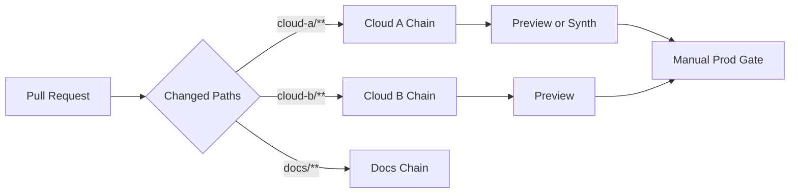

An infrastructure monorepo is a lovely idea right up until the first time you change a README and watch three cloud pipelines spin up to tell you nothing changed. Multiply that by every pull request and you get the quiet tax of the naive monorepo: slow feedback, plans nobody reads because they're always green-for-the-wrong-reason, and eventually a team that stops trusting CI because it cries wolf on every commit.

The fix is not to split the repo. It is to **run only the pipeline that owns the files you touched** — path-filtered delivery chains. One repository, one place to review cross-cutting changes, but execution scoped tightly to what actually changed.

This is the delivery chapter of a series on running stateful infrastructure safely. It assumes the [config-as-data](/engineering/config-as-data-for-infrastructure-repos/) layout (the path filters map onto those directories) and feeds directly into [safe rollouts](/engineering/safe-rollouts-for-stateful-cloud-infrastructure/).

## The Problem

In a monorepo with no path awareness:

- a networking change triggers the database pipeline
- an IAM tweak triggers unrelated application checks
- slow, always-running plans bury the one failure that mattered in noise

The result is longer feedback loops and — worse — lower confidence in every green check.

## The Design

Split pipelines by directory ownership. A representative mapping:

- `cloud-a/**` → Cloud A IaC chain
- `cloud-b/**` → Cloud B IaC chain
- `docs/**` → docs checks only

Each chain owns its own runtime bootstrapping, lint/test commands, preview/synth step, and release/version policy. The repo stays unified; the *execution* stays scoped.



## What a Path Filter Actually Looks Like

The mechanism is boring, which is the point — every major CI system ships it. The shape, in a generic pipeline config:

```yaml
jobs:
  cloud-a:
    trigger:
      paths: ["cloud-a/**"]
    steps:
      - install-deps
      - lint-and-test
      - render-plan        # synth / preview / equivalent
      - publish-artifact

  cloud-b:
    trigger:
      paths: ["cloud-b/**"]
    steps: [install-deps, lint-and-test, render-plan, publish-artifact]
```

On GitHub Actions that's `on.push.paths`; on GitLab it's `rules: changes:`; most other systems have a direct equivalent. Two guardrails worth setting from the start:

- **Make filters mutually exclusive.** Overlapping globs (`cloud-a/**` and `**/config`) will double-trigger and quietly waste runners.
- **Decide what a shared-file change does.** A change to a root lockfile or CI config arguably touches *every* chain — be explicit about whether it fans out to all of them or fails closed.

## Why Manual Production Gates Still Matter

Automated checks should be strict. But for stateful infrastructure, the deploy step itself often deserves a human. This is not nostalgia for manual ops — it is matching the approval to the blast radius.

Use a manual gate when:

- replacing the resource has a high blast radius
- the change window is controlled
- the deploy depends on coordination with another team

Automated quality gates and manual production gates are complementary: the machine proves the change is *valid*, the human decides it is *safe to release now*. I unpack that division in the [safe rollouts post](/engineering/safe-rollouts-for-stateful-cloud-infrastructure/).

## Suggested Stage Layout

For each infrastructure chain:

1. Install dependencies (from a committed lockfile — see failure modes).
2. Static checks and unit tests, including config guardrails.
3. Render the plan (`synth`, `preview`, or equivalent).
4. Publish the artifact and review the diff.
5. Manual approval for production.
6. Deploy by pipeline identity only — **never** a local laptop.

That last point matters more than it looks: a local deploy skips every gate above it and leaves no artifact to audit. The pipeline identity is the only principal that should hold deploy permissions in production.

## Ownership Model

Path filters pay off only when each folder has a clear owner:

- one team owns the pipeline *and* the folder it deploys
- one review group approves that component's production releases
- one changelog and version stream per component

Anything ambiguous here shows up later as a handoff nobody owns.

## Failure Modes to Watch

- **Overlapping path rules** that trigger duplicate chains.
- **Shared files with unclear ownership** — the root config that belongs to everyone and no one.
- **Non-deterministic previews** from a missing or stale lockfile. Pin dependencies or your "no-op" diffs will lie.
- **Hidden runtime dependencies** on a specific engineer's machine.
- **A toolchain too old to know the resource types.** Brand-new cloud services often ship *L1-only* — the raw, CloudFormation-level constructs — and only in recent releases of your IaC library. Pin a recent version (and, if you lint CloudFormation separately, a recent linter too). An older toolchain fails synth or validation on an "unknown resource type" it has simply never heard of — a confusing failure if you don't know to check versions first.

Fix these before you scale up contributors, not after.

## Writing About This Safely

The delivery *pattern* — directory-to-pipeline mapping, gate criteria, stage sequencing — carries no secrets and is the genuinely useful part to share. What stays internal is the inventory: account numbers, private endpoint names, and real production topology diagrams. I keep the full anonymization checklist in the [config-as-data post](/engineering/config-as-data-for-infrastructure-repos/#writing-about-this-safely).

## Further Reading

How the major CI systems implement path-based triggering:

- [GitHub Actions — Workflow syntax (`paths` / `paths-ignore`)](https://docs.github.com/en/actions/writing-workflows/workflow-syntax-for-github-actions) — trigger workflows only when matching files change.
- [GitLab CI/CD — `rules:changes`](https://docs.gitlab.com/ee/ci/yaml/#ruleschanges) — run jobs conditionally based on changed paths.

## Final Takeaway

Path filtering is one of the highest-leverage changes you can make to an infrastructure monorepo. It cuts noise, tightens feedback, and — most importantly — keeps delivery responsibility aligned with code ownership, so every green check means something again.
