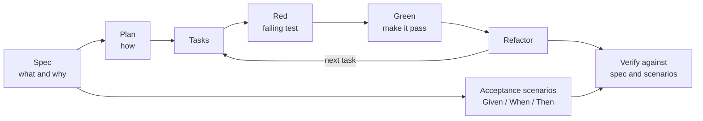

For most of the last year, my worst results with AI coding agents have had the same shape, and it isn't bad code. It's good code for the wrong thing. An agent reads a one-line prompt, fills every gap with a plausible guess, and hands back two hundred tidy, tested lines that solve a problem I didn't quite have.

The fix wasn't a better model or a longer prompt. It was moving my attention upstream. I still design by hand before anything gets implemented — the problem, the approaches, the trade-offs — and the agent doesn't write code until that design is written down as a spec. The code review that follows got shorter, because most of the arguments had already happened on the spec. And because the spec is a file rather than a chat, I can share it with the team and settle the design with them while it's still cheap to change. Every post I've published on this site since August started the same way: a design spec committed to the repo — audience, argument, what it must not repeat from other posts — reviewed before a word of prose was written.

The industry has settled on a name for that habit: **spec-driven development**, or SDD. GitHub's [Spec Kit announcement](https://github.blog/ai-and-ml/generative-ai/spec-driven-development-with-ai-get-started-with-a-new-open-source-toolkit/) describes the spec as "a contract for how your code should behave" that "becomes the source of truth your tools and AI agents use to generate, test, and validate code." Thoughtworks put the technique on its Technology Radar at *Assess* in November 2025.

The question I get most about it is some version of *"isn't that just TDD?"* or *"isn't that just BDD?"* It isn't, and it doesn't replace either. This post shows why with one feature built three ways, then covers how to actually run SDD in Claude Code, GitHub Copilot, Cursor, and the two dedicated tools, Spec Kit and Kiro.

Prompt structure, instruction files and a definition of done for AI-assisted changes are already in my [AI coding playbook](/engineering/ai-assisted-coding-playbook/), so I'll link to those rather than repeat them.

## TL;DR

| | TDD | BDD | SDD |
| --- | --- | --- | --- |
| **Primary artifact** | A failing unit test | Executable scenarios in Given/When/Then | A written spec, then a plan and tasks |
| **Question it answers** | Does this unit do what I intended? | Does the system behave the way the business expects? | Are we building the right thing, and has the agent understood it? |
| **Written for** | Developers | Developers, testers, product | Humans *and* AI agents |
| **Feedback loop** | Seconds | Minutes, per scenario | Hours to days, per feature |
| **Typical failure** | Tests that pin the implementation instead of the behavior | Scenario suites only developers maintain, drifting into brittle UI scripts | Specs that drift from the code, or grow so detailed they become waterfall |

They work at different altitudes. **SDD decides what to build and why. BDD scenarios are a good format for the spec's acceptance criteria. TDD is how each task gets built safely**, whether you or the agent writes the code.

## Three methods, three questions

**Test-driven development** comes from Kent Beck's [*Test-Driven Development: By Example*](https://www.informit.com/store/test-driven-development-by-example-9780321146533) (2002). The preface gives two rules — "Write new code only if an automated test has failed" and "Eliminate duplication" — and the loop everyone remembers: red, write a little test that fails; green, make it pass quickly; refactor, clean up what you did to get there. TDD is a design discipline for the person writing the code. It makes you decide what a unit should do before you decide how.

**Behavior-driven development** comes from Dan North's [*Introducing BDD*](https://dannorth.net/blog/introducing-bdd/), first published in 2006. His starting observation was that "'Behaviour' is a more useful word than 'test'", and with Chris Matts he arrived at the Given/When/Then template: given some context, when an event occurs, then ensure some outcomes. [Gherkin](https://cucumber.io/docs/gherkin/reference/), the language Cucumber popularized, made those scenarios executable. BDD is a communication discipline. It gets product, testing and development to agree on behavior in a form all three can read.

**Spec-driven development** is the newest of the three, and Birgitta Böckeler's article on martinfowler.com, [*Understanding Spec-Driven-Development: Kiro, spec-kit, and Tessl*](https://martinfowler.com/articles/exploring-gen-ai/sdd-3-tools.html), has the clearest definition I've found: "writing a 'spec' before writing code with AI ('documentation first'). The spec becomes the source of truth for the human and the AI."

Writing requirements down before building isn't new, of course. Requirements documents, RFCs and design docs are decades old; the [EARS notation](https://alistairmavin.com/ears/) that Kiro uses for requirements was developed by Alistair Mavin and colleagues at Rolls-Royce and published in 2009. What changed is the reader.

> **TDD and BDD discipline the human who writes the code. SDD disciplines the agent.** An agent is fast, tireless and literal, and where the instructions run out it guesses. The spec is how you take the guessing away — and it gives you something to review that's much shorter than the diff.

## One feature, three ways

The feature: *lock an account after five failed logins within 15 minutes, for 15 minutes; a successful login resets the count.* Small enough to hold in your head, with enough edge cases to be interesting. The examples are Python and pytest, but nothing depends on that.

### TDD: start from a failing test

```python
# tests/test_lockout.py
from datetime import datetime, timedelta

from auth.lockout import LockoutPolicy

T0 = datetime(2026, 1, 1, 12, 0)
FIFTEEN_MIN = timedelta(minutes=15)


def test_fifth_failure_within_window_locks_account():
    policy = LockoutPolicy(max_failures=5, window=FIFTEEN_MIN)
    for i in range(5):
        policy.record_failure("alice", at=T0 + timedelta(minutes=i))
    assert policy.is_locked("alice", at=T0 + timedelta(minutes=5))


def test_failures_outside_the_window_do_not_count():
    policy = LockoutPolicy(max_failures=5, window=FIFTEEN_MIN)
    for i in range(5):  # failures at minutes 0, 4, 8, 12, 16
        policy.record_failure("alice", at=T0 + timedelta(minutes=4 * i))
    assert not policy.is_locked("alice", at=T0 + timedelta(minutes=16))
```

Red. Then the simplest thing that goes green:

```python
# auth/lockout.py
from collections import defaultdict
from datetime import datetime, timedelta


class LockoutPolicy:
    def __init__(self, max_failures: int, window: timedelta):
        self.max_failures = max_failures
        self.window = window
        self._failures: dict[str, list[datetime]] = defaultdict(list)

    def record_failure(self, user: str, at: datetime) -> None:
        self._failures[user].append(at)

    def is_locked(self, user: str, at: datetime) -> bool:
        recent = [t for t in self._failures[user] if at - t < self.window]
        return len(recent) >= self.max_failures
```

Both tests pass. And the implementation has a quiet problem: the lock lifts fifteen minutes after the *first* failure, not the fifth. Fail at minutes 0 through 4 and you're locked at minute 4 — then free again at minute 15, eleven minutes later. Is that what we wanted? TDD can't tell you. The tests encode whatever I assumed when I wrote them.

That's not a flaw in TDD. It's a precise, executable statement about one unit, and that's all it claims to be. It never asks whether five is the right number, what the user sees, or whether this feature creates a new problem. It assumes you already know what to build.

### BDD: describe the behavior the business can read

```gherkin
# tests/features/lockout.feature
Feature: Account lockout after repeated failed logins

  Rule: Five failed logins within 15 minutes lock the account for 15 minutes

    Scenario: The fifth failure locks the account
      Given "alice" has failed to log in 4 times in the last 10 minutes
      When a wrong password is entered again
      Then the account is locked
      And the login page says to try again in 15 minutes

    Scenario: A successful login resets the count
      Given "alice" has failed to log in 4 times in the last 10 minutes
      When the correct password is entered
      Then the failed-login count is reset
```

Bound to code with [pytest-bdd](https://github.com/pytest-dev/pytest-bdd):

```python
# tests/test_lockout_scenarios.py
from pytest_bdd import given, parsers, scenarios, then, when

scenarios("features/lockout.feature")


@given(
    parsers.parse('"{user}" has failed to log in {count:d} times in the last 10 minutes'),
    target_fixture="username",
)
def recent_failures(auth, user, count):
    for _ in range(count):
        auth.login(user, "wrong-password")
    return user


@when("a wrong password is entered again")
def wrong_password(auth, username):
    auth.login(username, "wrong-password")


@then("the account is locked")
def account_locked(auth, username):
    assert auth.is_locked(username)
```

This is a real improvement in a different direction. The rule is now written in words a product manager can check, and the phrase "try again in 15 minutes" has quietly pinned down the lock duration my unit test got wrong. BDD is excellent at surfacing that kind of disagreement early, because the people who know the answer can read the question.

What it still doesn't hold is everything that isn't an example. There's no *why*, no decision about what happens when the system storing the counts is down, nothing about where the code should live or which existing client to use, and no record of what we chose not to build. Scenarios describe behavior. They don't describe the decisions around it — and those are exactly where an agent guesses.

### SDD: write the contract before anyone writes code

```markdown
# Spec: Lock accounts after repeated failed logins

## Why
Password-guessing traffic against the login endpoint is rising. Slow attackers
down without locking real users out for long.

## Requirements
R1. WHEN an account records its 5th failed login within 15 minutes,
    THE SYSTEM SHALL lock the account for 15 minutes from that failure.
R2. WHILE an account is locked, THE SYSTEM SHALL reject logins without checking
    the password, and tell the user when they can try again.
R3. WHEN a login succeeds, THE SYSTEM SHALL reset the account's failure count.
R4. WHEN an account is locked, THE SYSTEM SHALL write an `account_locked`
    audit event with the account ID and source IP.
R5. IF the failure store is unavailable, THEN THE SYSTEM SHALL allow the login
    attempt and log a warning. (Fail open: availability beats lockout here.)

## Acceptance scenarios
- The two scenarios in tests/features/lockout.feature, plus:
- Given a locked account, when 15 minutes have passed since it was locked,
  then a correct password logs in.

## Edge cases
- A failure exactly 15 minutes old no longer counts.
- Two simultaneous wrong passwords must be counted atomically; neither may
  slip past the fifth.

## Non-goals
- IP-based rate limiting and CAPTCHA (separate spec).
- An admin unlock screen.

## Constraints
- Count per account, not per IP.
- Use the existing store client in auth/store.py. No new dependencies.

## Risks
- Anyone who knows a username can lock that user out. Accepted for now: the
  lock is short, and password reset still works while an account is locked.

## Open questions
- [NEEDS CLARIFICATION: should repeat lockouts get progressively longer?]
```

The requirements use EARS keywords the way Kiro writes them — `WHEN … THE SYSTEM SHALL …`, with `WHILE` for states and `IF … THEN` for unwanted conditions. The `[NEEDS CLARIFICATION]` marker is borrowed from Spec Kit's spec template, which uses it for anything the author had to assume.

Look at what's on that page that neither the test nor the scenarios held:

- **R1 fixes the bug in my TDD implementation** by saying when the fifteen minutes start.
- **R5 is a decision, not a behavior.** Fail open or fail closed is a genuine trade-off, and an agent left to itself will pick one without mentioning it.
- **The edge cases name a race condition** that no happy-path test would have surfaced.
- **The risk is a known one.** The [OWASP Authentication Cheat Sheet](https://cheatsheetseries.owasp.org/cheatsheets/Authentication_Cheat_Sheet.html) warns that lockout can be turned into denial of service against other users' accounts, and suggests keeping password reset available while locked — which is what the spec records.
- **The non-goals and constraints are fences.** They're the difference between an agent building this feature and an agent building this feature plus an IP rate limiter plus a new Redis wrapper.

Every one of those is a decision. Leave it out, and the agent makes it anyway — silently, plausibly, and not necessarily the way you would.

## How the three fit together

Notice that the spec *points at* the BDD feature file and implies the unit tests. That's the shape of the whole thing:



SDD is the outer loop. BDD-style scenarios are the acceptance layer, and they're the most checkable part of any spec. TDD is the inner loop the agent runs for each task. Spec Kit's own reference constitution makes the same point: one of its example articles is a "Test-First Imperative", marked "NON-NEGOTIABLE". The SDD tooling assumes you're doing TDD inside it.

The overlap people trip over is SDD and BDD, because both start from a description of behavior. The difference is scope. BDD scenarios are executable examples. A spec also holds the things that can't be executed — the why, the trade-offs, the non-goals, the constraints — because those are what an agent needs to plan. A spec without examples is vague; examples without a spec leave the agent guessing at everything around them.

## Spec-first, spec-anchored, spec-as-source

Böckeler's article draws a distinction I've found more useful than any tool comparison. SDD comes in three levels of commitment:

- **Spec-first:** "A well thought-out spec is written first, and then used in the AI-assisted development workflow for the task at hand."
- **Spec-anchored:** "The spec is kept even after the task is complete, to continue using it for evolution and maintenance of the respective feature."
- **Spec-as-source:** "The spec is the main source file over time, and only the spec is edited by the human, the human never touches the code."

Her assessment in October 2025 was that Kiro is mostly spec-first, and that Spec Kit, despite aiming higher, is "still what I would call spec-first only". Only Tessl explicitly aimed at spec-anchored and experimented with spec-as-source — and Tessl has since repositioned itself around agent skills, with SDD shipping as one installable workflow in its registry. She compares spec-as-source to model-driven development, which in her words "never took off for business applications", and wonders whether it might end up with "the downsides of both MDD and LLMs: Inflexibility and non-determinism."

The Radar has been similarly measured. The November 2025 entry warned that "we may be relearning a bitter lesson — that handcrafting detailed rules for AI ultimately doesn't scale." By the April 2026 edition the generic technique had dropped off, replaced by two specific tools at *Assess*: GitHub Spec Kit, with a caution about instruction bloat and verbose markdown, and [OpenSpec](https://github.com/Fission-AI/OpenSpec), whose propose, apply and archive workflow tracks changes to specs as deltas and suits existing codebases.

Where I've landed: **spec-first for any change that touches more than one file or more than one person; spec-anchored for long-lived contracts** like public APIs, data models and anything other teams depend on; and spec-as-source I'd watch rather than bet on.

## The loop, and where the human checkpoints are

Tools name the steps differently, but the loop is the same everywhere:

1. **Project rules, once.** The always-on context: stack, conventions, non-negotiables. Spec Kit calls it the constitution; Claude Code, Copilot and Cursor each have an instruction file. What belongs in one is covered in [the playbook's section on instruction files](/engineering/ai-assisted-coding-playbook/#11-instruction-files-reducing-bugs-through-grounding).
2. **Specify.** What and why, gathered from your stakeholders, not invented by the agent. No libraries, no file layout.
3. **Clarify.** Let the agent interrogate the spec before it plans. This is the cheapest step in the loop and the one people skip. When it finds a gap, take the question back to the stakeholder; don't let the agent answer its own question, because a confident guess at this stage can steer the whole feature away from what anyone asked for. **Checkpoint: you approve the spec.**
4. **Design, then plan.** How: components, data model, interfaces, which existing code to reuse, and the alternatives you rejected. The agent can propose options; choosing between them means weighing them against budget, time, people and existing debt, and that stays yours. **Checkpoint: you approve the design and the plan.** This is where you catch the new dependency, the needless abstraction, the rewrite of something that works.
5. **Tasks.** Small, ordered, each independently testable.
6. **Implement.** One task at a time, test first, commit per task.
7. **Verify.** Check the code against the spec, not just against the tests. **Checkpoint: you review the diff with the spec open**, using a [definition of done](/engineering/ai-assisted-coding-playbook/#13-definition-of-done-for-ai-assisted-changes).

> **If the plan surprises you, fix the spec, not the plan.** A surprising plan means the spec left something open. Patch the plan and you've fixed this run; patch the spec and you've fixed every run after it — including the next person's.

## Running it in Claude Code

Claude Code is where I do this, and the split of work is deliberate: **I design by hand, and the agent implements.** For the implementation half I use [Superpowers](https://github.com/obra/superpowers), Jesse Vincent's open-source library of skills for coding agents.

**The design is mine, because design is a business decision as much as a technical one.** The technically best solution is often the wrong one to build: too expensive, not feasible with the people and time available, or fighting the technical debt it would have to sit on top of. Good design also reuses what the company already has instead of generating something new because generating is cheap, and stays within what the team can operate — code only the agent understands becomes a liability the first time it breaks during an outage. An agent can describe the ideal architecture beautifully. It doesn't know the team is two people short this quarter, that the deadline is tied to a commitment someone already made, or that the service it wants to extend is due to be retired. The biggest platform decision I've written about here — [keeping a CI server and rebuilding around it](/engineering/rebuilding-ci-cd-without-changing-platforms/) rather than migrating — was exactly that kind of call.

> **The best technical solution and the right solution are often different things.** The difference is cost, time, people and debt — context an agent doesn't have, and the reason the design stays with a human.

So before an agent is involved, I work out the problem, the options, what each would cost the business, and the decision — and write it down, including what we chose not to do and why.

**Superpowers takes it from there.** My design becomes the spec it works from. A planning skill turns the spec into an implementation plan of small, test-first tasks, and execution works through them one at a time, with review along the way. Nothing is built until I've reviewed the plan against the design.

**The artifacts are the point.** The spec and plan are files, so they're something I can share. When a change affects other people, the review happens with the team, on the design and the plan, before anything is built — a markdown file in a pull request is far easier to change than a working implementation someone is attached to. The specs and plans behind this site sit in the repo next to the posts, so I can always see what was decided, and why.

If you'd rather assemble your own workflow, these are the building blocks Claude Code gives you.

**Project rules** go in `CLAUDE.md` at the repo root, which is read at the start of every session; Anthropic's [memory docs](https://code.claude.com/docs/en/memory) suggest keeping it under about 200 lines, with path-scoped rules in `.claude/rules/`. If your repo already has an `AGENTS.md` for other tools, Claude Code can read that too.

**Plan mode** is the approval gate. `Shift+Tab` cycles into it, or prefix a single prompt with `/plan`, and Claude researches and proposes without editing anything until you approve. If you want planning to be the default for a repo, set it in `.claude/settings.json`:

```json
{
  "permissions": {
    "defaultMode": "plan"
  }
}
```

**A skill** turns your spec format into a command. Custom slash commands have been folded into [skills](https://code.claude.com/docs/en/skills), so a file at `.claude/skills/spec/SKILL.md` gives you `/spec`:

```markdown
---
name: spec
description: Draft a feature spec before any code is written. Use when starting a feature or a change that touches more than one file.
---

Write specs/<NNN>-<slug>/spec.md with these sections:
Why, Requirements (EARS), Acceptance scenarios, Edge cases,
Non-goals, Constraints, Risks, Open questions.

- Describe what and why. Do not choose libraries or file layouts.
- Mark anything you had to assume as [NEEDS CLARIFICATION: ...].
- Ask me up to five questions before you finish.
- Do not write or edit code.
```

**Hooks** enforce the parts you'd otherwise have to remember. A `Stop` hook runs when Claude is about to finish; exiting with code 2 [blocks it](https://code.claude.com/docs/en/hooks) and hands your message back, so "done" can mean "tests pass":

```bash
#!/bin/bash
# .claude/hooks/tests-must-pass.sh — register under "Stop" in .claude/settings.json
INPUT=$(cat)
# If this hook already sent Claude back once, let it stop rather than loop.
[ "$(echo "$INPUT" | jq -r '.stop_hook_active')" = "true" ] && exit 0
uv run pytest -q >&2 || exit 2
```

**Subagents** in `.claude/agents/` give you a reviewer with a fresh context — one that reads `spec.md` and the diff, and nothing of the conversation that produced it. Fresh eyes are the point.

## Running it in GitHub Copilot

Copilot has grown the same set of pieces, under different names.

**Project rules** go in `.github/copilot-instructions.md`, with path-specific rules in `.github/instructions/*.instructions.md` scoped by an `applyTo` glob. Copilot also reads `AGENTS.md`, and the [custom instructions docs](https://docs.github.com/en/copilot/how-tos/configure-custom-instructions/add-repository-instructions) describe how the nearest one in the tree takes precedence.

**Prompt files** are the equivalent of a skill: `.github/prompts/spec.prompt.md` becomes `/spec` in chat, and its frontmatter can pin the agent to planning so it can't start editing:

```markdown
---
description: Draft a feature spec before any code is written
agent: plan
---

Write specs/<NNN>-<slug>/spec.md with these sections: Why, Requirements (EARS),
Acceptance scenarios, Edge cases, Non-goals, Constraints, Risks, Open questions.
Mark assumptions as [NEEDS CLARIFICATION: ...]. Do not write or edit code.
```

**Custom agents** (they used to be called chat modes) live in `.github/agents/*.agent.md`, and their `handoffs` field is a neat fit for SDD's checkpoints: a spec-writing agent with read-only tools can end with a button that hands its output to the implementation agent, and nothing moves until you click it. In VS Code, `/plan` or the Plan agent covers step 4.

**Copilot cloud agent** — renamed from "coding agent" in April 2026 — handles the tail end. Put the spec in the issue, or link to `spec.md`, assign the issue to Copilot, and it works on a branch in its own environment. It can now research and plan before opening a pull request, and the pull request review is your final checkpoint. The better the spec in the issue, the less that review has to catch.

## Running it in Cursor

I haven't used Cursor day to day, so this comes from [its documentation](https://cursor.com/docs/rules) rather than my own habits — but the mapping is direct.

**Project rules** are `.mdc` files in `.cursor/rules/`, with frontmatter for `description`, `globs` and `alwaysApply`; note that plain `.md` files in that folder are ignored. The rule types are now called Always Apply, Apply Intelligently, Apply to Specific Files and Apply Manually. `AGENTS.md` is supported as well.

**Plan Mode** is `Shift+Tab` from the chat input: the agent asks clarifying questions, researches, and writes an editable plan before building. Plans are saved in your home directory by default; use *Save to workspace* so the plan lands in the repo, where it can be reviewed like anything else.

**Skills** are where Cursor is most convenient for a mixed team: alongside its own `.cursor/skills/`, it [also loads](https://cursor.com/docs/skills) skills from `.claude/skills/`. The `/spec` skill from the Claude Code section should work in both tools without changes. Longer tasks can go to Cloud Agents, formerly Background Agents.

That portability is worth leaning into generally. `AGENTS.md` is read by Copilot, Cursor and Kiro, and by Claude Code; specs are plain markdown in the repo. **Keep the spec in a file, not in a chat window**, and it outlives whichever tool you're using this quarter.

## Dedicated tooling: Spec Kit and Kiro

Everything above works with no extra tooling. The dedicated tools package the loop so that a team runs it the same way every time.

**[GitHub Spec Kit](https://github.com/github/spec-kit)** was started by Den Delimarsky and John Lam at GitHub and reached 1.0 in August 2026. It's a CLI that installs the workflow into whichever agent you use — it lists 38 integrations, Claude Code, Copilot and Cursor among them:

```bash
uv tool install specify-cli
specify init my-project --integration claude
```

The documentation writes the commands as `/speckit.specify` and so on, but they now install as agent skills, so in Claude Code and Copilot you type `/speckit-specify`. The full sequence is constitution, specify, clarify, plan, checklist, tasks, analyze, implement, converge. Only specify, plan, tasks and implement are essential; clarify, checklist and analyze are optional quality gates, and converge — the newest — checks the code against the spec, plan and tasks, adding tasks for whatever's missing until it reports that the two agree. The constitution lives in `.specify/memory/constitution.md`, and each feature gets a directory under `specs/` holding its `spec.md`, `plan.md`, `tasks.md` and supporting files.

The gates are the most useful part. `clarify` asks up to five targeted questions and writes the answers back into the spec, and `analyze` is a read-only consistency check across spec, plan and tasks that catches contradictions before they turn into code. The cost is volume: it generates a lot of markdown, which the Radar flags too. For a one-file change, that's ceremony, which is part of why my own workflow is lighter: a design I write myself, then Superpowers for the plan and the implementation. Spec Kit earns its place when a team wants one standard process across whichever agents its members use.

**[Kiro](https://kiro.dev/docs/specs/)**, from AWS, is an agentic IDE (and now a CLI) built around specs, generally available since November 2025. A Kiro spec is three files in `.kiro/specs/<feature>/`: `requirements.md` in EARS notation, `design.md`, and `tasks.md`, with approval between each phase — requirements first, or design first if you already know the architecture. Project context lives in steering files under `.kiro/steering/`, and hooks can run a command or prompt on events like saving a file or finishing a task.

The idea from Kiro worth taking to every other tool is in its bugfix specs, which record three things: the current incorrect behavior, the expected behavior, and what must stay the same — `WHEN … THE SYSTEM SHALL CONTINUE TO …`. That third line is a regression test written in English, and agents fixing bugs need it more than anything else. An agent told only what to fix will happily fix it by breaking something next door.

## When SDD is the wrong tool

It's easy to come away from a post like this wanting to spec everything. Don't.

- **Small, obvious changes.** A typo, a one-line fix, a dependency bump. If the commit message can describe the whole change, the commit message is the spec.
- **Exploration.** When you don't yet know what you want, a spec is premature. Spike it, throw the spike away, then write the spec with what you learned.
- **Specs nobody maintains.** A spec-first spec starts rotting at merge. Either treat it as scaffolding and let it go, or keep it spec-anchored and update it in the same pull request as the code. The worst option is the common one: keeping it and letting it lie.
- **Waterfall in markdown.** A ten-page spec for a two-day feature means the feature is too big or the spec is doing the plan's job. Size the spec to the change, and when one sprawls, split the feature.
- **Rubber-stamped specs.** If the agent drafts the spec and you approve it unread, you've moved [vibe coding](/engineering/ai-assisted-coding-playbook/#15-expert-level-pitfalls) up a level, not removed it. The spec is now the most important thing you review. Read it like it matters.

## Final thoughts

TDD made me think about a unit before writing it. BDD made teams agree on behavior before building it. SDD makes me write down the decisions an agent would otherwise make for me. None of them replaces the others; each works at its own altitude, and the best results I get use all three.

If you want to try it, don't install anything yet. On your next feature, write a one-page spec with the headings above, run the agent in plan mode, and read the plan properly before you let it touch code. Implement task by task, test first. You'll know within a week whether the review at the end got easier.

How are you running this — spec in a file, spec in the prompt, or no spec at all? I'd like to hear what's working. [Find me on LinkedIn](https://www.linkedin.com/in/riddam/).

## Credits and further reading

- Kent Beck, [*Test-Driven Development: By Example*](https://www.informit.com/store/test-driven-development-by-example-9780321146533) (Addison-Wesley, 2002).
- Dan North, [*Introducing BDD*](https://dannorth.net/blog/introducing-bdd/) (2006), and the [Gherkin reference](https://cucumber.io/docs/gherkin/reference/) from the Cucumber project.
- Alistair Mavin, [EARS: the Easy Approach to Requirements Syntax](https://alistairmavin.com/ears/).
- Den Delimarsky, [*Spec-driven development with AI: Get started with a new open source toolkit*](https://github.blog/ai-and-ml/generative-ai/spec-driven-development-with-ai-get-started-with-a-new-open-source-toolkit/) (GitHub Blog, September 2025), and the [Spec Kit repository](https://github.com/github/spec-kit) with its [spec-driven development guide](https://github.com/github/spec-kit/blob/main/spec-driven.md).
- Birgitta Böckeler, [*Understanding Spec-Driven-Development: Kiro, spec-kit, and Tessl*](https://martinfowler.com/articles/exploring-gen-ai/sdd-3-tools.html) (martinfowler.com, October 2025).
- Thoughtworks Technology Radar, [*Spec-driven development*](https://www.thoughtworks.com/radar/techniques/spec-driven-development) (Vol. 33, November 2025).
- [Kiro documentation: specs](https://kiro.dev/docs/specs/), [OpenSpec](https://github.com/Fission-AI/OpenSpec), and [pytest-bdd](https://github.com/pytest-dev/pytest-bdd).
- Jesse Vincent, [Superpowers](https://github.com/obra/superpowers).
- OWASP, [Authentication Cheat Sheet](https://cheatsheetseries.owasp.org/cheatsheets/Authentication_Cheat_Sheet.html).
- Tool documentation: [Claude Code](https://code.claude.com/docs/en/memory), [GitHub Copilot custom instructions](https://docs.github.com/en/copilot/how-tos/configure-custom-instructions/add-repository-instructions), [Cursor rules](https://cursor.com/docs/rules).
