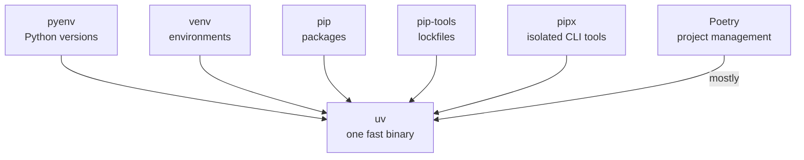

Every Python developer eventually accumulates the same tool zoo: pyenv to install Python versions, venv to isolate projects, pip to install packages, pip-tools to lock them, pipx to run CLI tools, and maybe Poetry to hold the whole thing together. Each tool is fine. The *pile* is not — six tools, six config styles, six ways for CI to differ from your laptop.

[uv](https://github.com/astral-sh/uv), from Astral (the makers of ruff), replaces the pile with one tool, written in Rust, and it is *fast* — dependency resolution and installs are routinely 10–100× quicker than pip with a warm cache. This post covers what it replaces, how to start, and how to migrate incrementally. (It pairs well with my tour of [what's new in Python 3.13 and 3.14](/engineering/python-313-314-whats-new/).)

## What uv actually is

One binary that can:

- **Install and manage Python versions** — no more pyenv, no more system-Python roulette.
- **Create and manage isolated environments** per project, automatically.
- **Manage dependencies** with a universal lockfile — add, remove, lock, sync.
- **Run tools in isolation** — linters and formatters without polluting your project env.
- **Speak pip** — a `uv pip` interface for incremental adoption with zero workflow change.

> **The kitchen analogy.** If your development environment is a kitchen, the classic setup has a separate gadget for every job — one machine to chop, one to time, one to weigh. uv is the multifunction appliance: one interface, every job, and it happens to work faster than the gadgets it replaced.



## Quick start

```bash
# Install and pin a Python version for your project
uv python install 3.14
uv python pin 3.14

# Initialize a project, add dependencies, lock, sync, test
uv init myproj && cd myproj
uv add fastapi uvicorn
uv lock
uv sync
uv run pytest -q

# Run tools without touching your project environment
uvx ruff check .
uv tool install black
uv tool list

# Or use pip-style commands for incremental adoption
uv venv .venv && source .venv/bin/activate
uv pip install -r requirements.txt
uv pip freeze > requirements.lock.txt
uv pip sync requirements.lock.txt
```

Two commands do most of the daily work: `uv add <package>` (updates `pyproject.toml`, resolves, locks, and syncs in one step) and `uv run <command>` (runs anything inside the project environment, creating it on demand — you may never type `source .venv/bin/activate` again).

## The replacement cheat sheet

| Traditional tool | What it did | uv equivalent |
| --- | --- | --- |
| pyenv | Install/switch Python versions | `uv python install`, `uv python pin` |
| venv / virtualenv | Create isolated environments | `uv venv` (or implicit via `uv run`/`uv sync`) |
| pip | Install and uninstall packages | `uv pip install`, `uv pip uninstall`, or `uv add`/`uv remove` |
| pip-tools | Lock and synchronize dependencies | `uv lock`, `uv sync`, `uv pip sync` |
| pipx | Run CLI tools in isolation | `uvx`, `uv tool install` |
| Poetry (mostly) | Project deps, lockfiles, scripts, publishing | `uv init`, `uv add`, `uv lock`, `uv run`, `uv build`, `uv publish` |

A few notes on the edges:

- **pipx → uvx** is the easiest win: `uvx ruff check .` downloads, isolates, caches, and runs in one shot.
- **Poetry "mostly"**: uv covers dependency management, lockfiles, scripts, workspaces, building, and publishing. If you rely on Poetry plugins, check for equivalents before switching.
- **The lockfile** (`uv.lock`) is cross-platform and universal — one lockfile resolves for macOS, Linux, and Windows simultaneously, which ends a classic CI-versus-laptop drift.

## Who gets what out of it

- **Platform / infrastructure teams**: reproducible, predictable builds — the lockfile plus pinned Python version means "works on my machine" finally means something.
- **DevOps / CI**: fewer tools to install in pipelines, and dramatically faster installs. A cold `uv sync` frequently turns a minutes-long pip step into seconds.
- **SREs**: isolated tool execution (`uvx`) means diagnostic tools never contaminate an app environment.
- **Developers**: one mental model, one config file, no environment-activation rituals.

## An incremental migration path

You don't need a big-bang migration. This is the sequence I recommend:

1. **Pilot** — pick one small project. `uv init`, `uv add` its dependencies, run its tests with `uv run pytest`. You'll learn the model in an hour.
2. **Replace pipx first** — switch your global tools (`ruff`, `black`, `pre-commit`) to `uvx`/`uv tool install`. Zero risk, immediate speed.
3. **Adopt pip-compatibly** — keep your existing `requirements.txt` workflow, but run it through `uv pip install`/`uv pip sync`. Same files, much faster, no team retraining.
4. **Move to lockfile workflows** — when the team is comfortable, migrate to `pyproject.toml` + `uv lock` + `uv sync` as the source of truth, and update CI to `uv sync --frozen`.
5. **Pin Python per project** — `uv python pin` ends the "which Python is this using?" class of bugs.

## Caveats

- uv is developed at a rapid pace — pin the uv version in CI (`uv self version` locally, a pinned installer version in pipelines) so a tool upgrade never surprises a deploy.
- Some Poetry-specific workflows (custom plugins, some dynamic-versioning setups) need rework rather than translation.
- Corporate proxies and private indexes work well (`UV_DEFAULT_INDEX` / `UV_INDEX`, or `[[tool.uv.index]]` in `pyproject.toml`), but test them in your pilot before rolling out broadly.

The bottom line: uv consolidates pyenv, venv, pip, pip-tools, pipx, and most of Poetry into a single fast, coherent utility. Of everything that's happened in Python tooling in the past few years, this is the change with the highest payoff-to-effort ratio — the pilot costs you an afternoon, and it's the rare tool that's simultaneously simpler *and* faster than what it replaces.

For the full documentation, see the [official uv repository](https://github.com/astral-sh/uv) and [docs](https://docs.astral.sh/uv/).
