*This is the guide I wish I'd had when I first started designing AI systems: every layer, pattern, and trade-off in one place. I keep it current and reach for it whenever I'm helping someone architect something new.*

## 01 — The AI Architecture Landscape

AI architecture in 2026 is no longer "pick a model and prompt it." It's a layered system with distinct concerns at each level. Understanding where each decision lives prevents the most common mistake: solving a knowledge problem with fine-tuning, or solving a behavior problem with RAG.

**Fig 01.1 — The AI system stack**

| Layer | Concerns |
|---|---|
| **Application layer** | chatbots, copilots, autonomous agents, data pipelines, content generation |
| **Orchestration layer** | single-agent loops, multi-agent coordination, human-in-the-loop, workflow engines |
| **Intelligence layer** | prompt engineering, RAG (retrieval), fine-tuning, tool use / MCP |
| **Model layer** | foundation models (GPT, Claude, Gemini, Llama), embedding models, specialized models |
| **Infrastructure layer** | GPUs / TPUs, model serving, vector databases, model gateways, observability |

> **The architect's job:** At each layer, you're making trade-off decisions: which model, how to customize it, how to orchestrate it, what guardrails to apply, and what infrastructure to run it on. The rest of this guide walks through each layer's decisions systematically.

## 02 — Foundation Models & Selection

### The major model families (2026)

| Provider | Frontier | Workhorse | Fast / cheap | Strengths |
|---|---|---|---|---|
| Anthropic | Claude Opus | Claude Sonnet | Claude Haiku | Safety, long context (200K), coding, structured output |
| OpenAI | GPT-4.5 / o3 | GPT-4o | GPT-4o mini | Ecosystem breadth, multimodal, reasoning (o-series) |
| Google | Gemini Ultra | Gemini Pro | Gemini Flash | Multimodal native, huge context (1M+), Google integration |
| Meta | Llama 4 Maverick | Llama 4 Scout | Llama 3.3 70B | Open weights, self-hostable, fine-tunable, no API dependency |
| Mistral | Mistral Large | Mistral Medium | Mistral Small | EU-hosted, multilingual, open weights for some |
| DeepSeek | DeepSeek-R1 | DeepSeek-V3 | — | Open weights, reasoning, cost-efficient, China-based |

### Model selection decision framework

**Fig 02.1 — How to choose a model**

- Need **maximum reasoning / complex tasks** (low volume, high stakes)? → **Frontier (Opus / GPT-4.5 / o3)**
- Need **balanced cost + capability** for most production workloads? → **Workhorse (Sonnet / GPT-4o / Pro)**
- Need **fast, cheap** for classification / routing / high-volume simple tasks? → **Fast (Haiku / mini / Flash)**
- Need **data sovereignty / no vendor lock-in / custom fine-tuning**? → **Open weights (Llama / Mistral / DeepSeek)**

> **Trade-off — closed API vs open weights:** **Closed API** (Claude, GPT) = highest capability, zero infra, pay-per-token, vendor lock-in. **Open weights** (Llama, Mistral) = self-hostable, fine-tunable, no per-token API cost — but you own GPU infra, ops, and security. Most production systems use a **mix**: closed API for the hard reasoning, open weights for high-volume/sensitive tasks.

> **Key principle — right-size the model:** Don't use a frontier model for everything. In a multi-agent system, the **router** uses a fast/cheap model (Haiku), the **main agent** uses the workhorse (Sonnet), and only the **hardest reasoning steps** escalate to frontier (Opus). This can cut costs 60–80% versus using frontier everywhere.

## 03 — The Customization Ladder

The single most important strategic decision: **how do you make a general model perform well on your specific task?** Three approaches, tried in this order.

**Fig 03.1 — The customization ladder (try from bottom → top)**

| Rung | What it changes | Tag |
|---|---|---|
| **Fine-tuning** | Change the model's *behavior* by training on your data — tone, format, domain reasoning. Most expensive, slowest to iterate. | behavior |
| **RAG** | Give the model *knowledge* at runtime by retrieving relevant docs. Doesn't change the model, changes what it sees. | knowledge |
| **Prompt engineering** | Change the *instructions* — system prompt, examples, context structure. Cheapest, fastest to iterate. | instructions |

> **The golden rule:** **Start with prompt engineering. Add RAG when you need knowledge the model doesn't have. Fine-tune only when behavior still isn't right after the first two.** Most teams overshoot — they fine-tune when RAG would've solved it, or build RAG when better prompting was enough. The practical default for most production systems in 2026 is prompt engineering + RAG.

| | Prompt engineering | RAG | Fine-tuning |
|---|---|---|---|
| **Changes** | Instructions to the model | Knowledge the model sees | Model weights / behavior |
| **Setup time** | Hours to days | Days to weeks | Weeks to months |
| **Cost** | ~$0 (prompt design) | $70–1000+/mo (infra) | $1000+ (training) + higher inference |
| **Data freshness** | Static (in prompt) | Live (retrieves at runtime) | Frozen at training time |
| **Best for** | Tone, format, simple tasks | Knowledge grounding, docs, enterprise data | Domain style, specialized reasoning, latency |
| **Iteration speed** | Minutes | Hours (re-index) | Days (re-train) |

### The decision flowchart

**Fig 03.2 — Which customization approach?**

- Can prompt engineering alone reach acceptable accuracy? → Yes → **Ship it. Iterate prompts.**
- Does the model need **knowledge it doesn't have** (your docs, live data, domain facts)? → Yes → **Add RAG**
- Is the model's **behavior / tone / format** still wrong after prompt + RAG? → Yes → **Fine-tune**
- Do you need **maximum control + data sovereignty + lowest per-token cost at scale**? → Yes → **Fine-tune open weights + self-host**

## 04 — Prompt Engineering (Production Patterns)

### Core techniques

| Technique | What it does | Use when |
|---|---|---|
| System prompt design | Define persona, role, constraints, output format | Every production system — the foundation of all customization |
| Few-shot examples | Show 2–5 input/output pairs to anchor behavior | Inconsistent output; need specific tone/format/length |
| XML/structured tags | Wrap context in tags (`<document>`, `<instructions>`) | Complex prompts with multiple context sources |
| Chain-of-thought | Ask model to reason step-by-step before answering | Complex reasoning, math, multi-step logic |
| Prefilled response | Start the assistant's response to steer format | Force JSON, force a specific opening structure |
| Self-critique / reflection | Model evaluates its own output, then revises | High-quality generation; catch hallucinations |

### The PRECISE framework (Anthropic's pattern)

**P**ersona · **R**ole · **E**xplicit instructions · **C**ontext · **I**nstructions · **S**teps · **E**xamples — a structured template for system prompts. The **Examples** component is the single most impactful lever: without examples, the model guesses format and tone from pretraining.

### Structured output patterns

- **Tool-use extraction:** define a "tool" whose input schema matches your desired JSON structure, force Claude to "call" it → schema-validated output. Production-grade.
- **JSON mode:** some APIs support `response_format: { type: "json_object" }` — simpler but less validation.
- **Validation-retry loop:** parse output → validate against schema → if invalid, send error back to model with the original input → retry (cap at 2–3).

> **Trade-off — strict schema vs free-form:** **Structured (tool_use / JSON Schema):** deterministic, parseable, production-safe — but constrains the model. **Free-form text:** more natural, flexible — but requires post-processing and can't be reliably parsed. Default to structured for any machine-consumed output.

## 05 — RAG Architectures

RAG (Retrieval-Augmented Generation) is the **dominant enterprise AI pattern in 2026** — grounding LLM responses in your own data. But "RAG" is no longer one thing; there are 5+ distinct architectures with very different complexity/accuracy trade-offs.

### The RAG maturity ladder

**Fig 05.1 — RAG architectures (simpler → more capable)**

| Architecture | How it works | Tag |
|---|---|---|
| **1. Naive RAG** | Embed query → vector search → stuff top-K chunks into prompt → generate. Baseline; works for simple Q&A. | start here |
| **2. Hybrid + rerank** | Combine vector search + keyword (BM25) search → reranker scores results → top chunks to LLM. Much better precision. | production baseline |
| **3. Self-RAG** | Model decides *whether* to retrieve, evaluates relevance of chunks, may re-retrieve. Reduces noise. | adaptive |
| **4. Graph RAG** | Knowledge graph + vector search. Enables multi-hop reasoning over connected entities (contracts, case law, org charts). | relationships |
| **5. Agentic RAG** | Agent decomposes query into sub-queries, decides which retrieval tools to call, iterates until it has enough context. Most capable. | complex reasoning |

> **The 60/30/10 rule:** In a typical enterprise system, ~60% of queries are simple enough for Naive or Hybrid RAG. ~30% benefit from reranking or Self-RAG. Only ~10% need Graph or Agentic RAG. **Adaptive RAG** routes each query to the cheapest architecture that can handle it — this is the cost-efficient production pattern.

**Fig 05.2 — Hybrid RAG pipeline (production baseline)**

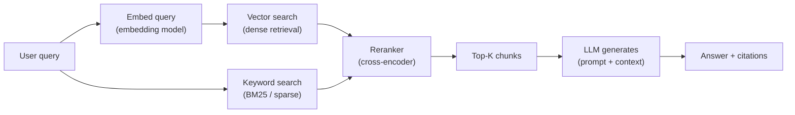

**Fig 05.3 — Agentic RAG (most capable)**

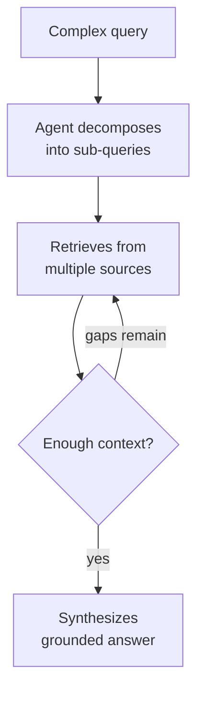

**Fig 05.4 — Graph RAG (relationship reasoning)**

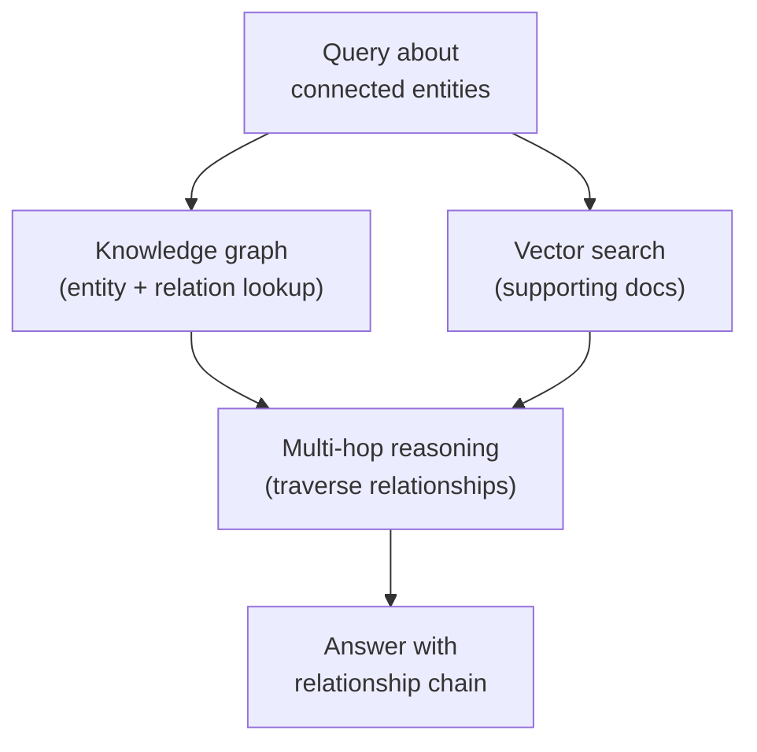

### RAG pipeline components

**Fig 05.5 — Document ingestion pipeline (offline / indexing)**

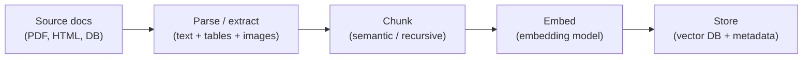

| Component | Options (2026) | Decision |
|---|---|---|
| Embedding model | Voyage 3, Cohere Embed v4, OpenAI text-embedding-3-large, Qwen3-Embedding | Domain-specific fine-tuned embeddings add 5–15% accuracy for specialized corpora |
| Vector database | Qdrant, Pinecone, Weaviate, Chroma, pgvector | Qdrant for greenfield; pgvector if already on Postgres; Pinecone for managed simplicity |
| Chunking strategy | Fixed-size, semantic, recursive, document-structure-aware | Structure-aware (respect headings, paragraphs) > fixed-size. Chunk size 256–512 tokens typical. |
| Reranker | Cohere Rerank, Voyage Rerank, cross-encoder models | Always add a reranker for production — cheap uplift in relevance |
| Retrieval method | Dense (vector), Sparse (BM25), Hybrid (both) | Hybrid is the 2026 production baseline — catches what pure vector misses |

> **Trade-off — chunk size:** **Small chunks (128–256 tokens):** more precise retrieval, but lose surrounding context. **Large chunks (512–1024):** more context per result, but may retrieve irrelevant noise. In practice, **256–512 with overlap** is the sweet spot. Some systems use "parent-child" chunking — retrieve the small chunk, then expand to include its parent context.

## 06 — Fine-Tuning

Fine-tuning changes the model's **weights** — it's the most powerful customization but the most expensive and slowest to iterate. Use it only when prompt engineering + RAG can't achieve the behavior you need.

### When to fine-tune (and when not to)

**Fine-tune when:**

- You need a specific **tone, style, or format** consistently
- Domain-specific **reasoning patterns** that prompting can't reliably produce
- You need to **reduce latency** (smaller fine-tuned model > larger general model)
- You have **large volume** and need to cut per-token cost by using a smaller model
- You need **data sovereignty** and will self-host open weights

**Don't fine-tune when:**

- You need **knowledge** — use RAG instead (fine-tuning "bakes in" data that goes stale)
- You're **still exploring** the product — iteration speed matters more than optimization
- You have **less than 100 high-quality examples** — insufficient for meaningful training
- The issue is **prompt quality**, not model capability — fix the prompt first
- The model **already does it well** with good prompting — fine-tuning adds complexity for no gain

### Fine-tuning techniques

| Technique | What it changes | Data needed | Use when |
|---|---|---|---|
| Full fine-tuning | All model weights | 10K+ examples | Deep domain adaptation; requires significant compute |
| LoRA / QLoRA | Low-rank adapter layers only | 100–1000 examples | Most practical for production; fast training, small adapters |
| RLHF / DPO | Alignment / preference | Preference pairs | Safety alignment, output quality improvement |
| Distillation | Trains small model to mimic large model | Large model outputs | Cost reduction: train Haiku-class to act like Opus-class on your domain |

> **The hybrid pattern (2026 default):** The best-performing production systems combine all three: **fine-tuned model** (behavior + domain tone) → **RAG** (current knowledge at runtime) → **prompt engineering** (per-request orchestration and guardrails). Each layer addresses a different failure mode.

**Fig 06.1 — The hybrid production pattern**

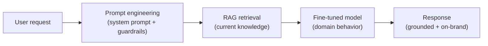

## 07 — Agentic AI Patterns

An **agent** is an LLM that operates in a loop — observe, think, act, repeat — rather than answering one question and stopping. It can use tools, make decisions, and take multi-step actions toward a goal.

### When to use agentic vs simpler patterns

**Fig 07.1 — Complexity spectrum**

- Single question → single answer, no tools needed? → **Simple prompt (no agent)**
- Fixed multi-step pipeline with no dynamic decisions? → **Workflow / chain (deterministic)**
- Dynamic decisions + tool use + variable steps? → **Single agent with tools**
- Multiple specialized capabilities + coordination? → **Multi-agent system**

> **Trade-off — agent vs workflow:** **Workflow (chain):** deterministic, predictable, easy to debug, lower cost — but can't handle dynamic/unknown paths. **Agent:** flexible, handles ambiguity, can reason about next steps — but unpredictable, harder to debug, more expensive. Default to the **simplest pattern that handles the task**. Don't build an agent when a chain would do.

### The agentic loop

```
1. Send request (prompt + tools + history)
2. Model responds
3. Check stop_reason
4. Execute tool(s)
5. Append results
⤴ Loop
```

- `stop_reason === "tool_use"` → execute tools → loop back.
- `stop_reason === "end_turn"` → terminate. This is the **only reliable** termination signal.
- Every iteration: append the assistant response and tool results to conversation history, so the model can reason about the cumulative state.

### Agent frameworks (2026)

| Framework | Best for | Provider |
|---|---|---|
| Claude Agent SDK | Production agents on Claude; hooks, subagents, session management | Anthropic |
| LangGraph | Complex stateful workflows with conditional branching, checkpointing | LangChain |
| AutoGen | Multi-agent conversation, research-oriented architectures | Microsoft |
| CrewAI | Quick multi-agent prototyping, role-based agents | Community |
| OpenAI Assistants / Agents SDK | Handoff-based agent routing, OpenAI ecosystem | OpenAI |

## 08 — Multi-Agent Systems

When a single agent isn't enough, you coordinate multiple specialized agents. Here are the 6 proven production patterns.

| Pattern | How it works | Use when |
|---|---|---|
| 1. Router (classifier) | Lightweight classifier directs each request to a specialized agent | Many distinct intents; each handled by a different specialist |
| 2. Planner-executor | Planner decomposes goal into steps; executor agents run steps in sequence/parallel | Complex tasks requiring dynamic decomposition |
| 3. Tool-use agent | Single agent with a toolbox; LLM decides which tool to call when | Moderate complexity; the agent can reason about tool selection |
| 4. Generator-critic | Primary agent generates output; critic agent verifies; ships only if critic passes | High-quality output; code review, compliance checking |
| 5. Supervisor-workers | Manager owns the goal; workers own subtasks; manager delegates and synthesizes | Enterprise workflows, regulated environments |
| 6. Parallel + judge | Multiple agents work the same problem in parallel; a judge picks the best output | Creative tasks, diverse approaches, consensus needed |

### Critical design principles

**Fig 08.1 — Router pattern (classifier → specialists)**

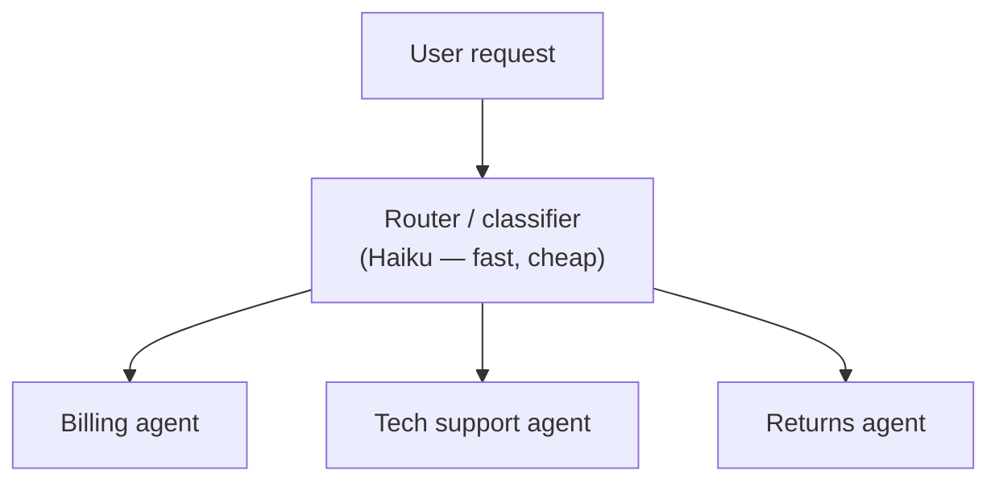

**Fig 08.2 — Planner-executor pattern**

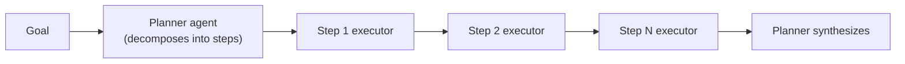

**Fig 08.3 — Generator-critic (quality gate)**

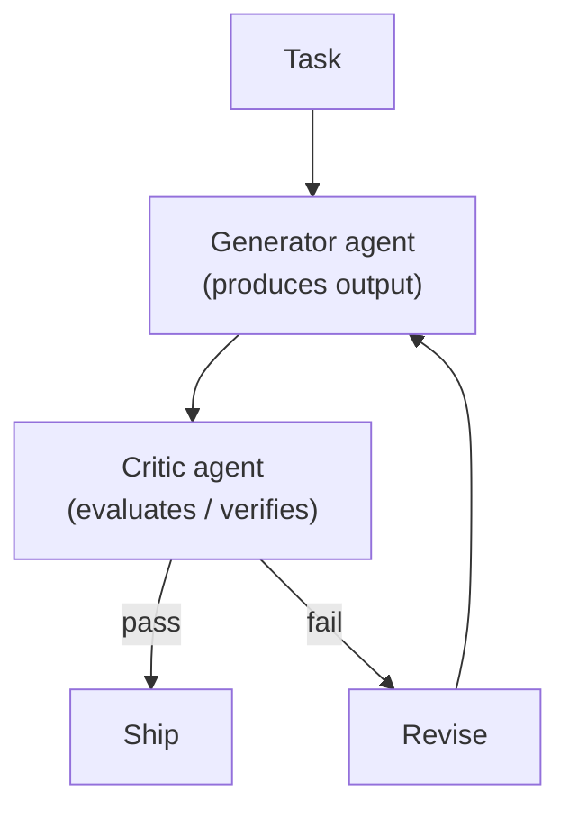

**Fig 08.4 — Supervisor-workers (enterprise)**

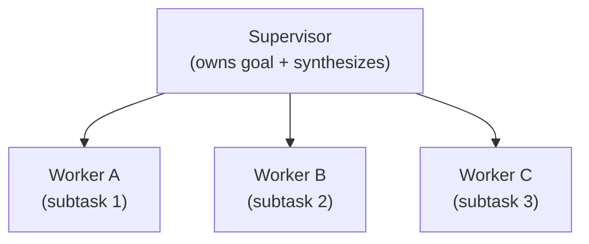

- **Context isolation:** each agent gets only the context it needs — never share the coordinator's full history (prevents context pollution).
- **Structured handoffs:** pass JSON between agents, not raw text — preserves attribution and structure.
- **Minimal footprint:** each agent scoped to a single responsibility and returns a focused result.
- **Right-size models:** router = Haiku; workers = Sonnet; hardest reasoning = Opus.
- **Observability:** log every agent call, tool use, and decision at the coordinator level. You cannot debug what you cannot see.

> **Common mistake:** Building a multi-agent system when a single agent with tools would suffice. Multi-agent adds latency, cost, and debugging complexity. Start with the simplest architecture that works, and only add agents when you hit a clear capability ceiling.

## 09 — Tool Use & MCP

### Tool use — what it is

Tool use lets the model call **functions you define**. The model doesn't execute the function — it outputs a structured request (function name + arguments), your code executes it, and you send the result back. This gives the model capabilities beyond text generation: search, calculation, API calls, database queries.

### MCP (Model Context Protocol)

An open standard for connecting AI models to external tools and data sources — "USB-C for AI." Instead of each app building custom integrations, MCP provides a standard protocol.

| MCP primitive | What it does | Direction |
|---|---|---|
| Tools | Functions the model can call (actions) | Model → server (write/execute) |
| Resources | Data the model can read (files, records, URIs) | Server → model (read-only) |
| Prompts | Reusable prompt templates exposed by the server | Server → model (templates) |

> **Tool description quality matters most:** The model uses the tool's **description** to decide which tool to call. Vague descriptions ("handles data") lead to misrouting. Write descriptions with **distinct verbs, narrow scope, and clear use cases**. Test with production queries and log selection accuracy.

## 10 — LLMOps & Evaluation

LLMOps is the discipline of deploying, monitoring, and improving LLM-based systems in production. It's MLOps adapted for the non-deterministic, prompt-driven world.

### The LLMOps lifecycle

```
Develop (prompts, RAG, agents) → Evaluate (test sets, benchmarks)
→ Deploy (gateway, versioning) → Monitor (logs, quality, cost)
→ Improve (feedback loops) → ⤴ Iterate
```

### Evaluation (the hardest part)

| Eval type | How it works | When |
|---|---|---|
| Human evaluation | Domain experts rate outputs on rubrics (accuracy, helpfulness, safety) | Gold standard; expensive; use for benchmarking |
| LLM-as-judge | A stronger model evaluates a weaker model's output against criteria | Scalable proxy for human eval; useful for regression testing |
| Automated metrics | BLEU, ROUGE, exact match, retrieval precision/recall | Coarse signal; best for RAG retrieval quality, not generation quality |
| A/B testing | Route % of traffic to new version, measure business outcomes | Production; the only eval that matters is real-user impact |

### Model gateway pattern

A centralized proxy between your application and LLM providers. It handles: rate limiting, token budget tracking, multi-provider failover, prompt/response logging, cost attribution, and policy enforcement. Every production system should have one.

> **Cost management levers:** **Prompt caching** (90% cheaper cached reads) · **Batch API** (50% cheaper, async) · **Model right-sizing** (Haiku for routing) · **Token budgets** (per-user, per-team) · **Progressive summarization** (reduce context growth). A well-run system can cut LLM costs 40–70% vs naive implementation.

## 11 — AI Safety & Guardrails

### Defense in depth — layered guardrails

**Fig 11.1 — Guardrail layers**

| Layer | Controls |
|---|---|
| **Input guardrails (before the model)** | prompt injection detection, PII scrubbing, topic filtering, rate limiting |
| **Model-level controls** | system prompt constraints, operator permissions, tool restrictions, response prefilling |
| **Output guardrails (after the model)** | content classification, schema validation, PII detection on output, citation verification |
| **Action guardrails (before execution)** | tool-call validation (hooks), human-in-the-loop gates, irreversible-action blocks, spending limits |

> **Trade-off — programmatic vs prompt-based guardrails:** **Programmatic (hooks, code):** deterministic, can't be jailbroken, auditable — use for hard safety (PII, compliance, permissions). **Prompt-based:** flexible, natural-language, covers nuance — but can be circumvented by adversarial input. **Layer both:** prompts handle the soft cases, code handles the hard constraints.

### Key safety concepts

- **Prompt injection:** adversarial input that overrides system instructions. Defense: input validation + output verification + model-level resistance + separation of trusted/untrusted content.
- **Hallucination mitigation:** RAG grounding + citation requirements + self-evaluation + nullable fields in schemas (model can say "I don't know").
- **Human-in-the-loop:** mandatory approval gate before irreversible or high-value actions (financial transactions, data deletion, external communications). Design the escalation criteria explicitly.
- **Red teaming:** adversarial testing by humans or automated tools to find failure modes before deployment. Run regularly, not just once.

## 12 — Enterprise AI Governance

- **Data governance:** RAG is only as good as the data it retrieves. Enforce access controls on retrieval (document-level and row-level ACLs). Don't let the model see data the user shouldn't see.
- **Compliance:** regulated industries (healthcare, finance, government) need audit trails of every prompt, response, tool call, and decision. Log everything through the model gateway.
- **Data residency:** know where your prompts are processed. Closed APIs send data to the provider's region. For sovereignty, self-host open-weight models or use provider regions that match your jurisdiction.
- **Cost governance:** set token budgets per team/project; alert on anomalies; review cost-per-outcome, not just cost-per-token.
- **Model risk management:** treat LLMs as you'd treat any critical vendor: track model versions, test for regression on updates, have a rollback plan, maintain a "model bill of materials."

## 13 — Infrastructure & Serving

### Inference infrastructure

| Approach | Use when | Trade-off |
|---|---|---|
| API providers (Anthropic, OpenAI, Google) | Default. Zero infra, pay per token, highest capability | Vendor dependency, data leaves your control |
| Self-hosted (vLLM, TGI, Ollama) | Data sovereignty, custom models, predictable cost at scale | You own GPU infra, ops, scaling, security |
| Managed serving (AWS Bedrock, GCP Vertex, Azure AI) | Cloud-provider ecosystem, compliance, hybrid of API + control | Cloud lock-in, sometimes behind on latest models |

### GPU/TPU landscape

- **NVIDIA H100/H200:** the workhorse for LLM training and inference; most available, broadest framework support.
- **NVIDIA B100/B200 (Blackwell):** next-gen, higher throughput; becoming available 2025–2026.
- **Google TPUs (v5e/v6e):** competitive for training large models on GCP; Jax/TensorFlow-centric.
- **AMD MI300X:** growing alternative; good cost/performance for inference.

> **Trade-off — API vs self-host:** **API** wins when: you're under ~$50K/mo in inference, you want the latest models immediately, you don't have GPU ops expertise. **Self-host** wins when: you're spending $100K+/mo (amortized GPU cost is lower), you need data sovereignty, or you've fine-tuned open weights. Most enterprises use both — API for frontier reasoning, self-hosted for high-volume / sensitive tasks.

## 14 — Multimodal AI

Modern AI systems aren't text-only. **Multimodal** models process images, audio, video, and code alongside text.

| Modality | Models (2026) | Use cases |
|---|---|---|
| Vision (image → text) | Claude Sonnet/Opus, GPT-4o, Gemini Pro | Document understanding, UI analysis, image description, OCR replacement |
| Image generation | DALL-E 3, Midjourney, Stable Diffusion 3, Imagen 3 | Creative assets, product mockups, data visualization |
| Audio / speech | Whisper (STT), GPT-4o (native audio), ElevenLabs (TTS) | Transcription, voice agents, real-time conversation |
| Video | Gemini (native video), Sora, Runway Gen-3 | Video understanding, generation, editing |
| Code | Claude, GPT-4o, Codex, DeepSeek-Coder | Code generation, review, debugging, migration |

### Multimodal RAG

Standard RAG embeds text. **Multimodal RAG** also embeds images, tables, and diagrams from documents (using vision models or multimodal embeddings like CLIP/Jina CLIP). This is critical for document-heavy industries (legal, medical, manufacturing) where important information lives in charts, forms, and images — not just text.

## 15 — Cloud AI Platforms — GCP / AWS / Azure

Knowing the patterns (§03–§08) is half the job. The other half is knowing **which cloud services implement them** for a customer deployment. This section maps every AI architecture pattern to its concrete service on each cloud, plus the architect-level trade-offs for platform selection.

### The three platforms at a glance

| | GCP | AWS | Azure |
|---|---|---|---|
| **Primary AI platform** | Vertex AI / Gemini Enterprise Agent Platform | SageMaker + Bedrock | Azure AI Studio + Azure ML |
| **Foundation model access** | Gemini (native), Llama, Gemma via Model Garden | Claude, Llama, Mistral, Cohere via Bedrock; GPT via custom | GPT-4o/o3 via Azure OpenAI (exclusive); Llama, Mistral via Model Catalog |
| **Unique hardware** | TPUs (v5e/v6e) — best $/FLOP for large training | Trainium/Inferentia — purpose-built inference chips | Maia AI accelerators (emerging) |
| **Best for** | Data in BigQuery, Gemini models, TPU training, opinionated managed workflows | Deepest flexibility, broadest ecosystem, Bedrock for Claude/multi-model | Microsoft-centric orgs, Azure OpenAI (GPT), compliance/hybrid |
| **Sweet spot** | Research, startups, warehouse-native ML | Expert teams, fine-grained control, large inference | Enterprises on Microsoft stack, regulated industries |

### Service mapping — pattern → cloud service

| AI architecture pattern | GCP | AWS | Azure |
|---|---|---|---|
| **Model training (custom)** | Vertex AI Training + TPUs | SageMaker Training + p5/Trainium | Azure ML Compute + ND-series GPUs |
| **Fine-tuning (managed)** | Vertex AI Model Tuning | SageMaker JumpStart fine-tuning / Bedrock custom models | Azure AI Studio fine-tuning / Azure OpenAI fine-tuning |
| **Model serving / inference** | Vertex AI Endpoints (dedicated + serverless) | SageMaker Endpoints (real-time, serverless, async, multi-model) | Azure ML Managed Endpoints (online + batch) |
| **Foundation model API (hosted)** | Vertex AI Model Garden / Gemini API | Amazon Bedrock | Azure OpenAI Service / Azure AI Model Catalog |
| **RAG — vector search** | Vertex AI Vector Search / AlloyDB pgvector | Amazon OpenSearch / Bedrock Knowledge Bases / Aurora pgvector | Azure AI Search (vector mode) / Cosmos DB vCore |
| **RAG — embedding** | Vertex AI Embeddings (Gemini) / text-embedding | Bedrock Embeddings (Titan / Cohere) | Azure OpenAI Embeddings (ada-002/3-large) |
| **RAG — orchestration** | Vertex AI Agent Builder | Bedrock Knowledge Bases + Agents | Azure AI Studio Prompt Flow |
| **MLOps pipeline** | Vertex AI Pipelines (Kubeflow) | SageMaker Pipelines | Azure ML Pipelines |
| **Experiment tracking** | Vertex AI Experiments | SageMaker Experiments / MLflow on SageMaker | Azure ML + MLflow |
| **Model registry** | Vertex AI Model Registry | SageMaker Model Registry | Azure ML Model Registry |
| **Feature store** | Vertex AI Feature Store | SageMaker Feature Store | Azure ML Managed Feature Store |
| **Data labeling** | Vertex AI Data Labeling | SageMaker Ground Truth | Azure ML Data Labeling |
| **AutoML** | Vertex AI AutoML | SageMaker Autopilot | Azure AutoML |
| **AI safety / guardrails** | Model Armor + VPC-SC | Bedrock Guardrails | Azure AI Content Safety |
| **Agent framework** | Agent Builder / Vertex AI Agent | Bedrock Agents | Azure AI Agent Service |
| **Notebooks** | Vertex AI Workbench (managed JupyterLab) | SageMaker Studio | Azure ML Notebooks |

**Fig 15.1 — Cloud AI training & inference pipeline (generic, all clouds)**

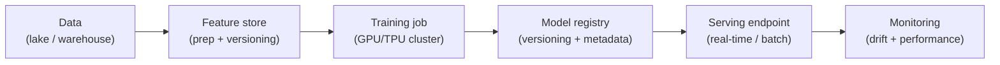

### Platform selection decision tree

**Fig 15.2 — Which cloud for your AI workload?**

- **Data gravity:** where does most of your data already live? → S3 → AWS · BigQuery → GCP · Azure Data Lake → Azure
- Need **Azure OpenAI (GPT-4o/o3)**? → **Azure (exclusive enterprise GPT access)**
- Need **Claude** via managed service? → **AWS Bedrock (deepest Claude integration)**
- Need **Gemini** or **TPU training**? → **GCP Vertex AI**
- **Microsoft-centric** org (Entra, M365, Power BI)? → **Azure ML**
- Need **maximum flexibility** + deepest service catalog? → **AWS SageMaker**
- **Greenfield team** wanting opinionated, fast-to-start pipelines? → **GCP Vertex AI**

> **The data gravity rule:** The single strongest predictor of platform choice is **where the data already lives**. Moving petabytes between clouds is expensive and slow. If your data is in BigQuery, build on Vertex AI. If it's in S3, build on SageMaker. If it's in Azure Data Lake or SQL Server, build on Azure ML. Everything else is secondary.

### Training infrastructure trade-offs

| Factor | GCP | AWS | Azure |
|---|---|---|---|
| **Best GPU value** | TPU v5p ~$4.20/hr (best $/FLOP for large training) | H100 via p5 ~$8.60–10.80/hr; Trainium for AWS-optimized workloads | H100 via ND-series; best through EA negotiated pricing |
| **Spot / preemptible** | Spot VMs up to ~91% off (good for training) | Spot Instances (~60–90% off); SageMaker Managed Spot Training | Spot VMs available but less GPU spot capacity |
| **Distributed training** | TPU pods (scale natively); GPU with NCCL | SageMaker HyperPod (auto fault recovery, 99.9% uptime in 6-week runs) | Azure ML distributed training with DeepSpeed/FSDP |
| **Cost savings** | Sustained Use Discounts (auto); CUDs | SageMaker Savings Plans (up to 64%) | Enterprise Agreement negotiated rates |

### Inference infrastructure trade-offs

| Pattern | GCP | AWS | Azure |
|---|---|---|---|
| **Real-time (always-on)** | Vertex AI Dedicated Endpoints (~$7/day min) | SageMaker Real-time Endpoints | Azure ML Managed Online Endpoints |
| **Serverless (scale-to-zero)** | Vertex AI Serverless Prediction (limited model types) | SageMaker Serverless Inference (scales to zero — dev/low-traffic) | Azure ML Serverless (newer) |
| **Batch** | Vertex AI Batch Prediction | SageMaker Batch Transform | Azure ML Batch Endpoints |
| **Multi-model hosting** | Custom containers (manual routing) | SageMaker Multi-Model Endpoints + Inference Components (up to 80% savings) | Custom containers |
| **Async inference** | Custom (Pub/Sub + Cloud Run) | SageMaker Async Inference (native, built-in) | Custom (Service Bus + Azure Functions) |
| **Foundation model API** | Vertex AI / Gemini API (pay per token) | Bedrock (pay per token; 50% batch discount) | Azure OpenAI (pay per token; provisioned throughput for steady load) |

> **Trade-off — managed platform vs self-hosted on cloud:** **Managed platform** (SageMaker/Vertex/Azure ML) = faster to ship, less ops, built-in MLOps — but 20–40% more expensive than raw compute (e.g., SageMaker ml.* instances cost more than equivalent EC2). **Self-hosted on raw VMs** (EC2 + your own serving stack like vLLM) = cheaper at scale, full control — but you own infrastructure, scaling, monitoring. Use managed for most workloads; go self-hosted only if you have a dedicated MLOps team *and* the cost savings justify it.

### Multi-cloud AI patterns

- **Train on one cloud, infer on another:** train where GPUs/TPUs are cheapest (GCP TPUs for large models), deploy inference where your app already runs (AWS/Azure). Transfer the trained model weights, not the training data.
- **AI Gateway pattern:** a proxy layer that routes LLM API calls to the cheapest/fastest/most-available provider (Claude on Bedrock, GPT on Azure, Gemini on Vertex) with automatic failover. Emerging standard for multi-cloud LLM ops.
- **Portable MLOps:** standardize on vendor-neutral tools (MLflow for tracking, KubeFlow for pipelines, ONNX for model format) to reduce lock-in. Managed services are faster but create deeper coupling.

**Fig 15.3 — Multi-cloud AI gateway pattern**

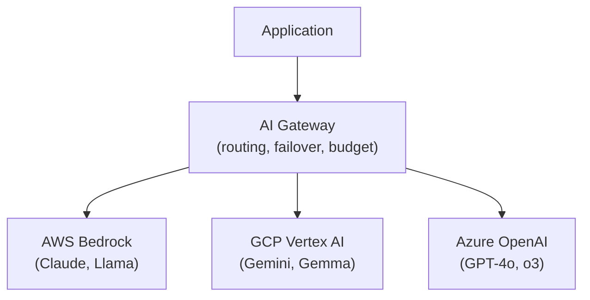

## 16 — Trade-off Master Reference

Every architectural decision an AI architect makes, in one table.

| Decision | Option A | Option B | Default |
|---|---|---|---|
| Customization approach | Prompt engineering | RAG → Fine-tuning | Start with prompts, escalate |
| Model tier | Frontier (most capable) | Fast/cheap (cost-efficient) | Right-size per task |
| Model source | Closed API | Open weights (self-host) | API unless sovereignty/cost forces self-host |
| RAG vs fine-tune | RAG (knowledge at runtime) | Fine-tune (behavior change) | RAG for knowledge, fine-tune for behavior only |
| Agent vs workflow | Deterministic workflow/chain | Dynamic agent loop | Simplest that works |
| Single vs multi-agent | One agent + tools | Multi-agent coordination | Single until you hit capability ceiling |
| Sequential vs parallel | Sequential (steps depend on prior) | Parallel (independent subtasks) | Sequential for dependent; parallel for independent |
| Guardrails | Prompt-based (soft) | Programmatic hooks (hard) | Both — prompts for nuance, code for safety |
| Structured vs free-form output | Schema-validated JSON | Natural language text | Structured for machine consumption |
| Chunk size (RAG) | Small (128–256 tokens) | Large (512–1024 tokens) | 256–512 with overlap |
| Retrieval method | Vector (dense) only | Hybrid (vector + keyword) | Hybrid is 2026 production baseline |
| Evaluation | Automated metrics | Human evaluation | LLM-as-judge for scale, human for gold standard |
| Batch vs real-time | Batch API (50% cheaper) | Real-time Messages API | Batch for bulk ETL; real-time for user-facing |
| Context strategy | Full history (precise) | Progressive summarization (efficient) | Summarize when context exceeds 50% of window |
| Caching | Prompt cache (90% cheaper reads) | No cache | Cache anything repeated across turns |
| Cost control | Per-token optimization | Per-outcome optimization | Measure cost per successful outcome, not just tokens |
| Cloud AI platform | Managed (SageMaker/Vertex/Azure ML) | Self-hosted on raw compute | Managed unless dedicated MLOps team + cost savings justify self-hosting |
| Training hardware | GPUs (H100, universal) | TPUs (GCP) / Trainium (AWS) | GPUs for flexibility; TPU/Trainium for cost at large scale |
| Foundation model source | Cloud-managed API (Bedrock/Vertex/Azure OpenAI) | Direct vendor API (Anthropic/OpenAI) | Cloud-managed for governance + VPC; direct for latest models + flexibility |
| Multi-cloud vs single | Single cloud (simpler ops) | Multi-cloud (avoid lock-in) | Single unless regulatory/cost/model-access forces multi-cloud |

> **The architect's mental model:** Every decision above is a dial, not a switch. The expert architect doesn't pick "always A" or "always B" — they tune each dial per use case, per constraint, and per organizational context. The table gives you the defaults; the skill is knowing when to deviate.

## 17 — Books & Learning Path

Organized as a reading path — start at the foundation and work up. Each book is mapped to the guide sections it reinforces. The goal is depth and coherence, not breadth — these are the ones practitioners actually reference.

### Tier 1 — Foundations (start here)

| Book | Author(s) | Covers | Maps to |
|---|---|---|---|
| Build a Large Language Model (From Scratch) | Sebastian Raschka · Manning, 2025 | Attention, tokenization, pretraining, fine-tuning, LoRA — builds a GPT-like model step by step. Understand what's inside the black box. | §02, §06 |
| Hands-On Large Language Models | Jay Alammar & Maarten Grootendorst · O'Reilly, 2024 | Embeddings → RAG → fine-tuning in one accessible flow. Great visual explanations of transformer internals. | §02, §05, §06 |
| Designing Machine Learning Systems | Chip Huyen · O'Reilly, 2022 | The ML lifecycle: data, modeling, deployment, monitoring, iteration. The principles transfer directly to LLM systems. | §10, §12 |

### Tier 2 — Production AI engineering

| Book | Author(s) | Covers | Maps to |
|---|---|---|---|
| AI Engineering | Chip Huyen · O'Reilly, 2025 | The full stack: evaluation, prompt design, RAG, agent architectures, deployment trade-offs. Arguably the single best production LLM book. | §03–§10 |
| The LLM Engineer's Handbook | Paul Iusztin & Maxime Labonne · Packt, 2024 | End-to-end project: RAG, fine-tuning, vector DBs, evaluation, deployment, observability, cost optimization. | §05, §06, §10, §13 |
| Building LLMs for Production | Louis-François Bouchard & Louie Peters · Towards AI, 2024 | Practical RAG techniques (vanilla through GraphRAG), prompt engineering, agents, fine-tuning, deployment. Code-heavy. | §04, §05, §06, §07 |

### Tier 3 — Agents & multi-agent systems

| Book | Author(s) | Covers | Maps to |
|---|---|---|---|
| Building Applications with AI Agents | Victor Dibia · Manning, 2025 | 6 orchestration patterns, PicoAgents library from scratch, MCP/A2A, evaluation, failure modes, 2 full case studies. Framework-agnostic. | §07, §08, §09, §11 |
| Agentic Architectural Patterns for Building Multi-Agent Systems | Ali Arsanjani & Juan Pablo Bustos · Packt, 2026 | Hierarchical multi-agent architecture, coordination, explainability, fault tolerance, human-agent interaction. Enterprise-focused. | §08, §11, §12 |
| Building LLM-Powered Applications | Valentina Alto · Packt, 2024 | LangChain, agent memory, tool integration, multi-agent architectures, failure handling. Prototype-to-production. | §07, §08, §09 |

### Tier 4 — Specialized depth

| Book | Author(s) | Covers | Maps to |
|---|---|---|---|
| Prompt Engineering for LLMs | John Berryman & Albert Ziegler · O'Reilly, 2025 | Context as "packets of knowledge"; flexible, scalable prompt systems. Written by a core GitHub Copilot engineer. | §04 |
| Prompt Engineering for Generative AI | James Phoenix & Mike Taylor · O'Reilly, 2024 | CoT, ReAct, planning loops, agent behavioral architecture, prompt debugging. Strong on why agents fail. | §04, §07 |
| Building Reliable AI Systems | Manning, 2026 | Reduce hallucinations, improve performance, manage bias. From prototype to production reliability. | §10, §11 |
| Generative AI Design Patterns | Multiple authors · Packt | 32 patterns including RAG, reasoning, generation, evaluation. Pattern catalog for architects. | §04–§08 |
| Machine Learning System Design Interview | Ali Aminian & Alex Xu | ML design problems, feature engineering, scalability, monitoring. System-design thinking for ML/AI. | §10, §12, §13 |

### Tier 5 — Data & infrastructure foundations

| Book | Author(s) | Covers | Maps to |
|---|---|---|---|
| Fundamentals of Data Engineering | Joe Reis & Matt Housley · O'Reilly, 2022 | Data lifecycle: ingestion, storage, transformation, orchestration, serving. The data layer beneath every AI system. | §05 (data for RAG), §12 |
| Designing Data-Intensive Applications | Martin Kleppmann · O'Reilly, 2017 | Distributed systems, consistency, replication, partitioning. Still the GOAT for understanding the infrastructure AI runs on. | §13 |

### Tier 6 — Cloud AI platforms & MLOps

| Book | Author(s) | Covers | Maps to |
|---|---|---|---|
| Practical MLOps | Noah Gift & Alfredo Deza · O'Reilly, 2021 | MLOps on AWS, Azure, GCP — the cross-cloud operational playbook. AutoML, containers, edge, monitoring. Practical case studies. | §10, §13, §15 |
| MLOps Engineering at Scale | Carl Osipov · Manning, 2022 | Serverless ML pipelines on AWS: PyTorch + SageMaker + Lambda + Step Functions. Infrastructure-as-code for ML. | §10, §13, §15 (AWS) |
| GCP MLOps Engineer Handbook | Dilip Kumar Mondal · 2026 | Vertex AI, BigQuery, Cloud Build, Pipelines. End-to-end GCP-native ML platform design with drift detection and monitoring. | §10, §15 (GCP) |
| Hands-On MLOps on Azure | Various · Packt | Azure ML CLI, GitHub integration, LLMOps, secure and scalable ML workflows on Azure. Enterprise governance focus. | §10, §12, §15 (Azure) |
| The Machine Learning Solutions Architect Handbook | David Ping · Packt, 2nd ed. 2024 | ML lifecycle, system design, MLOps, generative AI from a solutions architect perspective. Cross-cloud strategies and best practices. | §10–§15 |
| AI Systems Performance Engineering | Various · 2025 | Optimizing model training and inference with GPUs, CUDA, PyTorch. Hardware-level understanding for architects who need to spec infrastructure. | §13, §15 |

### Free & open resources

| Resource | What it is | Maps to |
|---|---|---|
| Anthropic Academy (anthropic.skilljar.com) | 19 free courses: Claude API, MCP, Claude Code, AI Fluency, Agentic Architecture. Official Anthropic. | §04, §07, §09 |
| Anthropic Cookbook (github.com/anthropics/anthropic-cookbook) | 43K+ stars. Production recipes: RAG, tool use, agents, structured output, prompt caching. | §04, §05, §07, §09 |
| DeepLearning.AI short courses | Free courses with Andrew Ng: LangChain, LlamaIndex, RAG, agents, fine-tuning, prompt engineering. | §03–§08 |
| Full Stack AI Engineering (Towards AI Academy) | Louis-François Bouchard's practical course: RAG, agents, fine-tuning, deployment. | §05–§10 |
| LLM Visualization (bbycroft.net/llm) | Interactive 3D visualization of transformer internals. Best single resource for building intuition on how LLMs work. | §02 |
| MCP Specification (modelcontextprotocol.io) | The open standard specification for tool/resource/prompt integration. | §09 |
| Cloud ML Platforms (Coursera — Board Infinity) | Free course: deploy ML on AWS SageMaker, Azure ML, Vertex AI. Practical cross-cloud comparison. | §15 |
| AWS ML Specialty exam guide + free training | AWS Skill Builder free courses covering SageMaker, Bedrock, MLOps on AWS. | §15 (AWS) |
| Google Cloud Skills Boost — ML Engineer path | Free labs + courses on Vertex AI, BigQuery ML, MLOps on GCP. | §15 (GCP) |
| Microsoft Learn — Azure AI Engineer path | Free modules on Azure ML, Azure OpenAI, Prompt Flow, responsible AI. | §15 (Azure) |

### Recommended reading order

**Fig 17.1 — Learning path (follow the arrows)**

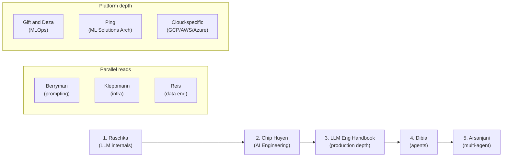

> **The learning principle:** Reading is necessary but not sufficient. **Pair each book with a real project:** build a RAG chatbot after the RAG chapters, fine-tune a model after the fine-tuning chapters, deploy an agent after the agent chapters. The combination of strong mental models from books and hands-on experience building real systems is what separates architects from tutorial-watchers.

---

*Built from current industry practice, research, and production patterns. Independent reference — not affiliated with any vendor. The AI landscape moves fast; verify current model availability and pricing before making procurement decisions.*
