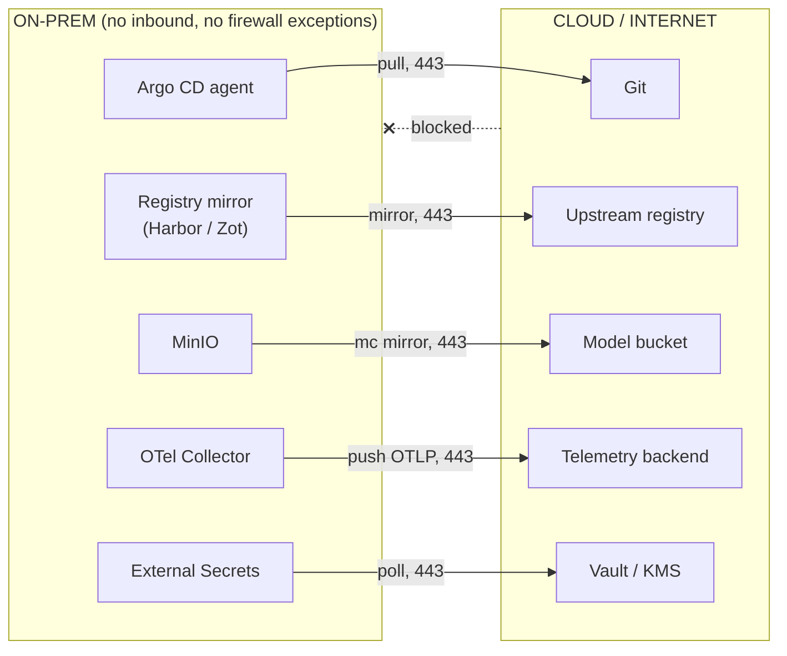
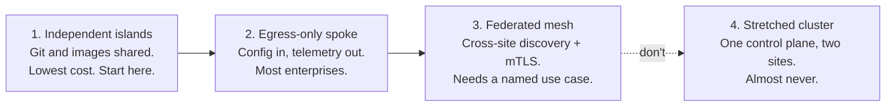
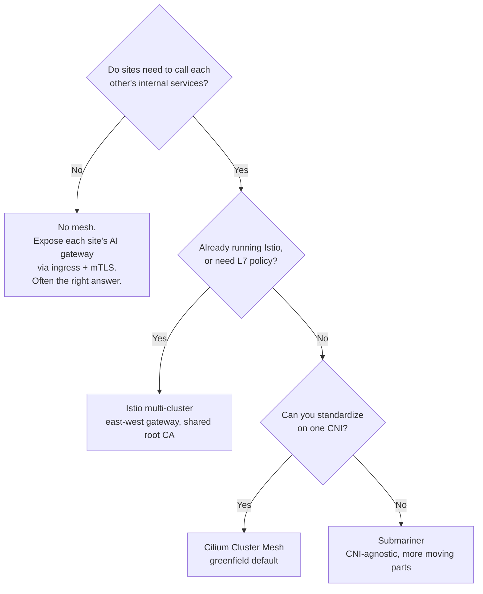

*The model layer is the easy part. On every hybrid platform I have worked on, the boundary between a cloud VPC and a datacenter that accepts no inbound connections has taken more time than everything above it combined — and that constraint, once you stop fighting it, turns out to produce the better architecture anyway.*

## 01 — Assume No Inbound Connectivity, Ever

Start from the rule, not the negotiation: **nothing outside the datacenter may initiate a connection into it.** Every interaction is opened from the restricted side, outbound, over 443.

This is not pessimism about firewalls. A firewall change request is an organisational object, not a technical one — it crosses a team boundary, acquires a review board, and comes back weeks later scoped more narrowly than you asked. Then it does that again for the next service. A design that needs three of them has a dependency it cannot schedule; a design that needs none ships on your own timeline.

The reframe is the part worth keeping. Outbound-only is not the compromise you accept to get approved — it is a better architecture that you arrived at under duress. A site with no inbound listeners presents nothing to enumerate from outside, and because every channel is a pull, the datacenter's entire delivery surface is a list short enough to hold in your head. Five items, as section 08 works through.

**Fig 02.1 — Outbound-only, and the one thing that is impossible**



## 02 — Pick a Topology First

Before any tooling question, decide how connected the sites actually need to be. There are four answers, and they form a ladder of operational cost rather than a menu of equals.

| Pattern | What it means | Use when | Cost |
|---|---|---|---|
| **1. Independent islands** | Each site runs the full stack; only Git and container images are shared | Data must never cross; simplest to operate | Lowest — start here |
| **2. Egress-only spoke** | On-premises pulls config and pushes telemetry outbound; nothing inbound | Strict firewall policy, which is most enterprises | Low |
| **3. Federated mesh** | Cross-site service discovery and mTLS; services call each other by name | Cloud burst, or cloud applications calling on-premises data services | Medium to high |
| **4. Stretched cluster** | One control plane, nodes in both places | Almost never — latency and partition behaviour will hurt you | Don't |

Start at 1 or 2. Graduate to 3 only against a named use case, and treat "we might want cross-site calls later" as not being one. Pattern 4 is on the list so you can recognise and reject it: a control plane with a WAN inside it fails in ways that are genuinely hard to reason about.

Force this decision early, because it is the cheapest one to get right and the most expensive to revisit. It is also routinely over-answered — most "we need a service mesh across clouds" requirements dissolve under questioning into "we need on-premises to read a cloud bucket", which is pattern 1 with credentials.

**Fig 02.2 — Topology as an escalation ladder**



## 03 — CIDR Planning, Or a Rebuild Later

Anything past pattern 1 has one non-negotiable prerequisite: **non-overlapping pod, service and node CIDRs across every site, allocated before the first cluster exists.**

Overlapping RFC1918 between a datacenter and a VPC is the most common hybrid blocker and the least forgiving, because pod and service CIDRs are fixed at cluster creation on every distribution worth running. There is no reconfiguration path. Retrofitting means standing up replacement clusters and migrating onto them — a quarter of work to undo an afternoon's decision.

So allocate from one registry covering cloud VPCs and datacenter ranges together, including the sites that do not exist yet, and validate the allocations as data in CI rather than in a spreadsheet. That is the same guardrail that keeps managed-database connectivity sane, which I have written up [in that context](/engineering/network-connectivity-for-managed-database-platforms/). For which ranges Kubernetes needs reserved and why they have to be distinct, plan against the [cluster networking concepts](https://kubernetes.io/docs/concepts/cluster-administration/networking/) page.

## 04 — Getting IP Reachability

With CIDRs settled, you need packets to flow. Four options, in order of increasing commitment:

| Option | Setup | Throughput | The catch |
|---|---|---|---|
| **WireGuard mesh** (Tailscale, NetBird, self-hosted Headscale) | Hours | Good | You now operate a coordination plane, or trust someone else's |
| **Tunnel services** (Cloudflare Tunnel, ngrok) | Minutes | Moderate | Exposes specific services outbound-only. A single API, not a fabric |
| **Site-to-site IPsec** | Days | A documented per-tunnel ceiling | The standard enterprise answer, and it needs the network team |
| **Dedicated interconnect** (Direct Connect, ExpressRoute, Cloud Interconnect) | Weeks to months | High, with low jitter | Expensive, long lead time, and you want redundant circuits |

A WireGuard-based overlay is the right starting point by a wide margin, and it is the option that matches section 01: outbound-initiated, NAT-traversing, no firewall exception to request. Most hybrid platforms never need anything more.

Two numbers get quoted at you during this decision and both deserve care. IPsec throughput is documented **per tunnel** — AWS, for one, [publishes a ceiling of around 1.25 Gbps for a single site-to-site VPN tunnel](https://docs.aws.amazon.com/vpn/latest/s2svpn/vpn-limits.html) — so the useful part is the unit rather than the figure: aggregate throughput means running multiple tunnels with ECMP, which is a design decision, not a tuning knob. Dedicated interconnect runs from 1 Gbps up to 100 Gbps depending on provider and port type; check the provider you are actually buying from ([AWS](https://docs.aws.amazon.com/directconnect/latest/UserGuide/Welcome.html), [Azure](https://learn.microsoft.com/en-us/azure/expressroute/expressroute-introduction), [Google Cloud](https://cloud.google.com/network-connectivity/docs/interconnect)) rather than trusting a universal range.

## 05 — Cross-Cluster Service Discovery

Once IP reachability exists, pick exactly one mechanism for cross-cluster discovery. Running two is how you end up debugging which layer resolved a name.

**Cilium Cluster Mesh** is my default for a greenfield hybrid fabric. It joins clusters into one logical network using eBPF, so a pod in one cluster reaches endpoints in another through *global services*, and network policies can name remote endpoints directly. No sidecars, no separate gateway component. The requirement is exactly what section 04 just delivered: node-level IP connectivity. Marking a service global is an annotation:

```yaml
metadata:
  annotations:
    service.cilium.io/global: "true"
    service.cilium.io/affinity: "local"   # prefer local backends, fail over cross-site
```

That `affinity: local` line matters more for AI workloads than it looks. Inference should stay local and spill cross-site only under pressure, because cross-site token streaming is miserable to sit behind — the first token arrives late and every token after it inherits the WAN.

**Istio multi-cluster** is right if you already run Istio, or if you need L7 policy, mirroring or fine-grained routing across the boundary. The shape is a shared root CA (or SPIRE federation) for common trust, an east-west gateway in each cluster using `AUTO_PASSTHROUGH` so mTLS routes by SNI without being terminated, and remote secrets so each control plane can discover the other's services.

**Submariner** exists for the case where you cannot standardise on one CNI. It is CNI-agnostic by design, at the cost of a broker, per-cluster gateway engines and a DNS component — another release cadence to keep compatible with your Kubernetes version.

**Or no mesh at all.** Expose each site's AI gateway through ordinary ingress with mTLS and let sites call each other's *public API* rather than each other's internal services. This belongs on the list as a peer of the other three, not as a fallback. It is less elegant and dramatically easier to operate, debug and audit, and for a platform whose cross-site traffic is a handful of model calls, it is usually the correct answer.

**Fig 02.3 — Choosing a service-connectivity mechanism**



## 06 — Identity Across the Boundary

Cloud IAM stops at the cloud's edge, and that is a sharper problem than it sounds. It is not that the datacenter lacks an equivalent — it is that the *subjects* your policies name do not exist on the other side. A grant to a cloud principal is unexpressible on-premises. A policy keyed to an IP range means something different at each site by construction, because section 03 made the ranges deliberately different. Either way you maintain two policies that are supposed to mean the same thing, with nothing checking that they do.

Make the workload itself the subject instead. **SPIFFE/SPIRE** with trust-domain federation gives every workload an X.509 SVID, so authorization references `spiffe://dc1.corp/ns/ai/sa/serving` rather than a CIDR or an ARN — one policy, one meaning, both sides of the boundary. A mesh's built-in CA with a shared root reaches the same place if section 05 already committed you to a mesh.

For human identity the equivalent move is federating to a single OIDC provider — Entra ID, Okta, Keycloak — and mapping groups to Kubernetes RBAC identically at every site. *Identically* is the load-bearing word; per-site RBAC drift is how the on-premises cluster quietly becomes the permissive one.

Everything else about securing this platform — versioning, lineage, audit trails, supply chain, model cards, the EU AI Act — is not boundary-specific, and I have covered it under [security and governance](/guides/mlops-production-guide/#12--security--governance). This section is only the part that changes because there are two trust domains instead of one.

## 07 — Move the Compute, Not the Data

The strongest hybrid architectures are the ones where very little crosses. Four patterns do most of the work:

- **Inference at the data.** If the sensitive records live on-premises, run the model there and send only the result to cloud. This inverts the usual instinct and is almost always both cheaper and easier to defend in a review.
- **Embed locally, index locally.** Never ship raw documents to a cloud embedding API when the documents are the sensitive thing — and if you conclude that shipping "only the vectors" is safe, note that embeddings are partially invertible. Enough of the source text can be recovered that vectors deserve the same handling as what produced them.
- **Train in cloud, serve on-premises.** [Multi-cloud AI patterns](/guides/ai-architecture-master-guide/#multi-cloud-ai-patterns) introduces training on one cloud and inferring on another; this is that pattern with a datacenter as the second site. What makes it the highest-value hybrid arrangement is a difference in shape rather than degree: weights are a **bounded, one-time transfer**, sized by the model and moved once per release, while training data is **continuous**, sized by your business, and recurring. Fine-tune on rented GPUs using de-identified or synthetic data, ship the artifact down, and the boundary carries a release instead of a firehose.
- **Cache at the boundary.** A read-through cache for model weights and container images at each site turns a cross-WAN pull into a local read — the difference between a scale-up that takes seconds and one that takes an hour.

Then measure egress in week one, not quarter three. Cloud egress is the silent budget killer in hybrid AI, and it is the one number that arrives after the architecture is already load-bearing.

## 08 — The Locked-Down Datacenter Checklist

Fig 02.1 is the whole delivery contract on one page, and the useful part is not the five arrows but their uniformity. Config, images, model weights, telemetry and secrets are five different concerns handled by five different components, and every one of them has the same shape: an agent inside the datacenter, reaching outbound over 443, with nothing listening on the boundary.

That uniformity buys two things. The site becomes auditable — the complete set of ways bytes cross fits on a page, so a reviewer can check each one instead of sampling. And the failure mode becomes boring: when a channel breaks, the datacenter goes *stale* rather than unreachable or exposed. Stale is a condition you can alert on, which section 10 returns to.

The sixth interaction is the one with no outbound form: something in the cloud deciding to call in. That is a direction to reverse, not a firewall to negotiate. The datacenter polls a queue, or holds a long-lived outbound gRPC stream that the cloud writes commands into — which is how every agent-based fleet manager already works. Adopt it deliberately rather than discovering it under pressure.

## 09 — Air-Gap as a First-Class Path

Some sites take delivery on physical media. Build for that from the start, because retrofitting air-gap support into a platform that assumed internet access is a rewrite rather than a feature — the assumption is spread across every chart, init container and default registry in the stack.

The procedure itself is short. Derive the image list from the rendered chart rather than hand-maintaining one, which is wrong the first time a subchart is bumped:

```bash
# 1. Mirror every image (parse the chart, don't hand-maintain a list)
helm template platform/ | grep 'image:' | awk '{print $2}' | sort -u > images.txt
while read img; do
  skopeo copy docker://$img docker-archive:bundle/$(echo $img|tr '/:' '__').tar
done < images.txt

# 2. Bundle chart, weights and checksums, then sign the manifest
helm pull oci://registry.corp/charts/ai-platform --version 1.4.0 -d bundle/
mc mirror s3/models bundle/models/
sha256sum -r bundle/**/* > bundle/MANIFEST.sha256
cosign sign-blob bundle/MANIFEST.sha256 --output-signature bundle/MANIFEST.sig
```

On the far side, load the archives into the internal registry and install with a registry override, so the only delta between an air-gapped install and a connected one is a single value.

The load-bearing step is the last one: **test the air-gap path in CI from day one**, on a runner with no egress. A bundle exercised only at delivery time is a bundle that fails at delivery time — in a datacenter, inside someone else's change window.

## 10 — What Breaks First

Nothing above is the hard part in practice. These are, in rough order of how often I have hit them:

1. **Overlapping CIDRs, found after both clusters exist.** Symptom: some pods unreachable, or worse, traffic silently landing in the wrong site because two ranges both look local. There is no fix, only a rebuild — which is why section 03 is a prerequisite and not a recommendation.
2. **MTU mismatch across the tunnel.** Symptom: small requests are fine and large payloads and model pulls hang. The worst bug on this list, because it presents as a storage or registry problem and sends you into the wrong subsystem for a day. Any overlay adds encapsulation overhead; set the MTU deliberately at both ends and test with a large transfer, not a ping.
3. **Trust-domain or certificate misconfiguration.** Symptom: asymmetric failure — site A reaches site B but not the reverse — surfacing far from the cause, usually as a generic TLS error in a sidecar log. Verify federation first after any rotation.
4. **A mesh version pinned incompatibly against a Kubernetes upgrade.** On-premises clusters upgrade slowly, so you will support N-2 whether you planned to or not. Keep an explicit matrix of platform version against Kubernetes version against GPU driver version, and treat the oldest site as the constraint on the newest feature.
5. **A registry or weight mirror that silently stops syncing.** Symptom: nothing at all, until a scale-up pulls an image that is not there — usually during the incident that caused the scale-up. Alert on mirror *age*, not on mirror success; a job that exits zero having synced nothing is exactly the failure you are trying to catch.

## Tools and Further Reading

Everything this post referenced, and nothing it did not:

| Tool | Where it fits |
|---|---|
| [WireGuard](https://www.wireguard.com/) | The protocol under most outbound-only overlays |
| [Tailscale](https://tailscale.com/kb/) | Managed WireGuard mesh |
| [Headscale](https://github.com/juanfont/headscale) | Self-hosted coordination server |
| [NetBird](https://docs.netbird.io/) | WireGuard mesh with its own policy layer |
| [Kubernetes cluster networking](https://kubernetes.io/docs/concepts/cluster-administration/networking/) | The CIDR model to plan against |
| [Cilium Cluster Mesh](https://docs.cilium.io/en/stable/network/clustermesh/clustermesh/) | Cross-cluster discovery, greenfield default |
| [Istio multi-cluster](https://istio.io/latest/docs/setup/install/multicluster/) | East-west gateway and shared trust |
| [Submariner](https://submariner.io/getting-started/) | CNI-agnostic cross-cluster connectivity |
| [ingress-nginx](https://kubernetes.github.io/ingress-nginx/) | The "no mesh at all" path |
| [SPIFFE](https://spiffe.io/docs/latest/spiffe-about/overview/) | Portable workload identity |
| [SPIRE](https://spiffe.io/docs/latest/spire-about/) | The implementation, with trust-domain federation |
| [Argo CD](https://argo-cd.readthedocs.io/en/stable/) | Config channel, pulling from Git |
| [External Secrets Operator](https://external-secrets.io/latest/) | Secrets channel, polling Vault or a KMS |
| [Harbor](https://goharbor.io/docs/) | In-datacenter registry mirror |
| [Zot](https://github.com/project-zot/zot) | Lighter OCI registry, for small sites |
| [Skopeo](https://github.com/containers/skopeo) | Copies images into an air-gap bundle |
| [MinIO `mc mirror`](https://min.io/docs/minio/linux/reference/minio-mc/mc-mirror.html) | Syncs model weights outbound |
| [Sigstore cosign](https://docs.sigstore.dev/cosign/signing/overview/) | Signs the bundle manifest |

And the neighbouring posts here:

- [AI Architecture: A Practitioner's Field Guide](/guides/ai-architecture-master-guide/#multi-cloud-ai-patterns) — multi-cloud AI patterns, which this post extends to on-premises.
- [MLOps & AI Production Operations](/guides/mlops-production-guide/#12--security--governance) — the security and governance ground this post does not repeat.
- [Network Connectivity Patterns for Managed Database Platforms](/engineering/network-connectivity-for-managed-database-platforms/) — the same transit-versus-peering reasoning, for databases.

One caveat on the snippets above. Field names, chart versions and CRD schemas move faster in this space than anywhere else in the stack, so read these manifests as structurally correct patterns rather than as copy-paste material, and verify every field against the version you have actually pinned.
