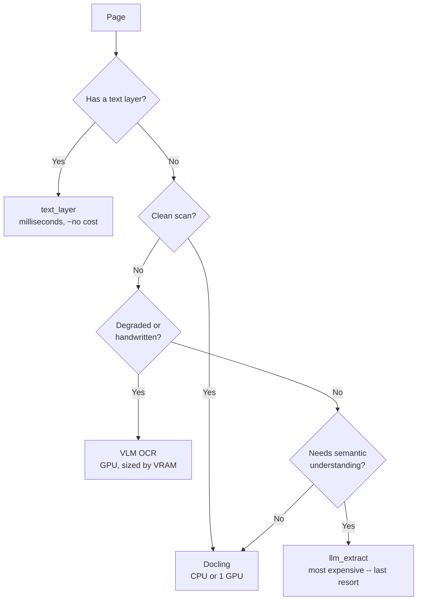
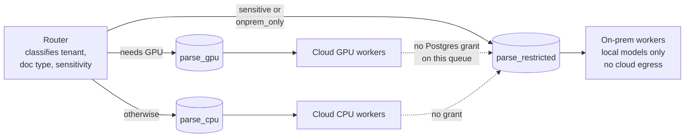

*Most AI platform advice assumes the workload is a conversation. Document extraction is not: nobody is waiting for the first token, the unit of work is a page, and the number that matters is pages per second per pound. Almost every default inverts, and the biggest win is what you get to delete.*

## 01 — Four Things That Change

Take the generic portable-AI-platform blueprint and point it at batch document work, and four of its recommendations turn over.

| Generic advice | Extraction-shaped version | Why |
|---|---|---|
| S3-compatible storage everywhere | An `fsspec` abstraction in Python | Azure Blob is not S3-native. Abstract at the Python layer, not the protocol layer |
| A serving platform with KServe and a gateway | Queue-driven batch workers with KEDA | This is async throughput work. Time-to-first-token is irrelevant; pages per second per pound is everything |
| The AI gateway is the key abstraction | The parser interface is the key abstraction | The swappable component is the document parser, not the chat model |
| pgvector as a starter choice | Postgres is the architecture | It is already the queue, the metadata store, the system of record — and the vector store |

What follows from that is a subtraction, and it is the most valuable thing in this post. **This architecture does not need KServe, Kubeflow, Ray, a service mesh, or a vector database.** Cutting those five is the single biggest win available, because each one is a distributed system with its own upgrade cadence that would otherwise have to be replicated across every site.

What it does need is shorter: a parser abstraction, a portable queue, GPU workers with queue-driven autoscaling, a provenance-first Postgres schema, and compliance-aware routing.

Two of those have already been covered here. The schema is [its own post](/guides/extraction-data-modelling-with-provenance/), because it is the piece that outlives everything else. And if one of the sites is a datacenter that accepts no inbound connections, [the boundary is its own subject too](/guides/connecting-cloud-and-on-premises/). This post is the workload in between.

## 02 — The Parser Is the Swappable Seam

If the generic blueprint puts a gateway in front of interchangeable models, the extraction equivalent puts a protocol in front of interchangeable parsers. It is the most important forty lines in the system:

```python
# core/parsing/base.py
from dataclasses import dataclass
from typing import Protocol, Literal
from pathlib import Path

@dataclass(frozen=True)
class Block:
    page: int
    kind: Literal["heading", "paragraph", "table", "figure", "list", "formula", "caption"]
    text: str | None
    bbox: tuple[float, float, float, float]   # normalized 0-1, ALWAYS populate
    reading_order: int
    confidence: float | None = None
    html: str | None = None                    # table structure

@dataclass(frozen=True)
class ParsedDocument:
    blocks: list[Block]
    page_count: int
    markdown: str
    raw: dict                    # parser-native output, straight to JSONB
    parser: str                  # "docling"
    parser_version: str          # "2.58.0"
    model_versions: dict[str, str]
    duration_ms: int

class DocumentParser(Protocol):
    name: str
    def supports(self, mime: str) -> bool: ...
    def parse(self, path: Path, *, page_range: tuple[int, int] | None = None) -> ParsedDocument: ...
```

Implement one class per backend — a text-layer reader, a local structured parser, a vision-model OCR path, and a cloud form-recognition service — and let **nothing else in the codebase import a parser library directly.**

The reason this earns its place is churn. The OCR field genuinely moves month to month, and the leader when you start will probably not be the leader when you scale. A single `parse(path) -> ParsedDocument` boundary is what lets you A/B two parsers on the same corpus, fall back from one to another mid-pipeline, and replace the whole engine without touching anything downstream. Note also that `parser`, `parser_version` and `model_versions` are carried on the result rather than logged — that is what makes two runs comparable later, and it is the hook the [schema's promotion pattern](/guides/extraction-data-modelling-with-provenance/) hangs on.

`bbox` deserves the shouty comment. Populate it always, even when the current use case has no reviewer UI, because retrofitting provenance onto extractions you have already stored is not possible — you have to re-parse the corpus to get it.

## 03 — Choosing a Parser, Including With No GPUs

Licensing belongs in this table as a first-class column, not a footnote, because it is the constraint most likely to stop a parser after it is already load-bearing.

| Parser | Licence | Runs on | Use for | Watch out |
|---|---|---|---|---|
| Text layer via [PyMuPDF](https://github.com/pymupdf/PyMuPDF) | [AGPL, commercial option](https://pymupdf.readthedocs.io/en/latest/about.html) | CPU, milliseconds per page | Born-digital PDFs, frequently the majority of an enterprise corpus | The licence. [pypdfium2](https://github.com/pypdfium2-team/pypdfium2) is the permissive alternative for the same job |
| [Docling](https://github.com/docling-project/docling) | [MIT](https://github.com/docling-project/docling/blob/main/LICENSE) | **CPU or GPU** | The default. Structured output, and formats beyond PDF | Absent from public accuracy leaderboards — benchmark it yourself |
| Vision-model OCR ([olmOCR](https://github.com/allenai/olmocr) and peers) | Mostly permissive, verify per model | GPU | Scans, handwriting, stamps, poor-quality images | VRAM per worker is what sizes your concurrency |
| [Marker](https://github.com/datalab-to/marker) | [GPL-3.0 code plus restricted model weights](https://github.com/datalab-to/marker/blob/master/LICENSE) | GPU | Raw speed | Read the weight licence before it enters the build. This one has caught out a lot of teams |
| [MinerU](https://github.com/opendatalab/MinerU) | AGPL | GPU | CJK, dense academic layouts, formulas | Its structural output suits document conversion better than field extraction |
| [Azure Document Intelligence](https://learn.microsoft.com/en-us/azure/ai-services/document-intelligence/overview), [Google Document AI](https://cloud.google.com/document-ai/docs) | Commercial | Cloud only | Structured forms, prebuilt invoice and receipt models | **Cannot run on-premises.** Non-sensitive document classes only |

Read the licences at those links rather than trusting any summary, including this one. Two in particular are worth a lawyer's five minutes before they are load-bearing: the AGPL text-layer path, which is the single most commonly missed licence in this stack precisely because it looks like a utility, and the restricted-weight parser, where the code licence and the weight licence say different things.

**The branch that matters most: what if there are no GPUs on-premises?** Many teams read that as disqualifying and stop. It isn't. A CPU-capable structured parser is what makes the whole compliance story viable without accelerators — restricted documents get processed locally, slower, on hardware that already exists. That single property is doing more work in this architecture than any accuracy benchmark, because it is the difference between an on-premises site that can participate and one that can only forward.

The smallest useful version of this platform is therefore quite small: one modest cluster, CPU parsing, Postgres, no mesh, no serving platform. Verify throughput on the actual hardware early, because that is the assumption everything else rests on.

## 04 — The Routing Ladder

Run the cheapest path that works, and escalate only when it doesn't. This is where the cost of the platform is decided.

**Fig 03.1 — The routing ladder**



The first branch is close to free and it is the one that pays: asking whether a page has a text layer is a single library call and no model at all, and it returns an empty string on image-only pages. In a corpus where born-digital documents are the majority, that check alone diverts most of the volume away from every GPU path below it.

On the economics, one directional claim is worth making and no precise one is. Self-hosting the OCR tier is dramatically cheaper per page than routing the same pages through a commercial vision API, and the gap widens with volume — which is why the ladder exists at all. I am deliberately not quoting a figure: the published per-million-page numbers move with hardware, model and batch size, and any specific one would be stale before it was useful. Measure cost per thousand pages per route on your own corpus, and let that be the number you plan against. The general levers for cutting inference cost are [already covered in the MLOps guide](/guides/mlops-production-guide/#11--cost-optimization); the extraction-specific lever is the ladder.

The last tier deserves suspicion. Sending a page to a language model for semantic extraction is the most expensive thing this system can do, and it is also the most tempting, because it works on anything. Treat it as a fallback with a budget, not as the default that a well-behaved pipeline occasionally avoids.

And benchmark on your own documents. Performance across document types and languages varies enormously, and a given domain is usually badly represented in public benchmarks. A few hundred representative pages with ground truth, collected before committing to a parser, is the cheapest insurance available here — and per section 10 it is also a permanent asset rather than a one-off exercise.

## 05 — Storage Across Three Backends

Do this in Python, not at the protocol layer. The temptation is to declare "S3-compatible everywhere" and put a translation layer in front of Azure Blob, but Blob is not S3-native and the shim becomes a component you own. [fsspec](https://filesystem-spec.readthedocs.io/en/latest/) gives one API over all three backends instead:

```python
# core/storage.py
import fsspec
from functools import lru_cache

@lru_cache
def fs():
    # STORAGE_URL: gs://bucket
    #            | abfs://container@account.dfs.core.windows.net
    #            | s3://bucket   (MinIO on-prem)
    return fsspec.core.url_to_fs(settings.STORAGE_URL)[0]

def read_bytes(key: str) -> bytes:
    with fs().open(f"{settings.STORAGE_ROOT}/{key}", "rb") as f:
        return f.read()
```

One environment variable is the entire difference between the three environments. Credentials never appear in code — each platform supplies them: [Workload Identity](https://cloud.google.com/kubernetes-engine/docs/concepts/workload-identity) on GKE, [Azure Workload Identity](https://learn.microsoft.com/en-us/azure/aks/workload-identity-overview) on AKS, and on-premises an object-store key delivered by [External Secrets Operator](https://external-secrets.io/latest/) from a vault. The application asks for a filesystem and gets one; it never learns which cloud it is on.

## 06 — Postgres as the Queue

Postgres already runs in every environment, which makes it the only queue that is portable by default. Pub/Sub and Service Bus are not portable; Kafka or NATS is infrastructure this workload does not yet need. Use [pgmq](https://github.com/tembo-io/pgmq), or plain [`SELECT ... FOR UPDATE SKIP LOCKED`](https://www.postgresql.org/docs/current/sql-select.html) if you would rather not add an extension:

```sql
CREATE EXTENSION IF NOT EXISTS pgmq;
SELECT pgmq.create('parse_cpu');
SELECT pgmq.create('parse_gpu');
SELECT pgmq.create('parse_restricted');   -- on-prem workers only
```

The decisive argument is not elegance, it is portability of the autoscaler. [KEDA has a native PostgreSQL scaler](https://keda.sh/docs/latest/scalers/postgresql/), so queue-driven GPU autoscaling is configured identically on GKE, on AKS and on bare metal, with no cloud-specific scaler anywhere:

```yaml
apiVersion: keda.sh/v1alpha1
kind: ScaledObject
metadata: {name: parse-gpu-workers}
spec:
  scaleTargetRef: {name: parse-gpu-worker}
  minReplicaCount: 0            # scale to zero -- idle GPUs cost real money
  maxReplicaCount: 12
  cooldownPeriod: 300           # long: model load is slow, don't thrash
  triggers:
    - type: postgresql
      metadata:
        query: "SELECT count(*) FROM pgmq.q_parse_gpu WHERE vt <= now()"
        targetQueryValue: "20"
        connectionFromEnv: DATABASE_URL
```

**Scale-to-zero on GPU workers is the single biggest cost lever in this architecture.** Batch extraction has no latency SLA, so the queue is allowed to absorb a burst and the accelerators are allowed to not exist overnight. That is a property the conversational case cannot have, and it is worth a great deal.

Two sizing notes. Worker count is bounded by VRAM rather than by CPU, so set replica limits from measured peak memory under real batch sizes — not from nominal model size, which is what causes a worker to be killed for memory at three in the morning. And keep the cooldown long: loading model weights is slow enough that thrashing replicas costs more than the idle capacity you were trying to reclaim.

## 07 — Residency by Queue Topology

Enforce residency at the queue, not in application logic. The distinction is the whole point: an application-level check is a line of code someone can bypass, refactor around, or forget in a new code path, whereas queue topology is a fact about who can read what.

```python
def enqueue(doc: Document) -> str:
    if doc.sensitivity == "restricted" or doc.residency == "onprem_only":
        return "parse_restricted"        # only on-prem workers poll this
    if doc.needs_gpu:
        return "parse_gpu"
    return "parse_cpu"
```

**Fig 03.2 — Residency as queue topology**



The dotted lines are the enforcement, and they are the reason this works. Cloud workers hold no Postgres grant on the restricted queue, so the boundary is held by the database rather than by a code path. Four mechanisms back that up, and they are deliberately redundant:

- On-premises workers poll **only** the restricted queue, and cloud workers cannot read it — enforced by role grants, not by configuration.
- Cloud model backends are **absent from the on-premises values file entirely.** The configuration needed to reach them does not exist at that site, so there is nothing to misconfigure.
- A default-deny egress policy on the on-premises worker namespaces, with an allow-list containing no public endpoints.
- The run's `site` column records where every page was processed. That column is the answer to "prove this document never left the building" — a query rather than a log correlation.

Regional residency uses the same mechanism rather than a new one: an `eu` residency value maps to EU-region queues and EU-region model endpoints. Once residency is a queue-routing decision, adding a jurisdiction is a row, not a redesign. The wider governance surface — audit trails, lineage, model cards, the regulatory picture — is [covered in the MLOps guide](/guides/mlops-production-guide/#12--security--governance) and not repeated here.

## 08 — The GKE / AKS / On-Prem Delta

Ninety percent of the chart is shared. Here is the ten percent that isn't:

| Concern | GKE | AKS | On-premises |
|---|---|---|---|
| Identity | Workload Identity annotation | Azure Workload Identity label | External Secrets to a vault |
| Storage URL | `gs://bucket` | `abfs://container@acct.dfs.core.windows.net` | `s3://bucket` via [MinIO](https://min.io/docs/minio/kubernetes/upstream/index.html) |
| Postgres | Cloud SQL with the auth proxy sidecar | Flexible Server with a private endpoint | [CloudNativePG](https://cloudnative-pg.io/documentation/current/) |
| GPU nodes | Accelerator nodeSelector, driver DaemonSet | GPU taint, device plugin | [NVIDIA GPU Operator](https://github.com/NVIDIA/gpu-operator) |
| StorageClass | Premium block, Filestore for RWX | Premium CSI, Azure Files for RWX | Ceph block and CephFS |
| Ingress | GKE Gateway or ingress-nginx | AGIC or [ingress-nginx](https://kubernetes.github.io/ingress-nginx/) | ingress-nginx |

**Use ingress-nginx and the GPU Operator on all three rather than each cloud's native option.** Slightly less integrated, dramatically less divergence to maintain — and divergence is the thing that actually costs you, because it multiplies by the number of sites and shows up as a per-site bug rather than a shared one.

The discipline that keeps this honest: everything above lives in a per-environment values file, and **if a difference cannot be expressed as a value, it goes into a per-cloud infrastructure module output rather than a chart conditional.** The moment the chart starts branching on which cloud it is running in, it stops being one chart.

## 09 — What Breaks First

The architecture is not the hard part. These are, roughly in the order they show up:

1. **The same documents get parsed over and over.** Re-ingests, retries and pipeline reruns all reprocess work you have already paid for. Cache on the tuple of content hash, parser, parser version and parameter hash — all four, or the cache returns stale results after an upgrade. This pays for itself in the first week, and a content-addressed schema gives it to you for free.
2. **One enormous document hangs a worker indefinitely.** A nine-hundred-page scanned appendix will occupy a GPU until someone notices. Set a hard per-document timeout, and on breach **fall back to a cheaper path and mark the run partial — never drop the document.** Silent drops are the worst available failure mode in a compliance context, because the system reports success.
3. **Tail latency is unbounded without page-range splitting.** A `page_range` parameter on `parse()` is what lets a two-thousand-page file fan across many workers and merge by reading order. Without it, throughput is hostage to the largest document in the corpus.
4. **Redelivery corrupts results.** Message redelivery is guaranteed, not hypothetical, so every write must be idempotent — upsert on conflict everywhere, keyed on the run and field. Workers stay stateless so a redelivered message is merely wasted work rather than a duplicate row.
5. **Model weights are downloaded on pod start.** This turns a thirty-second scale-up into minutes, and it breaks an air-gapped site outright. Pre-bake weights into the image or mount them from a shared volume.
6. **Memory, not latency, is what kills workers.** Set memory limits from measured peak under real batch sizes and let a pod be killed quickly rather than degrade its whole node.

Six metrics are worth having from day one, because each maps to one of the failures above: pages per second per worker, cost per thousand pages by route, route distribution across the ladder, parser failure rate by document type, GPU utilization with VRAM headroom, and queue depth with the age of the oldest message. That last one is the closest thing this architecture has to a single health indicator — a queue that is deep but young is working, and a queue that is shallow but old is stuck.

## 10 — Sequencing

Build order, as exit criteria rather than a calendar. Each phase is worth shipping on its own, and none of them requires the next one to exist.

**A vertical slice in one environment.** A worker, the parser protocol with two implementations, the full schema, and the queue. Run it wherever there is already a cluster. *Exit: real documents processed end to end, and the extracted values are queryable with page and bounding-box provenance.*

**Benchmark, then route.** Build the ground-truth set from the actual document mix. Compare a structured parser, a vision-model parser and a cloud service on those documents. Implement the ladder and measure cost per thousand pages per route. *Exit: a parser choice defensible with your own numbers, and a repeatable evaluation you can rerun on every upgrade.*

**Portability.** Extract the storage abstraction, split the values files, deploy to the second environment, add scale-to-zero on the GPU workers. *Exit: the second environment onboarded in under a week, with a values delta small enough to read in one sitting.*

**On-premises and compliance.** The third site, its own Postgres and object store, CPU-only parsing if there are no accelerators, queue-level residency routing and egress lockdown. *Exit: a restricted document provably processed on-premises, with the `site` column as the evidence.*

**Harden.** Re-extraction and promotion, a review UI driven by bounding-box provenance, corrections feeding the eval set. *Exit: a parser upgrade applied across the whole corpus, compared against the previous run in SQL, and reversible.*

That last exit criterion is the one that determines whether any of this was worth building, and it is worth being blunt about why. Extraction accuracy is never total, so there will always be human corrections. If those corrections are not captured, there is no evaluation set; without an evaluation set no parser upgrade can be made safely; and a platform that cannot be upgraded is frozen on whatever version it launched with, however portable it is on paper. [The schema post](/guides/extraction-data-modelling-with-provenance/) is where that loop gets closed.

## Tools and Further Reading

| Tool | Where it fits |
|---|---|
| [Docling](https://github.com/docling-project/docling) | The default parser, CPU or GPU (section 03) |
| [PyMuPDF](https://github.com/pymupdf/PyMuPDF) | Text-layer fast path — check [the licence](https://pymupdf.readthedocs.io/en/latest/about.html) |
| [pypdfium2](https://github.com/pypdfium2-team/pypdfium2) | Permissive alternative for the same job |
| [Marker](https://github.com/datalab-to/marker) | Fast, with [a code and weight licence](https://github.com/datalab-to/marker/blob/master/LICENSE) to read first |
| [MinerU](https://github.com/opendatalab/MinerU) | CJK and dense academic layouts |
| [olmOCR](https://github.com/allenai/olmocr) | Open vision-model OCR for degraded scans |
| [Azure Document Intelligence](https://learn.microsoft.com/en-us/azure/ai-services/document-intelligence/overview) | Prebuilt form models, cloud only |
| [Google Document AI](https://cloud.google.com/document-ai/docs) | The same, on the other cloud |
| [fsspec](https://filesystem-spec.readthedocs.io/en/latest/) | One storage API over three backends (section 05) |
| [pgmq](https://github.com/tembo-io/pgmq) | The queue, inside Postgres |
| [`FOR UPDATE SKIP LOCKED`](https://www.postgresql.org/docs/current/sql-select.html) | The queue without an extension |
| [KEDA](https://keda.sh/docs/latest/) and its [Postgres scaler](https://keda.sh/docs/latest/scalers/postgresql/) | Queue-driven autoscaling, identically everywhere |
| [NVIDIA GPU Operator](https://github.com/NVIDIA/gpu-operator) | GPU enablement on all three sites |
| [CloudNativePG](https://cloudnative-pg.io/documentation/current/) | Postgres on Kubernetes on-premises |
| [MinIO](https://min.io/docs/minio/kubernetes/upstream/index.html) | On-premises object storage |
| [External Secrets Operator](https://external-secrets.io/latest/) | Credentials from a vault, not from code |
| [ingress-nginx](https://kubernetes.github.io/ingress-nginx/) | One ingress across all three environments |
| [RKE2](https://docs.rke2.io/) | A conservative Kubernetes distribution for the on-premises site |

And the neighbouring posts here:

- [Data Modelling for Document Extraction](/guides/extraction-data-modelling-with-provenance/) — the schema this workload writes into, and the promotion pattern that makes parser upgrades safe.
- [Connecting Cloud and On-Premises](/guides/connecting-cloud-and-on-premises/) — outbound-only delivery and air-gapped installs, for the restricted site.
- [MLOps & AI Production Operations](/guides/mlops-production-guide/#11--cost-optimization) — general inference cost levers, and [the governance ground](/guides/mlops-production-guide/#12--security--governance) this post does not repeat.
- [AI Architecture: A Practitioner's Field Guide](/guides/ai-architecture-master-guide/#05--rag-architectures) — retrieval architectures, for the case where extraction feeds search rather than fields.

One caveat, and in this corner of the stack it is a strong one. The parser landscape, the model names and every published benchmark move faster here than anywhere else in this series. Treat the code above as structurally correct patterns, re-verify parser choices at each major upgrade, and treat your own ground-truth benchmark as more authoritative than any published comparison — including the recommendations in this post.
