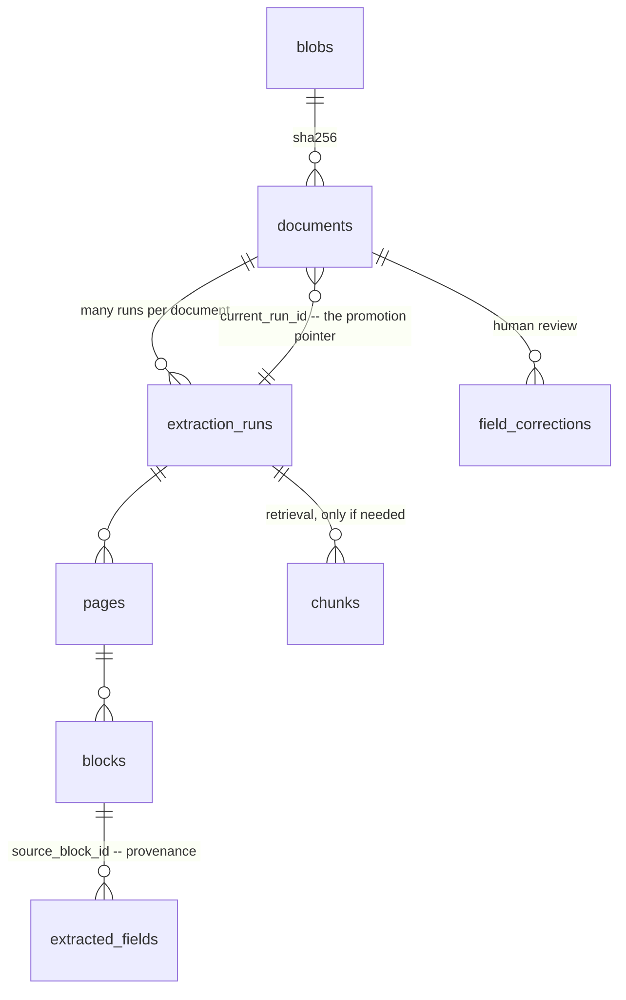
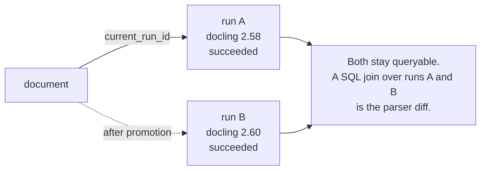

*The schema outlives every other decision in a document-extraction platform. Parsers get replaced, clouds get swapped, models get upgraded — and if the data model was built expecting that, none of it is a migration. If it wasn't, all of it is.*

## 01 — Four Design Commitments

Everything below follows from four decisions, and they are worth making deliberately because all four are expensive to add later.

**Documents are content-addressed.** Identify the bytes by their SHA-256, not by filename or an upstream ID. Reprocessing the same file becomes free and idempotent, the same document arriving through two source systems deduplicates itself, and "have we seen this before" is a primary key lookup rather than a heuristic.

**Extraction runs are immutable and versioned.** You will re-extract the whole corpus when you upgrade a parser — not as an exception but as routine maintenance. So never overwrite a result. Add a run, then promote it. This one commitment is what turns a parser upgrade from a migration with a rollback plan into a pointer move.

**Every extracted value carries provenance.** Page, bounding box, source block, run. This is non-negotiable if anyone will ever audit an extracted number, and it is also exactly what powers the feature reviewers ask for first: click the value, see it highlighted on the page.

**JSONB for raw, columns for queried.** Keep the parser's native output verbatim in a JSONB column, and project out only the fields you actually filter and join on. Parsers change their output shape; a verbatim copy means a schema change downstream is a re-projection rather than a re-extraction. Postgres' [JSON types](https://www.postgresql.org/docs/current/datatype-json.html) are good enough at this that reaching for a document store is rarely justified.

## 02 — The Six Layers

The schema separates physical bytes from business identity from extraction results, so that each can change without disturbing the others.

**Fig 04.1 — Six layers, and the promotion pointer**



The second relationship is the one that matters. `documents.current_run_id` points *back* at one run out of many, which is what makes promotion and rollback pointer moves rather than data rewrites.

Layers 1 and 2 separate the bytes from what the business calls them:

```sql
-- Layer 1: physical bytes, deduplicated across tenants
CREATE TABLE blobs (
    sha256          bytea PRIMARY KEY,
    byte_size       bigint      NOT NULL,
    mime_type       text        NOT NULL,
    storage_url     text        NOT NULL,   -- gs:// | abfs:// | s3://
    page_count      int,
    has_text_layer  boolean
);

-- Layer 2: logical documents -- business identity and governance
CREATE TYPE sensitivity AS ENUM ('public','internal','confidential','restricted');

CREATE TABLE documents (
    id             uuid PRIMARY KEY DEFAULT gen_random_uuid(),
    tenant_id      uuid        NOT NULL,
    blob_sha256    bytea       NOT NULL REFERENCES blobs(sha256),
    source_system  text        NOT NULL,
    source_ref     text,                    -- external ID, for reconciliation
    doc_type       text,                    -- invoice | contract | policy
    sensitivity    sensitivity NOT NULL DEFAULT 'internal',
    residency      text        NOT NULL DEFAULT 'any',  -- any | eu | onprem_only
    current_run_id uuid,                    -- the promoted run; FK added below
    UNIQUE (tenant_id, source_system, source_ref)
);
```

Two columns there are doing governance work rather than extraction work. `sensitivity` and `residency` are what a router reads to decide *where* a document may be processed — and if some of your sites accept no inbound connections, [the boundary mechanics are their own subject](/guides/connecting-cloud-and-on-premises/). Keeping both on the document rather than deriving them at processing time means the decision is auditable after the fact.

Layer 3 is where immutability lives:

```sql
-- Layer 3: extraction runs -- immutable, comparable, promotable
CREATE TYPE run_status AS ENUM ('queued','running','succeeded','failed','partial');

CREATE TABLE extraction_runs (
    id             uuid PRIMARY KEY DEFAULT gen_random_uuid(),
    document_id    uuid       NOT NULL REFERENCES documents(id) ON DELETE CASCADE,
    parser         text       NOT NULL,   -- docling | vlm_ocr | text_layer
    parser_version text       NOT NULL,
    model_versions jsonb      NOT NULL DEFAULT '{}',
    params         jsonb      NOT NULL DEFAULT '{}',
    site           text       NOT NULL,   -- which site processed it: the audit answer
    status         run_status NOT NULL DEFAULT 'queued',
    pages_processed int,
    duration_ms    int,
    cost_usd       numeric(12,6),
    raw_output     jsonb                  -- parser-native, verbatim
);

ALTER TABLE documents
  ADD CONSTRAINT documents_current_run_fk
  FOREIGN KEY (current_run_id) REFERENCES extraction_runs(id);
```

`parser`, `parser_version` and `model_versions` together are what make two runs comparable — without them you have two results and no way to attribute the difference. `site` is the column that answers a residency audit directly, in SQL, rather than by correlating logs.

Layers 4 and 5 carry the structure and the payload. The provenance columns at the end of `extracted_fields` are the part people skip and regret:

```sql
-- Layer 4: structure
CREATE TABLE pages (
    run_id         uuid NOT NULL REFERENCES extraction_runs(id) ON DELETE CASCADE,
    page_no        int  NOT NULL,
    had_text_layer boolean,
    route_taken    text,        -- which parser path this page actually took
    image_url      text,        -- rendered page, for the review UI
    PRIMARY KEY (run_id, page_no)
);

CREATE TYPE block_kind AS ENUM
    ('heading','paragraph','table','figure','list','formula','caption','header','footer');

CREATE TABLE blocks (
    id            bigserial PRIMARY KEY,
    run_id        uuid       NOT NULL REFERENCES extraction_runs(id) ON DELETE CASCADE,
    page_no       int        NOT NULL,
    parent_id     bigint     REFERENCES blocks(id),   -- section hierarchy
    kind          block_kind NOT NULL,                -- heading | table | figure | ...
    reading_order int        NOT NULL,
    bbox          box        NOT NULL,                -- normalized 0-1
    text          text,
    html          text,                               -- table structure
    confidence    real
);

-- Layer 5: the business payload
CREATE TABLE extracted_fields (
    id              bigserial PRIMARY KEY,
    run_id          uuid NOT NULL REFERENCES extraction_runs(id) ON DELETE CASCADE,
    document_id     uuid NOT NULL REFERENCES documents(id) ON DELETE CASCADE,
    field_key       text NOT NULL,     -- invoice.total | contract.party.name
    value_text      text,
    value_numeric   numeric,
    value_date      date,
    unit            text,              -- currency code, unit of measure
    confidence      real,
    method          text NOT NULL,     -- regex | layout | llm | human
    source_block_id bigint REFERENCES blocks(id),
    source_page_no  int,
    source_bbox     box,
    UNIQUE (run_id, field_key)
);
```

Typed value columns rather than one `text` are worth the width: `value_numeric` is what lets you index a field for range queries, and a partial index on the rows where it is non-null keeps that cheap.

Layer 6 is retrieval chunks, and it is optional. Add it when something actually needs semantic search over the corpus, not on the assumption that it will. When you do add it, denormalize `tenant_id` onto the chunk — filtered vector search needs the filter column local.

## 03 — Promotion: The Pattern That Saves You

Here is the whole payoff of the immutability commitment. Re-extract the corpus with the new parser, compare the two versions, then promote in a transaction:

```sql
-- Re-extract with a new parser, compare, then promote atomically.
BEGIN;
UPDATE documents d
SET current_run_id = r.id
FROM extraction_runs r
WHERE r.document_id = d.id
  AND r.parser = 'docling' AND r.parser_version = '2.60.0'
  AND r.status = 'succeeded'
  AND d.tenant_id = $1;
COMMIT;
```

**Fig 04.2 — Promotion and rollback**



Three properties fall out of this, and each one removes a category of risk. Old runs stay queryable, so nothing is destroyed by an upgrade. Rollback is one `UPDATE` — the same statement with the previous version pinned — which means the decision to revert takes seconds and no coordination. And promotion is per-tenant, so you can move one tenant, watch it, and move the rest, without the schema needing a concept of staged rollout.

Note also what the `status = 'succeeded'` predicate does: documents whose new run failed simply keep pointing at the old one. A partial re-extraction leaves the corpus in a coherent state by construction rather than by cleanup.

## 04 — That Join Is Your Eval Harness

The comparison step above is easy to read past, so it is worth naming plainly: **because both runs are still in the database, diffing two parser versions over one corpus is a plain SQL join.** No harness to build, no export, no separate evaluation store.

```sql
-- What changed between two parser versions, field by field
SELECT f_old.field_key,
       count(*) FILTER (WHERE f_old.value_text IS DISTINCT FROM f_new.value_text) AS changed,
       count(*) AS total
FROM extracted_fields f_old
JOIN extraction_runs r_old ON r_old.id = f_old.run_id AND r_old.parser_version = '2.58.0'
JOIN extraction_runs r_new ON r_new.document_id = r_old.document_id
                          AND r_new.parser_version = '2.60.0'
JOIN extracted_fields f_new ON f_new.run_id = r_new.id
                           AND f_new.field_key = f_old.field_key
GROUP BY f_old.field_key
ORDER BY changed DESC;
```

That query is the difference between a platform you can upgrade and one you cannot. Without it, every parser bump is a judgment call made on a handful of spot-checked documents, and the rational response to that risk is to stop upgrading — which is how a system ends up frozen on whatever version it launched with, indefinitely, while the field it depends on moves monthly.

This is a narrow claim about a schema, not a position on evaluation generally. The broader practice — offline metrics, LLM-as-judge, regression suites, what to measure and when — is [covered in the architecture guide](/guides/ai-architecture-master-guide/#10--llmops--evaluation) and in more depth under [evaluation harnesses and benchmarks](/guides/model-training-finetuning-eval/#07--evaluation-harnesses--benchmarks). The point here is only that for extraction specifically, the harness is a join you already have the data for.

## 05 — Corrections Are Three Assets

When a human reviewer fixes an extracted value, record the correction rather than overwriting the field:

```sql
CREATE TABLE field_corrections (
    id              bigserial PRIMARY KEY,
    document_id     uuid NOT NULL REFERENCES documents(id) ON DELETE CASCADE,
    field_key       text NOT NULL,
    corrected_value jsonb NOT NULL,
    previous_value  jsonb,
    reviewer        text NOT NULL,
    reason          text,
    created_at      timestamptz NOT NULL DEFAULT now()
);
```

One table, three assets. It is the **audit trail** — who changed what, when, and why. It is a labelled **eval set**, accumulated for free from work someone was doing anyway, and it is labelled on exactly the documents where the parser was wrong, which is where evaluation is worth spending. And it is **training data**, if fine-tuning ever becomes worthwhile.

The discipline that makes this survivable is that reads go through a view. Application code should never know that runs, promotion or corrections exist:

```sql
CREATE VIEW v_document_fields AS
SELECT d.id AS document_id, d.tenant_id, d.doc_type,
       f.field_key,
       COALESCE(c.corrected_value #>> '{}', f.value_text) AS value_text,
       f.value_numeric, f.value_date,
       (c.id IS NOT NULL) AS human_verified,
       f.confidence, f.source_page_no, f.source_bbox
FROM documents d
JOIN extracted_fields f ON f.run_id = d.current_run_id
LEFT JOIN field_corrections c
       ON c.document_id = d.id AND c.field_key = f.field_key;
```

The view resolves the correction over the extracted value and exposes `human_verified` so a caller can treat a reviewed number differently from an inferred one. Everything sophisticated about the schema stays behind that boundary, which is also what lets you change the sophisticated part later.

## 06 — Scale, Honestly

Three things grow, and only one of them is likely to be your problem.

**`blocks` grows fastest.** Every page contributes tens to low hundreds of rows, so block count outruns document count by orders of magnitude. Partition `blocks` and `chunks` — by `run_id` hash, or by month — once row counts reach the hundreds of millions. Postgres' [declarative partitioning](https://www.postgresql.org/docs/current/ddl-partitioning.html) handles this well, and doing it before you need it is much cheaper than doing it under pressure.

**Vector search is usually not the wall people expect.** [pgvector](https://github.com/pgvector/pgvector) is comfortable into the millions of chunks and workable well beyond, with HNSW index rebuild time — measured in hours on large datasets — becoming the practical ceiling rather than query latency. The failure mode that actually bites is subtler and has nothing to do with size: a tenant filter applied to an approximate index can quietly destroy recall, because the index returns its nearest neighbours and the filter then removes most of them. pgvector's iterative index scans exist specifically for this, and turning them on is the difference between correct results and plausible ones. If memory becomes the binding constraint, [pgvectorscale](https://github.com/timescale/pgvectorscale) keeps the footprint bounded on NVMe. Reach for [Qdrant](https://qdrant.tech/documentation/) or [Milvus](https://github.com/milvus-io/milvus) when the scale or latency target is genuinely beyond what Postgres will do — not before, because a second datastore is a second thing to back up, secure and keep in sync.

**Re-embedding churn is the likely pain point.** Every parser upgrade re-embeds the corpus, and updating embeddings in place generates exactly the row-version churn that Postgres is worst at. Write new chunk rows under the new `run_id` and drop the old partition instead. This is the same immutability move as section 03, applied one layer down.

## 07 — When Analytics Turns Up

Eventually someone wants dashboards, and the request arrives as a schema change. Refuse that framing. Keep the operational schema as the source of truth and build marts on top with [dbt](https://docs.getdbt.com/docs/core/connect-data-platform/postgres-setup) — the Postgres adapter behaves identically in every environment, so the marts are as portable as the extraction platform.

The division holds because the two have opposite shapes. Operational tables are normalized and provenance-heavy because their job is to be correct and auditable. Marts are denormalized and wide because their job is to be fast to query. Distorting the first to serve the second gets you a schema that is bad at both.

## 08 — What Breaks First

In rough order of how often these surface:

1. **`blocks` grows without bound.** Symptom: the table dwarfs everything else and routine maintenance starts timing out. Cause: every re-extraction adds a full set of blocks and nothing ever removes the superseded ones. Decide the retention rule early — usually "keep the promoted run plus the previous one" — and make dropping old runs a scheduled job rather than a cleanup project.
2. **A promotion that half-succeeded.** Symptom: some documents on the new parser, some on the old, with no record of which. Cause: promoting outside a transaction, or in per-document statements that failed partway. The transaction plus the `status = 'succeeded'` predicate prevent it; verify by counting documents grouped by their promoted `parser_version` after every promotion, and expect exactly one value.
3. **Corrections orphaned by a re-extract.** Symptom: a reviewer's fix silently stops applying after an upgrade. Cause: keying corrections to a run rather than to the document. Note that `field_corrections` above references `document_id` and `field_key` deliberately — a correction is a statement about the document, not about one extraction of it. If the field key itself changes between parser versions, that is a migration you must handle explicitly, and it is worth a check that every correction still matches a live field key.
4. **HNSW rebuild time discovered during an upgrade.** Symptom: a maintenance window planned for minutes runs for hours with search degraded throughout. Measure a rebuild on production-sized data before you need one, and prefer building the new index alongside the old and switching, over rebuilding in place.
5. **The view drifts from the tables.** Symptom: application code starts querying `extracted_fields` directly because the view was missing a column, and the abstraction is gone within a sprint. Treat the view as the contract: adding to it is routine, and any direct read of the underlying tables from application code is a review comment.

## Tools and Further Reading

| Tool | Where it fits |
|---|---|
| [PostgreSQL `CREATE TABLE`](https://www.postgresql.org/docs/current/sql-createtable.html) | Constraints and generated defaults used throughout |
| [PostgreSQL JSON types](https://www.postgresql.org/docs/current/datatype-json.html) | JSONB for verbatim parser output |
| [PostgreSQL partitioning](https://www.postgresql.org/docs/current/ddl-partitioning.html) | Partitioning `blocks` and `chunks` |
| [`pg_trgm`](https://www.postgresql.org/docs/current/pgtrgm.html) | Trigram indexes for filename and block-text search |
| [pgvector](https://github.com/pgvector/pgvector) | Embeddings, HNSW, and iterative index scans |
| [pgvectorscale](https://github.com/timescale/pgvectorscale) | Bounded-memory vector search on NVMe |
| [Qdrant](https://qdrant.tech/documentation/) | Dedicated vector store, when Postgres genuinely will not do |
| [Milvus](https://github.com/milvus-io/milvus) | The other dedicated option at very large scale |
| [dbt Postgres adapter](https://docs.getdbt.com/docs/core/connect-data-platform/postgres-setup) | Analytics marts on top of the operational schema |
| [CloudNativePG](https://cloudnative-pg.io/documentation/current/) | Running Postgres itself on Kubernetes, portably |
| [pgBackRest](https://pgbackrest.org/) | Backups — this schema is the state that is not in Git |
| [Docling](https://docling-project.github.io/docling/) | The parser whose versions appear in the examples |

And the neighbouring posts here:

- [Connecting Cloud and On-Premises](/guides/connecting-cloud-and-on-premises/) — what the `residency` and `site` columns imply once a site accepts no inbound connections.
- [AI Architecture: A Practitioner's Field Guide](/guides/ai-architecture-master-guide/#10--llmops--evaluation) — evaluation as a practice, which section 04 deliberately does not restate.
- [Model Training, Fine-Tuning & Evaluation](/guides/model-training-finetuning-eval/#07--evaluation-harnesses--benchmarks) — harnesses and benchmarks in depth.

One caveat on the SQL above. Parser and model version strings are illustrative, and extension APIs in this area move quickly — pgvector's index options in particular have changed more than once. Treat the schema as a structurally correct pattern and verify the extension-specific parts against the versions you have pinned.
