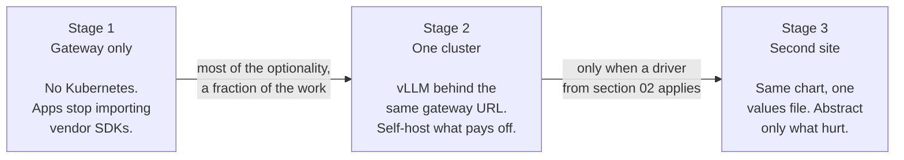
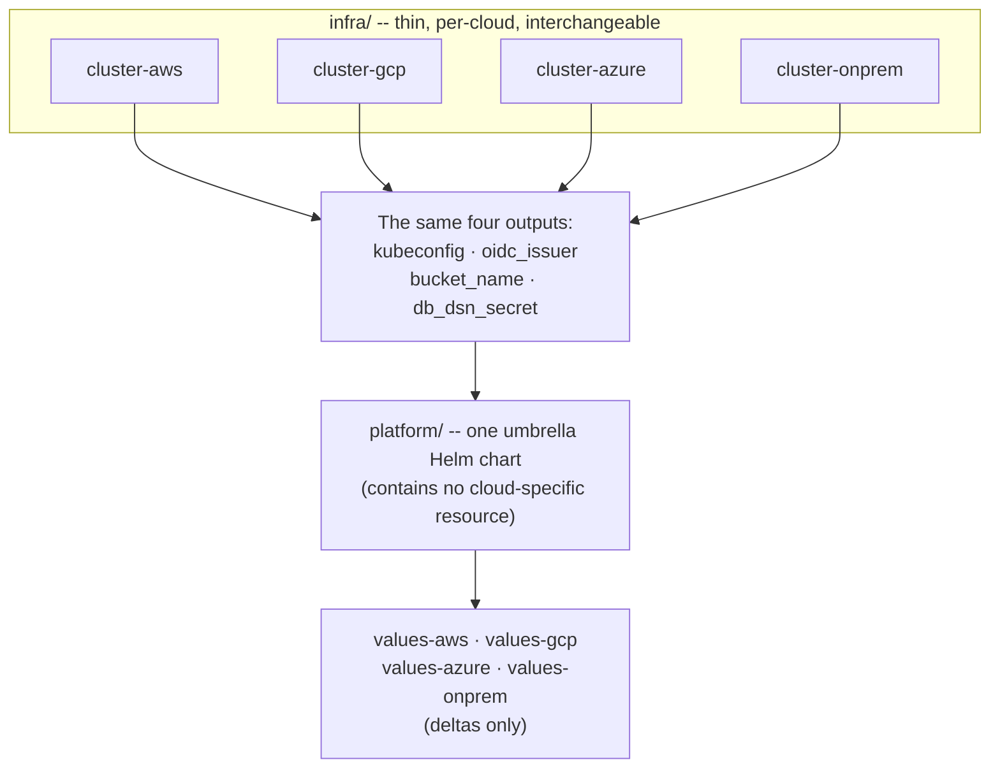

*There is no package you install to make an AI platform portable. What exists is a contract — a short list of open standards that every cloud and every datacenter implements — and a decision about whether paying for it is worth it. This post is mostly about the second part, because it is the one that gets skipped.*

## 01 — The Contract, In One Line

Build strictly against a small set of standards and the platform becomes a Helm chart you can install anywhere. Violate them and you have bought a migration project you will pay for later.

> **OCI containers, Kubernetes, OpenAI-compatible HTTP, S3-compatible object storage, OpenTelemetry, Postgres with pgvector, and GitOps.**

Everything else in this series is an elaboration of that sentence. But before elaborating, decide which platform you are actually building, because "AI platform" means at least three different things and most failed projects tried to build all three at once.

| Fork | What it needs | What it can skip |
|---|---|---|
| **Inference platform** — serve models behind an API | Serving runtime, GPU scheduling, autoscaling, gateway, model registry | Training infrastructure, pipelines |
| **Training platform** — fine-tune, batch jobs, experiments | Job orchestration, distributed training, experiment tracking, artifact store | Low-latency serving, gateway |
| **Application platform** — retrieval, agents, tools, chat products | Gateway, vector store, tracing and evals, workflow engine, secrets | Custom training operators |

**Most organisations should start with serving, add applications, and build training only against a proven need.** Fine-tuning is cheaper to rent than to operate, and the rented version is available on the day you decide you need it. The rest of this series assumes the serving-plus-applications core, because that is the highest-value portable ground.

## 02 — What Portability Costs

Here is the part the reference architectures leave out. Portability is not free, and the bill arrives in four instalments.

**Managed features you agree not to use.** The moment the contract says "Kubernetes is the only runtime abstraction", you have given up the managed endpoint services, the serverless inference, the hosted pipelines. Those products are genuinely good and they exist because operating the alternative is work.

**Autoscaling you rebuild.** Scale-to-zero, queue-driven scaling and traffic splitting come free in a managed platform. In the portable version they are components you install, configure and keep compatible.

**N-2 Kubernetes support, permanently.** On-premises clusters upgrade slowly. The oldest site sets the version floor for the newest feature, and that constraint never goes away — it is a standing tax on every upgrade decision.

**An operator burden spanning several specialities.** Kubernetes, GPU drivers, storage drivers, Postgres, and possibly a service mesh. Each is a discipline. The platform is only as available as the thinnest of them.

Against that, three drivers genuinely justify the cost:

- **Regulatory data residency** — not a preference for on-premises but a legal constraint on where bytes may exist.
- **A sovereign-cloud requirement**, where the target environment is simply not one of the three hyperscalers.
- **Real on-premises GPU capital**, already bought or already budgeted, that has to be used.

And three do not:

- **Unspecific lock-in anxiety.** "We don't want to be locked in" without a named scenario is a feeling, not a requirement.
- **Negotiating leverage.** Buying an entire second architecture to improve a discount is rarely the cheapest route to that discount.
- **"We might need to move someday."** Speculative portability is the most expensive kind, because you pay continuously for optionality you may never exercise.

The honest test is an operational one rather than an architectural one: **if the answer to "who operates this at three in the morning" is two people who also have other jobs, cut the stack down and stop.** An operable simple platform beats an unoperable complete one, every time, and the failure mode of the second is not a bad quarter — it is an outage nobody on the team can debug. This is the same reasoning that decides whether multi-cloud is worth it for infrastructure tooling generally, which I have [written about separately](/engineering/multi-cloud-terraform-vs-pulumi/); the answer here is not different just because the workload is AI.

## 03 — Start With the Gateway, Not the Cluster

Every reference architecture, including the one behind this series, is written greenfield. No reader is greenfield. So here is the sequencing advice that actually matters, and it inverts the usual order.

The gateway is the single most important piece for portability, and the standard build order puts it at step five — after a local cluster, an umbrella chart, GPU enablement and a serving control plane. Invert that. **A gateway in front of a managed model API, with no Kubernetes anywhere, captures most of the optionality for a fraction of the work.**

The reason is that one rule in the contract pays off alone and immediately: application code never imports a vendor SDK. Every direct provider import in application code is a future migration ticket, and removing them costs a day. Do that and models become interchangeable behind one URL — which is the portability property people actually want when they say "portable".

**Fig 01.1 — The adoption ladder**

Each stage is independently useful, which is the point. Many teams should stop at stage one and be entirely happy. Stage two is worth reaching when self-hosting a model demonstrably beats paying per token for your duty cycle. Stage three is worth reaching only when a driver from section 02 applies.

On the gateway itself, the choice is narrower than it looks. One option has the widest provider coverage and the fastest path to something working, with virtual keys, budgets and spend attribution built in — the right call for prototyping. The other is Kubernetes-native with CRD-driven configuration and Gateway API semantics, which fits better once you are already on that substrate. Either way, pin digests, vendor your images and verify signatures: that discipline is not a property of which gateway you picked. What a gateway *is* and what it does for routing and failover is already [covered in the architecture guide](/guides/ai-architecture-master-guide/#model-gateway-pattern), and this post has nothing to add to that beyond the portability angle.

## 04 — The Eight Rules

The contract, expanded. These are the rules that decide whether you can move.

1. **Kubernetes is the only runtime abstraction you may depend on.** Not the serverless products, not the managed endpoints, not the hosted pipelines. Every hyperscaler, every sovereign cloud and every on-premises distribution gives you a conformant API, and that API is the portability layer. Anything below it is substitutable; anything above it is yours.
2. **Every model is served behind an OpenAI-compatible HTTP interface.** This is the de facto lingua franca, and it means a self-hosted engine and three different hosted APIs are interchangeable behind one gateway. Never let application code import a provider SDK directly.
3. **All artifacts live in S3-compatible object storage.** Weights, datasets, checkpoints, indices. One code path everywhere, addressed by a configuration value rather than a hardcoded scheme.
4. **State lives in Postgres, not a proprietary datastore.** Metadata, job state, application state, and for most teams vectors too. Postgres is the most portable stateful service in existence, and [the data-modelling post](/guides/extraction-data-modelling-with-provenance/) is what taking that seriously looks like.
5. **Infrastructure in OpenTofu or Terraform, workloads in Helm, delivery through GitOps.** The contribution here is narrower than it sounds and it is the whole trick: cloud-specific code is quarantined into thin per-cloud modules **that all expose exactly the same outputs.** Cluster endpoint, node pools, bucket, database connection secret — same names, same shapes, every cloud. The workload layer then cannot tell which cloud it is on, because there is nothing in its inputs that varies.
6. **Observability is OpenTelemetry.** Every component emits OTLP into a collector you own, and the collector is the only thing that knows which backend is on the other side. Swapping vendors becomes a collector configuration change.
7. **Identity is OIDC and SPIFFE, not cloud IAM.** Use the cloud's native workload identity at the cloud edges only. Service-to-service identity should be workload certificates, which work identically on-premises.
8. **Assume no inbound connectivity to on-premises, ever.** Design every interaction as outbound-initiated from the restricted side. This one is load-bearing enough that it has [its own post](/guides/connecting-cloud-and-on-premises/), and it is where hybrid projects actually die.

Rule 5 deserves one note, because it is the rule most often mistaken for a tooling argument. It is not about which infrastructure-as-code tool you use, or whether to go multi-cloud at all — those are [separate questions I have argued elsewhere](/engineering/multi-cloud-terraform-vs-pulumi/). It is only the identical-outputs discipline.

**Fig 01.2 — The identical-outputs contract**

## 05 — The Shape of a Site

The property that makes the whole thing work: **each site is a complete, self-sufficient instance of the same chart.** Sites are peers, not a hub with dumb spokes. Cross-site traffic is an optimization, never a dependency for basic function — which means a site that loses its link keeps serving.

The repository layout follows directly. Infrastructure modules are thin and per-cloud with identical outputs. One umbrella chart is the actual product. Per-environment values files carry only deltas. Model definitions are one file each, applications are separate, and a GitOps directory fans the platform out to every registered cluster.

**The critical discipline is a single sentence: `platform/` must never contain a cloud-specific resource.** Anything cloud-specific is expressed as a value, and the per-cloud values files supply it. A useful tripwire: if you find yourself writing a conditional on which cloud you are running in more than twice, a cloud concept has leaked into the portable layer, and the fix is to push it down into an infrastructure output rather than to add a third conditional.

That tripwire is worth taking literally. Chart conditionals are how a portable chart quietly becomes four charts that happen to share a directory.

## 06 — What "Rebuild From Git" Actually Means

The claim that any site can be destroyed and rebuilt from Git plus object storage is the most attractive sentence in the reference architecture, and it is not quite true. It is worth being precise, because a reviewer will find the gap and it is better to close it deliberately.

**What genuinely is in Git:** the infrastructure definitions, the chart, the values, the model definitions, the application manifests, the GitOps registrations. All of it, reproducibly.

**What is in object storage:** model weights, datasets, checkpoints, indices. Also fine.

**What is in neither:** Postgres. Job state, application state, the metadata that says which run is promoted, and — for most teams — the vectors. None of that is in Git and none of it is in the bucket. A site rebuilt from Git plus object storage comes back with an empty database.

So either qualify the claim, or make the backup path explicit and load-bearing. The second is better: continuous archiving to object storage with a tool built for it, restore rehearsed on a schedule, and the restore time written down. The rehearsal is the part that matters — an untested restore is a belief, not a capability. Treat "we restored a site from Git plus object storage, timed it, and wrote down the number" as the actual exit criterion, and note that the number is dominated by database restore rather than by anything the platform layer does.

## 07 — Many Teams, One Platform

An internal AI platform almost always ends up multi-tenant, and the reference architectures reduce this to one table row. It deserves more, because shared GPUs make tenancy sharper than it is elsewhere.

**Noisy neighbours are a scheduling problem, not a quota problem.** A namespace per tenant with a resource quota stops a team from claiming the whole cluster, but it does not stop one team's batch job from occupying every GPU while another team's queue starves. That is what a fair-share queue controller is for, and it is section 08's first lever.

**Quota versus borrowing is the interesting design choice.** Strict per-tenant quotas waste capacity, because tenants are idle at different times. Guaranteed shares with borrowing — each tenant is guaranteed a floor and may use idle capacity above it, reclaimed when the owner returns — gets far better utilization at the cost of less predictable latency for the borrower. Guaranteed-plus-borrowing is usually right for internal platforms, where the tenants are colleagues rather than customers.

**Cost attribution has to be designed in, not derived later.** Per-tenant spend is only reconstructible if every request carries a tenant identity through the gateway and every job carries one through the queue. Retrofitting attribution means correlating logs, which produces numbers nobody trusts and therefore nobody acts on.

**Model isolation is the part people forget.** Tenants may not be permitted to see each other's fine-tuned weights, which makes the model registry a multi-tenant system too, with its own access control.

## 08 — Two Levers the Other Guides Don't Cover

GPUs are the budget, and most of the levers for cutting inference cost are already documented — the [cost optimization section of the MLOps guide](/guides/mlops-production-guide/#11--cost-optimization) covers quantization, spot capacity, caching, batching, scale-to-zero, task routing and committed capacity, and there is no point restating any of it here. The buy-versus-build crossover is likewise [already worked out](/guides/ai-architecture-master-guide/#13--infrastructure--serving).

Two levers are specific to the portable, multi-tenant case and are not in either.

**Fair-share queueing is the highest-leverage change on a shared cluster.** Without it, GPU utilization on shared clusters is commonly far below what the hardware could deliver — head-of-line blocking means one large job holds capacity while small jobs wait behind it, and the cluster looks busy while doing very little. A queue controller with guaranteed shares and borrowing addresses exactly that, and it is the first thing I would install on any cluster with more than one team on it. I am deliberately not quoting a before-and-after utilization figure: the numbers in circulation are unsourced, and the honest claim is directional rather than precise.

**KV-cache is the real capacity ceiling, not model size.** The instinct is to size a GPU by whether the weights fit. They are the floor, not the constraint. What actually limits concurrent requests is the key-value cache, and its size is set by the context length you configured multiplied by the concurrency you allow. Over-provisioned context length silently consumes the cache capacity that would otherwise have served more concurrent users, so tune maximum model length and memory utilization to real traffic rather than to the model's advertised maximum.

The weights arithmetic is worth doing explicitly, since it is derived rather than borrowed: a 70-billion-parameter model at two bytes per parameter is about 140 GB for weights alone. That is before any cache. It is why a "does it fit" conversation that stops at the weights is always optimistic.

For everything else — which serving runtime, which release strategy — the existing guides already answer it. [Serving runtimes are compared here](/guides/mlops-production-guide/#serving-runtimes-for-llms); the new material in this series is the layer above, which is that a serving control plane turns a single inference process into an autoscaling, canary-deployable service, and it does [traffic splitting](/guides/mlops-production-guide/#07--release-strategies-for-models) natively. Start with the bare engine to learn it, and adopt the control plane the moment you have more than two models.

## 09 — What Breaks First

Failures cluster, and they cluster in preflight rather than at runtime. Most failed installations are one of three things — a missing storage class, a GPU node that will not schedule, or a registry the cluster cannot reach — and all three are checkable before the install rather than during it. A preflight validation step that checks them is the highest-value hundred lines in the whole platform.

1. **No default StorageClass, or the wrong one.** Symptom: pods stuck pending forever with a volume that never binds. This is the single most common install failure and it is trivially detectable in advance.
2. **A GPU node that will not schedule.** Symptom: the pod is pending and the node looks healthy. Cause is usually a taint the workload does not tolerate, a driver or device plugin that has not finished initialising, or a resource name mismatch. Check that allocatable GPU capacity is actually non-zero before deploying anything that wants one.
3. **A registry the cluster cannot reach.** Symptom: image pull failures on a subset of sites, typically the restricted one. Verify reachability from inside the cluster rather than from a laptop.
4. **Model weights exceeding ephemeral storage.** Symptom: a pod evicted mid-download, often repeatedly, with a message about ephemeral storage nobody reads carefully. Large weights on a node with a small root disk will fail this way every time. Size the volume from the actual artifact and prefer a persistent volume or a pre-baked image over a download on start.
5. **Chart conditionals multiplying.** Not an outage, but the failure that ends portability. Every cloud conditional in the portable layer makes the next one easier to justify. Watch the count; it only goes up.

## 10 — Anti-Patterns

- **Building the abstraction layer before the second environment exists.** Deploy to one cloud, port to a second, then abstract what actually hurt. Speculative abstraction is how platforms die, and it is the failure this whole post is arguing against.
- **Adopting a full ML platform suite because it is "the" ML platform.** Take the pieces you need and skip the rest, unless you are committed to the whole surface area.
- **Three serving frameworks.** Someone brings one, someone brings another, someone brings a third. Pick one. The second costs more than the problem it solves.
- **Stretching one cluster across sites.** A consensus datastore across a WAN will teach you about partition tolerance in the worst possible way.
- **Letting applications import provider SDKs.** Every direct import is a future migration ticket.
- **Treating the vector store choice as the architecture decision.** It is the least consequential item on the list. Start with pgvector; you will know when you have outgrown it.
- **Ignoring CIDR planning.** It costs a rebuild, and [post two explains why](/guides/connecting-cloud-and-on-premises/).
- **Deferring the air-gap path.** Retrofitting air-gap support into a platform that assumed internet access is a rewrite, not a feature.
- **No eval harness.** This is the one that makes all the others moot, and it gets its own section.

## 11 — Portability You Cannot Verify Is Not Portability

Both source documents behind this series arrive independently at the same sentence, scare quotes included: without automated evaluation in CI, you cannot safely upgrade a model, and your "portable" platform is frozen on whatever you deployed first.

That is worth promoting from a footnote to the condition that makes the contract mean anything. A platform that can technically run anywhere but cannot change what it runs is portable in a sense nobody cares about. The contract buys the ability to move; the eval harness buys the ability to move *and still be correct*, and only the second is worth the cost in section 02.

This is not an argument about evaluation as a practice — [that ground is covered](/guides/ai-architecture-master-guide/#10--llmops--evaluation), in [more depth here](/guides/model-training-finetuning-eval/#07--evaluation-harnesses--benchmarks). It is narrower: whatever your harness is, it has to run in CI, on every version bump, or the portability you paid for quietly expires. [The data-modelling post](/guides/extraction-data-modelling-with-provenance/) shows what it looks like when the harness falls out of the schema for free rather than being built.

## 12 — Questions That Change the Design

Answer these seven and the design sharpens considerably. They also route you to the rest of this series.

1. **Serving, training, or applications?** Section 01. Determines two-thirds of the stack.
2. **Are there GPUs on-premises, and how many of what?** Determines whether the on-premises site is a serving site or only an application site.
3. **What is the actual data constraint?** "Prefers on-premises" and "legally cannot leave the building" produce very different architectures — and only the second justifies section 02's bill.
4. **How many environments in twelve months?** Two clusters need no fleet management. Twenty need a pull-model control plane from day one.
5. **How locked down is the datacenter?** Outbound 443, or a true air gap? The latter roughly doubles the packaging effort, and [post two covers both](/guides/connecting-cloud-and-on-premises/).
6. **What is already running?** If the organisation already operates a particular Kubernetes distribution or mesh, use it. Consistency with what the team can operate beats theoretical elegance every time.
7. **Who operates this at three in the morning?** The question from section 02, and the one that should override any of the others when they conflict.

If the workload is throughput rather than conversation, the answers change again — [document extraction](/guides/document-extraction-at-scale/) is the worked example of a real workload bending every default in this post.

## Tools and Further Reading

| Tool | Where it fits |
|---|---|
| [Kubernetes](https://kubernetes.io/) | The one runtime abstraction the contract allows (rule 1) |
| [RKE2](https://docs.rke2.io/), [k3s](https://docs.k3s.io/), [Talos](https://www.talos.dev/) | Conformant distributions for the on-premises site |
| [vLLM](https://docs.vllm.ai/en/latest/) | The inference engine behind the OpenAI-compatible interface |
| [KServe](https://kserve.github.io/website/) | Serving control plane above the engine |
| [Kueue](https://kueue.sigs.k8s.io/docs/) | Fair-share GPU queueing, section 08's first lever |
| [Envoy AI Gateway](https://aigateway.envoyproxy.io/) | Kubernetes-native gateway, [Gateway API](https://gateway-api.sigs.k8s.io/) semantics |
| [LiteLLM](https://docs.litellm.ai/) | Widest provider coverage, fastest path to stage one |
| [OpenTofu](https://opentofu.org/docs/) | Per-cloud modules with identical outputs (rule 5) |
| [Helm](https://helm.sh/docs/) | The umbrella chart that is the actual product |
| [Argo CD](https://argo-cd.readthedocs.io/en/stable/) | GitOps delivery, and the outbound-only pull for restricted sites |
| [OpenTelemetry](https://opentelemetry.io/docs/) | One collector you own (rule 6) |
| [SPIFFE](https://spiffe.io/docs/latest/spiffe-about/overview/) / [SPIRE](https://spiffe.io/docs/latest/spire-about/) | Workload identity that works on-premises (rule 7) |
| [pgvector](https://github.com/pgvector/pgvector) | Vectors in the database you already run |
| [CloudNativePG](https://cloudnative-pg.io/documentation/current/) | Postgres on Kubernetes |
| [pgBackRest](https://pgbackrest.org/) | The backup path section 06 makes load-bearing |
| [MinIO](https://min.io/docs/minio/kubernetes/upstream/index.html) | S3-compatible storage on-premises (rule 3) |
| [External Secrets Operator](https://external-secrets.io/latest/) | Secrets from a vault, never from Git |
| [Kyverno](https://kyverno.io/docs/) and [cosign](https://docs.sigstore.dev/cosign/signing/overview/) | Signature verification at admission |
| [NVIDIA GPU Operator](https://github.com/NVIDIA/gpu-operator) | GPU enablement, identically everywhere |
| [MLflow](https://mlflow.org/docs/latest/index.html) | Model registry and lineage |
| [KubeRay](https://docs.ray.io/en/latest/cluster/kubernetes/index.html) | Distributed training, if you build the training fork |
| [Langfuse](https://langfuse.com/docs) | Self-hostable LLM observability |

And the rest of this series, plus the guides it leans on:

- [Connecting Cloud and On-Premises](/guides/connecting-cloud-and-on-premises/) — rule 8 in full: topology, CIDR planning, cross-cluster connectivity, air-gap.
- [Document Extraction at Scale](/guides/document-extraction-at-scale/) — what a throughput workload does to every default here.
- [Data Modelling for Document Extraction](/guides/extraction-data-modelling-with-provenance/) — rule 4 taken seriously, and where the eval harness comes from free.
- [AI Architecture: A Practitioner's Field Guide](/guides/ai-architecture-master-guide/#model-gateway-pattern) — what a gateway is and does, which this post assumes.
- [MLOps & AI Production Operations](/guides/mlops-production-guide/#11--cost-optimization) — the cost levers this post deliberately does not restate.
- [Multi-Cloud: Terraform vs Pulumi](/engineering/multi-cloud-terraform-vs-pulumi/) — whether multi-cloud is worth it at all, argued for infrastructure generally.

One caveat, the same one the whole series carries. Specific API fields, chart versions and CRD schemas move quickly in this ecosystem. Treat the structure here as the durable part and verify the field names against the versions you have actually pinned.
