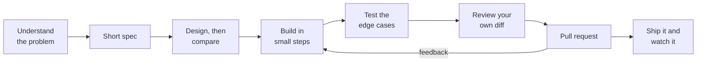

> Output got cheap. Understanding didn't.

The question I hear most from engineers early in their careers is some version of this: *if an AI can write the code, what am I supposed to be getting good at?*

It's a fair question, and the honest answer is uncomfortable in both directions. The tools really are good. I use them every day, and I've written up [how I keep them reliable](/engineering/ai-assisted-coding-playbook/). But the part of the job they're good at was never the part that made someone a senior engineer.

This is the process I'd hand to a junior developer starting today, or to anyone learning to code on their own: how to take a piece of work from question to production, what to hand to the AI and what to keep, and how to keep learning while a tool is offering to do the learning for you.

## 1. What changed, and what didn't

Start with the evidence, because it's more interesting than either the hype or the doom.

In January 2026, Anthropic published [a randomized controlled trial](https://www.anthropic.com/research/AI-assistance-coding-skills) with 52 mostly junior developers learning Trio, an asynchronous Python library none of them had used. Half could use an AI assistant. The AI group finished about two minutes faster — not a statistically significant difference — and then scored 50% on a quiz about the library, against 67% for the group that coded by hand. The widest gap was on debugging questions.

Experienced developers misjudge this too. In [METR's 2025 study](https://metr.org/blog/2025-07-10-early-2025-ai-experienced-os-dev-study/), experienced open-source developers working in codebases they knew well took 19% longer on tasks when using AI tools — while believing afterwards that they'd been 20% faster. METR's [2026 follow-up](https://metr.org/blog/2026-02-24-uplift-update/) points towards a speed-up with newer tools, though METR itself calls that data unreliable.

Developers sense something's off. In [Stack Overflow's 2025 survey](https://survey.stackoverflow.co/2025/ai), 84% of respondents used or planned to use AI tools, yet more distrusted the accuracy of the output (46%) than trusted it (33%). The most common frustration, named by 66%, was "AI solutions that are almost right, but not quite."

And the entry-level market has moved. Stanford's Digital Economy Lab, working from payroll data, [found](https://digitaleconomy.stanford.edu/publications/canaries-in-the-coal-mine/) that employment for 22-to-25-year-olds in the occupations most exposed to AI is now 19% below where it would have been had it kept pace with less-exposed peers; an earlier version of the paper put the drop for young software developers at nearly 20% from its late-2022 peak. The effect comes mostly through fewer hires, not layoffs. The detail that matters most: the declines are concentrated where AI *automates* the work. Where it *augments* people, employment is flat or rising.

Put those together and the picture is simple. Typing code was never the job. The job is understanding a problem well enough to decide what to build, building it in a way you can verify, and owning what happens after. AI made the typing nearly free and did very little to the rest — and the rest is what makes you someone the tools augment rather than work they automate.

> **The AI can write the code. It can't be the one who understands it.** Somebody on the team has to, and early in your career, the fastest way to become valuable is to make sure it's you.

## 2. The process: one ticket, start to finish

Here's what that looks like on real work. Take an ordinary ticket: *let customers download their order history as a CSV file.*



**Understand the problem before you open a tool.** Who asked for this, and what are they trying to do? Go and ask them. Requirements come from stakeholders, not from the AI: let an agent fill the gaps in a vague ticket and it will fill them confidently, sometimes with something a long way from what the stakeholder expected. Where does order data live? What happens today when someone wants their history? Write your questions down, then ask them. Use the AI here as a guide to the codebase, not a code generator: *"walk me through how an order is loaded, from the HTTP handler to the database"* is one of the most valuable prompts a new developer can type.

**Write a short spec.** Half a page: why, what, acceptance criteria, edge cases. For this ticket, the edge cases are where the real work is — a customer with no orders, a customer with ten thousand, product names containing commas, which timezone the dates are in, and, most important of all, a guarantee that customers can only ever export their own orders. Then there's the one almost nobody thinks of: a product name starting with `=`, which spreadsheet software may execute as a formula. That's [CSV injection](https://owasp.org/www-community/attacks/CSV_Injection), and it's exactly the kind of thing an AI won't bring up unless your spec does. Show the spec to your lead before writing code; it's the cheapest review you'll ever get. I've written separately about [how to write one and how it drives the agent](/engineering/spec-driven-development-tdd-bdd-ai-agents/).

**Design before you build, then compare.** AI doesn't remove the design step; it makes skipping it more expensive, because a wrong design now arrives as a lot of finished-looking code. Design also isn't picking the best technical answer; it's picking the best answer the business can afford, given the time, the people, and the debt already in the code. Those constraints are rarely in the ticket and never in the AI's context, so ask your lead about them. Then, before asking the AI for a plan, sketch your own design in five bullet points: which pieces change, where the data comes from, what could go wrong. Then run the agent in plan mode and compare the two. Where they differ is where you learn: either it knows something you don't — so ask it why — or it's about to do something you'd reject, and you've caught it before any code exists.

**Build in small steps.** One task at a time, each ending in a passing test and a commit. If you can't explain a step's diff in two sentences, the step was too big.

**Test the edge cases yourself.** Let the AI suggest test cases, but write the edge-case tests yourself, straight from the spec. They prove you understood the problem, and they're the tests a reviewer reads first.

**Review your own diff.** Read all of it, top to bottom, as if a stranger wrote it — because partly, one did. Apply the explain-back test from [my definition of done](/engineering/ai-assisted-coding-playbook/#13-definition-of-done-for-ai-assisted-changes): if you can't explain why a line is there, it doesn't ship.

**Open the pull request, and learn from the review.** Section 8 covers this properly.

**Ship it and watch it.** Your work isn't finished at merge. Check the logs after release, try the feature yourself in production, look at whether anyone uses it. Juniors who close that loop learn things no code review can teach.

## 3. What to hand to the AI, and what to keep

| Work | Hand it over? | Why |
| --- | --- | --- |
| Boilerplate, config, scaffolding | Yes | Low learning value, easy to verify |
| Explaining unfamiliar code, errors and concepts | Yes — this is its best use for you | A patient tutor that can read your codebase |
| Suggesting test cases and edge cases | Yes, then choose yourself | Choosing is the skill |
| Understanding the problem and the requirements | Keep | Nobody can do this for you |
| Debugging, at least the first attempt | Keep | This is where the learning gap was widest |
| Design decisions and trade-offs | Ask for options, decide yourself | It doesn't know your budget, deadline or technical debt — and you'll be defending the choice |
| Security-sensitive code: auth, permissions, personal data | Keep, and ask for senior review | See [the safety rules](/engineering/ai-assisted-coding-playbook/#12-safe-usage-rules-security--privacy) |
| Your pull request description | Keep | It's your understanding, on the record |

The rule underneath the table: **delegate what you already understand; keep what you're still learning.** The line moves as you grow. Code you'd write by hand in your first month is reasonable to delegate in your second year. What shouldn't change is that you *could* have written it.

## 4. What the AI doesn't know about your company

An AI assistant knows an enormous amount about software in general and almost nothing about your company in particular. Every real codebase has a legacy structure, technical debt, and a history that explains why things are the way they are, and none of it is in the model. Use AI to be more efficient. Don't rely on it to understand your situation. Five habits keep that gap from hurting you.

**Reuse before you generate.** Because AI makes new code nearly free to write, it's tempting to write new code for everything. But code is cheap to write and expensive to own: every new component needs tests, upgrades, security patches, and someone who remembers why it exists. Before building one, ask around the team whether something already does the job — a shared library, an internal service, a pattern another team has already solved. Reusing it, even imperfectly, is almost always cheaper than a shiny new version nobody else knows. The AI won't ask that question for you; it will happily generate a fourth date-formatting helper.

**Build what your team can run during an outage.** The AI can read any language and any structure. Your teammates can't, and during an outage it's your teammates who have to understand the code, quickly. If a solution uses a language, framework or pattern the team doesn't know, the AI may still write it well. But when production is down, someone has to steer, and an agent without a person who understands the system guiding it can make the mess bigger and the recovery slower. Match the design to the team's skills and the codebase's existing structure. A clever solution only the AI understands becomes a liability the first time it breaks.

**Estimate with the whole picture.** An AI can estimate the coding. It doesn't know that the work depends on another team's API that isn't ready, that a higher-priority project will pull you away next sprint, or that the release needs an approval only one person can give. Use AI for the coding estimate if you like, then add what it can't see — dependencies, priorities, reviews, the release process — or give it that context explicitly. A fast first draft is not a finished feature, and I've written before about why [an estimate mostly measures what you don't know yet](/leadership/leading-without-authority/#10-your-estimate-measures-what-you-dont-know-yet).

**Give it read access, never admin.** To give an assistant context, it's tempting to hand it an admin token for the ticket system, the cloud console or the database. Don't. Connect it through [MCP](https://modelcontextprotocol.io/) servers — the Model Context Protocol, the standard way assistants plug into tools — configured with read-only permissions and scoped to what the task needs. If a tool only offers admin access, that's a reason not to connect it, not a reason to grant admin. An agent that can only read can't delete a production table because it misunderstood you. The playbook's [safety rules](/engineering/ai-assisted-coding-playbook/#12-safe-usage-rules-security--privacy) cover the rest of this ground.

**You own it, whoever typed it.** The AI can do the work. It can't take the responsibility. Your name is on the commit and the pull request, and when the change breaks, "the AI wrote it" is not an answer anyone accepts — nor should it be. If you wouldn't defend a line in review, it isn't ready to merge.

## 5. Learn with the AI, not instead of it

The Anthropic study is useful here, because it didn't only find a gap — it found who didn't have one. The researchers grouped participants by how they used the assistant.

Three patterns scored low, averaging under 40%: handing the whole task to the AI, leaning on it more and more as the task went on, and pasting errors back to it until something worked. Three patterns preserved learning, scoring 65% or more: generating code and then asking follow-up questions to understand it, asking for code together with an explanation, and asking only conceptual questions while writing the code themselves. That last group was the fastest of the high scorers. The authors are careful to call this correlation rather than proof, but the pattern is hard to ignore.

The study also carries a warning worth sitting with. It tested a chat assistant in a sidebar, and the authors expect the effect on learning to be *larger* with agentic tools that write whole features on their own. The more the tool does, the more deliberate you have to be.

Habits that follow from it:

- **Try first.** Give yourself a fixed stretch — twenty minutes is a good default — before asking for help. The struggle isn't wasted time. It's the part that compounds.
- **Ask for understanding, not answers.** *"Don't write the code. Explain what's going wrong and give me a hint"* gets you further than *"fix this"*.
- **Ask it to quiz you.** After a task: *"Ask me five questions about how this code works. Don't give me the answers until I've tried."*
- **Type it, don't paste it**, when you're learning something new. It's slower. That's the point.
- **Use a learning mode.** Claude Code has a built-in [Learning output style](https://code.claude.com/docs/en/output-styles) that explains its choices and leaves the pieces involving a real design decision for you to write, marked `TODO(human)`. Switch it on with `/output-style` while you're finding your way around a new codebase.
- **Ask the senior question.** Once it works: *"What would an experienced engineer do differently here, and why?"*

If you're learning on your own rather than in a job, build some things with no AI at all. Not forever — just often enough that you know which skills are actually yours.

## 6. Read more code than you write

When an AI writes much of the code, the job shifts from writing to reading. Reviewing a few hundred lines you didn't write, and deciding whether they're right, is now a core daily skill — and it's one most juniors were never explicitly taught.

Ways to get better at it:

- **Read the code around your change**, not just the change.
- **Trace one request end to end with a debugger**, stepping through every layer. Do it once for every service you work on.
- **Read tests to learn intent.** They tell you what the author thought mattered.
- **Read your seniors' pull requests**, including the review comments. That's where a team's real standards get written down.

## 7. Debug like a scientist, not a slot machine

Pasting an error back to the AI, taking its next suggestion, and repeating until the tests go green is the pattern that scored lowest in the study. It feels productive. It teaches you nothing, and when it fails, it fails in ways you can't diagnose.

The process that works hasn't changed in decades:

1. **Reproduce it** reliably.
2. **Read the whole error** and the stack trace. Actually read it.
3. **Form a hypothesis**: "I think the timezone is being applied twice."
4. **Test the hypothesis** with the smallest possible experiment — a breakpoint, a log line, a one-line test.
5. **Fix it, then write a test** that would have caught it.

The AI is genuinely useful at steps 2 and 3, explaining an unfamiliar error or suggesting what might cause it. You run the experiments. Getting from hypothesis to evidence is the skill, and the only way to acquire it is to do it.

## 8. Open a pull request your reviewer can trust

Your reviewer's time is the scarcest resource on your team. A junior who makes review easy earns trust faster than one who writes clever code.

- **Keep it small.** One concern, reviewable in one sitting.
- **Never make your reviewer the first human to read the code.** That's your job, and it happened in section 2.
- **Say what you verified**, not just what you changed.
- **Check every new import exists in your lockfile.** AI tools invent plausible package names, and attackers register them — the playbook covers [why that matters](/engineering/ai-assisted-coding-playbook/#human-in-the-loop-verification).
- **Be open about AI use** if your team expects it. Either way, you own every line.

A description that does all of that:

```markdown
## What and why
Adds CSV export of order history (TICKET-123). Spec: docs/specs/order-export.md

## How I verified it
- uv run pytest tests/orders -q (12 new tests, all passing)
- Exported history for test accounts with 0, 1 and 10,000 orders
- Opened the file in a spreadsheet: names starting with = are escaped
- Confirmed a customer can't export another customer's orders (403)

## What I'm unsure about
- I stream the file rather than building it in memory. Not sure that's
  needed at our volumes — happy to simplify.

## AI use
Plan and first draft from Claude Code. Edge-case tests written by me.
```

Then learn from the review. Treat every comment as a lesson, not a verdict. If you don't understand why a change was requested, ask — *"can you help me understand why?"* is a question good seniors are glad to hear. Keep a list of the comments you get more than once. That list is your personal curriculum.

## 9. What seniors actually look for

Not how fast you produce code. Anyone with an AI assistant can produce code quickly now, which is exactly why speed no longer sets you apart. What does:

- **Asking the right question early.** The junior who asks "who can export whose data?" on day one saves the team a week.
- **Knowing why the best solution isn't always the right one.** A senior can say "that's the cleaner design, and we can't afford it this quarter" and mean both halves. Learn to ask what a solution costs, not just whether it works.
- **Knowing what you don't know**, and saying so. "I'm not sure — I'll find out" is a senior sentence.
- **Verifying before claiming.** "Done" means tested, reviewed by you, and working. Not "the agent said it's done."
- **Owning outcomes after merge.** Watching your change in production, and fixing what breaks without being asked — whoever, or whatever, wrote it.
- **Writing clearly.** Specs, pull request descriptions, questions in chat. Clear writing is clear thinking made visible, and it's a skill AI makes more valuable, not less.

## 10. A weekly checklist

- [ ] Worked out the core logic of at least one problem myself before asking the AI.
- [ ] Wrote a short spec before starting a piece of work, with requirements from the people who asked for it.
- [ ] Asked the team whether something already existed before building a new component.
- [ ] Stepped through one unfamiliar code path in a debugger.
- [ ] Wrote the edge-case tests for my own work.
- [ ] Explained a piece of AI-written code out loud, to a person or a rubber duck.
- [ ] Read one senior engineer's pull request end to end, and asked one question about it.
- [ ] Asked "why?" on at least one review comment.
- [ ] Checked one of my changes in production after it shipped.
- [ ] Made sure every tool connected to my AI assistant has only the access the task needs.

## Final thoughts

The tools will keep improving, and some of the specifics in this post will date. The core won't. Every generation of tooling — compilers, IDEs, search engines, Stack Overflow — made writing code easier, and each time the engineers who did well were the ones who understood what the tool had produced.

So use the AI every day. Just make sure that at the end of each week you understand more than you did at the start — not merely that more code exists with your name on it.

If you're early in your career and something here doesn't match what you're seeing, tell me. And if you mentor juniors, I'd like to hear what's worked for you. [Find me on LinkedIn](https://www.linkedin.com/in/riddam/).

## Credits and further reading

- Judy Hanwen Shen and Alex Tamkin, [*How AI Impacts Skill Formation*](https://arxiv.org/abs/2601.20245) (arXiv, January 2026), and Anthropic's summary, [*How AI assistance impacts the formation of coding skills*](https://www.anthropic.com/research/AI-assistance-coding-skills).
- METR, [*Measuring the Impact of Early-2025 AI on Experienced Open-Source Developer Productivity*](https://metr.org/blog/2025-07-10-early-2025-ai-experienced-os-dev-study/) (July 2025), and [*We are Changing our Developer Productivity Experiment Design*](https://metr.org/blog/2026-02-24-uplift-update/) (February 2026).
- Stack Overflow, [2025 Developer Survey: AI](https://survey.stackoverflow.co/2025/ai).
- Erik Brynjolfsson, Bharat Chandar and Ruyu Chen, [*Canaries in the Coal Mine? Six Facts about the Recent Employment Effects of Artificial Intelligence*](https://digitaleconomy.stanford.edu/publications/canaries-in-the-coal-mine/) (Stanford Digital Economy Lab, revised August 2026).
- OWASP, [CSV Injection](https://owasp.org/www-community/attacks/CSV_Injection).
- Anthropic, [Claude Code output styles](https://code.claude.com/docs/en/output-styles).
